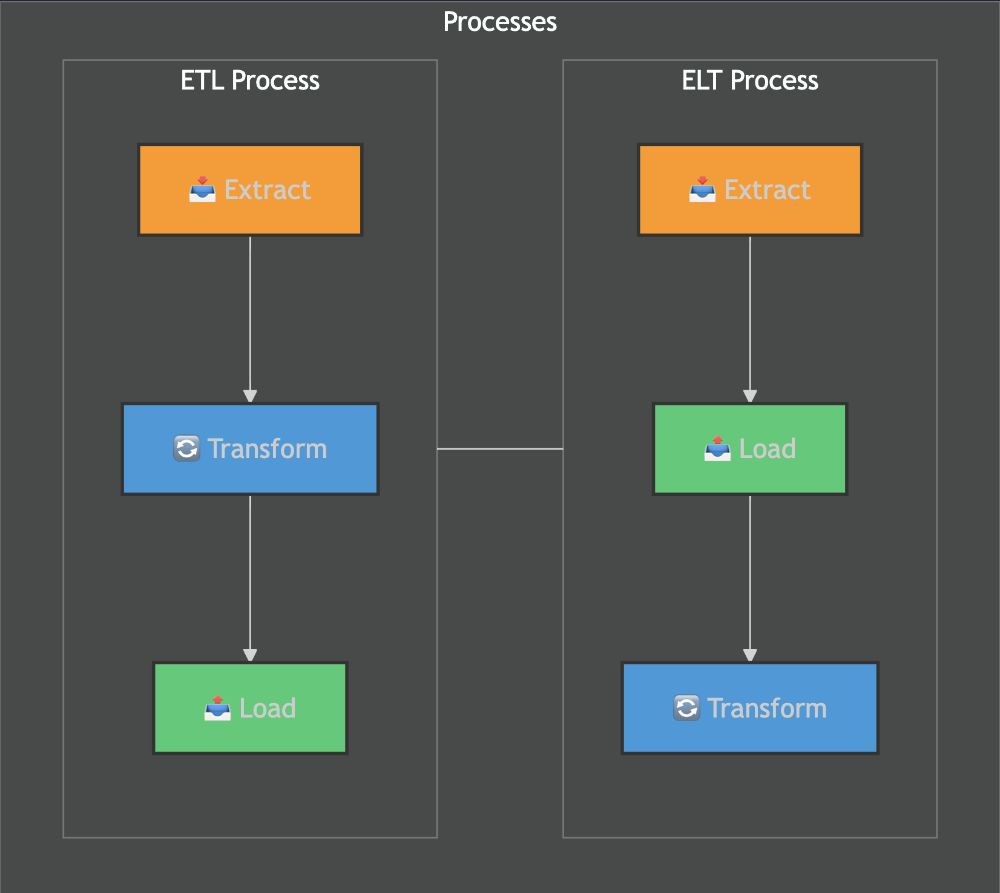

<div align="center">

# 🚀 ETL i ELT: Nowoczesny przewodnik dla początkujących

</div>

<p align="center">
  
  
  
</p>

> 💬 **O przewodniku**: Ten materiał to kompleksowy, przyjazny dla licealisty przewodnik po procesach **ETL** (Extract, Transform, Load) i **ELT** (Extract, Load, Transform). Wyjaśniamy wszystko krok po kroku, używając prostych analogii, przykładów z życia i praktycznych ćwiczeń, aby pomóc Ci opanować temat w ramach kursu na Coursera.

---

## 📑 Spis treści

<div align="center">
  <table>
    <tr>
      <th>📚 Podstawy</th>
      <th>🛠️ Procesy</th>
      <th>🔍 Analizy i praktyka</th>
    </tr>
    <tr>
      <td>
        <ul>
          <li><a href="#wprowadzenie-czym-są-etl-i-elt">Wprowadzenie do ETL/ELT</a></li>
          <li><a href="#ekstrakcja-danych-skąd-i-jak-bierzemy-dane">Ekstrakcja danych</a></li>
          <li><a href="#transformacja-danych-jak-przygotować-dane">Transformacja danych</a></li>
          <li><a href="#ładowanie-danych-jak-zapisać-dane">Ładowanie danych</a></li>
        </ul>
      </td>
      <td>
        <ul>
          <li><a href="#proces-etl-krok-po-kroku">Proces ETL</a></li>
          <li><a href="#proces-elt-krok-po-kroku">Proces ELT</a></li>
          <li><a href="#dlaczego-elt-jest-coraz-popularniejsze">Popularność ELT</a></li>
          <li><a href="#typowe-problemy-i-ich-rozwiązania">Typowe problemy</a></li>
        </ul>
      </td>
      <td>
        <ul>
          <li><a href="#porównanie-etl-i-elt-szczegółowa-analiza">Porównanie ETL i ELT</a></li>
          <li><a href="#przypadki-użycia-elt-gdzie-i-jak-się-sprawdza">Przypadki użycia ELT</a></li>
          <li><a href="#praktyczne-ćwiczenia-dla-początkujących">Praktyczne ćwiczenia</a></li>
          <li><a href="#przyszłość-etl-i-elt">Przyszłość ETL i ELT</a></li>
        </ul>
      </td>
    </tr>
  </table>
</div>

---

<div align="center">

## 📘 Wprowadzenie: Czym są ETL i ELT? 🌟

</div>

> **ETL** i **ELT** to dwa sposoby na organizowanie danych, aby można je było wykorzystać do analizy, np. do tworzenia raportów, przewidywania trendów czy personalizowania reklam. Pomyśl o nich jak o dwóch metodach sprzątania Twojego biurka przed nauką.

<div align="center">
  <table>
    <tr>
      <td width="50%">
        <h3>🧹 ETL: Uporządkuj, zanim zapiszesz</h3>
        <p>Najpierw zbierasz rzeczy (np. notatki, książki), porządkujesz je (układasz w segregatorze), a potem kładziesz na biurko tylko to, co potrzebne.</p>
      </td>
      <td width="50%">
        <h3>📦 ELT: Zapisz, potem porządkuj</h3>
        <p>Zbierasz wszystko i wrzucasz do wielkiego pudła. Kiedy potrzebujesz czegoś, wyciągasz i organizujesz tylko to, czego akurat używasz.</p>
      </td>
    </tr>
  </table>
</div>

### 🔑 Kluczowe różnice w procesie

> 💡 **Różnica**: ETL najpierw porządkuje dane, a ELT zapisuje je w surowej formie i porządkuje później.



<div align="center">
  <p></p>
</div>

---

<div align="center">

## 🔄 Proces ETL: Krok po kroku 🛠️

</div>

<p align="center"><i>ETL to tradycyjny sposób zarządzania danymi, idealny dla uporządkowanych danych, jak tabele w bazach danych.</i></p>

<div align="center">
  <table>
    <tr>
      <th width="33%">📥 Ekstrakcja</th>
      <th width="33%">🔄 Transformacja</th>
      <th width="33%">📤 Ładowanie</th>
    </tr>
    <tr>
      <td>
        <p align="center"><strong>Zbieranie danych</strong></p>
        <ul>
          <li>Z aplikacji 📱</li>
          <li>Z plików 📄</li>
          <li>Z baz danych 💾</li>
        </ul>
      </td>
      <td>
        <p align="center"><strong>Porządkowanie danych</strong></p>
        <ul>
          <li>Czyszczenie 🧹</li>
          <li>Formatowanie 📊</li>
          <li>Łączenie 🔗</li>
        </ul>
      </td>
      <td>
        <p align="center"><strong>Zapisywanie danych</strong></p>
        <ul>
          <li>Do baz danych 📦</li>
          <li>Do hurtowni danych 🏢</li>
          <li>Do Excela 📈</li>
        </ul>
      </td>
    </tr>
  </table>
</div>

### 📥 1. Ekstrakcja: Zbieranie danych

> **Co to jest?** Pobieranie danych z różnych źródeł, takich jak aplikacje, pliki czy strony internetowe.

**Przykład z życia**: Wyobraź sobie, że chcesz zrobić zestawienie swoich wydatków. Zbierasz dane z:

- Aplikacji bankowej (np. historia przelewów 💳).
- Notatek w telefonie (np. zapisane rachunki 📝).
- E-maili z potwierdzeniami zakupów (np. z Allegro 📧).

**Jak to działa?** Dane mogą być w różnych formatach: tabele w Excelu, tekst w e-mailach, liczby w aplikacjach. Ekstrakcja to zebranie ich w jedno miejsce.

### 🔄 2. Transformacja: Porządkowanie danych

> **Co to jest?** Przygotowanie danych do analizy przez czyszczenie, formatowanie lub łączenie.

**Co robisz?**

- **Czyszczenie**: Usuwasz błędy, np. literówki w nazwach czy zduplikowane wpisy.
- **Formatowanie**: Zamieniasz dane na odpowiedni format, np. procenty na stopnie.
- **Łączenie**: Scalasz dane z różnych źródeł, np. wydatki z banku i z notatek.

**Przykład z życia**: Masz oceny z matematyki w procentach (85%, 92%) i punktach (4/5). Zamieniasz wszystko na stopnie (np. 85% to 4, 92% to 5) i usuwasz błędne wpisy (np. ta sama ocena wpisana dwa razy).

### 📤 3. Ładowanie: Zapisywanie danych

> **Co to jest?** Zapisanie przygotowanych danych w miejscu, gdzie można je analizować, np. w bazie danych lub pliku Excel.

**Przykład z życia**: Zapisujesz wszystkie oceny w pliku Excel z kolumnami: „Przedmiot”, „Ocena”, „Data”. Teraz możesz łatwo policzyć średnią.

**Analogia**: ETL to jak przygotowanie kanapki 🥪: zbierasz składniki (ekstrakcja), kroisz i układasz je (transformacja), a potem podajesz na talerzu (ładowanie).

---

<div align="center">

## ⚡ Proces ELT: Krok po kroku 🌊

</div>

<p align="center"><i>ELT to nowszy sposób, idealny dla dużych i nieuporządkowanych danych, szczególnie w chmurze.</i></p>

<div align="center">
  <table>
    <tr>
      <th width="33%">📥 Ekstrakcja</th>
      <th width="33%">📤 Ładowanie</th>
      <th width="33%">🔄 Transformacja</th>
    </tr>
    <tr>
      <td>
        <p align="center"><strong>Zbieranie danych</strong></p>
        <ul>
          <li>Z aplikacji 📱</li>
          <li>Z plików 📄</li>
          <li>Z baz danych 💾</li>
        </ul>
      </td>
      <td>
        <p align="center"><strong>Zapisywanie danych</strong></p>
        <ul>
          <li>Do jeziora danych 🌊</li>
          <li>Do baz danych 📦</li>
          <li>Do hurtowni danych 🏢</li>
        </ul>
      </td>
      <td>
        <p align="center"><strong>Porządkowanie danych</strong></p>
        <ul>
          <li>Czyszczenie 🧹</li>
          <li>Formatowanie 📊</li>
          <li>Łączenie 🔗</li>
        </ul>
      </td>
    </tr>
  </table>
</div>

### 📥 1. Ekstrakcja: Zbieranie danych

> **Co to jest?** Pobieranie danych z różnych źródeł, podobnie jak w ETL.

**Przykład z życia**: Zbierasz wszystkie wiadomości z grupowego czatu na WhatsApp, żeby przeanalizować, o czym rozmawialiście. Pobierasz teksty, emotki, zdjęcia.

### 📤 2. Ładowanie: Zapisywanie danych

> **Co to jest?** Zapisanie surowych danych w dużym magazynie, np. jeziorze danych (to jak wielki folder w chmurze).

**Przykład z życia**: Wrzucasz wszystkie wiadomości z czatu do Google Drive lub chmury, bez zmieniania ich.

### 🔄 3. Transformacja: Porządkowanie danych

> **Co to jest?** Zmiana danych, kiedy są potrzebne, za pomocą narzędzi takich jak SQL czy Python.

**Przykład z życia**: Z czatu na WhatsApp wyciągasz tylko wiadomości z ostatniego tygodnia albo liczysz, ile razy ktoś napisał „spoko”. Robisz to na danych zapisanych w chmurze.

**Analogia**: ELT to jak wrzucenie wszystkich ubrań do szafy 👕 bez składania. Kiedy potrzebujesz koszulki, wyciągasz i składasz tylko tę jedną.

---

<div align="center">

## ⚖️ Porównanie ETL i ELT: Szczegółowa analiza 🔍

</div>

<div align="center">
  <table>
    <tr>
      <th colspan="2">🔍 Porównanie kluczowych aspektów</th>
    </tr>
    <tr>
      <th width="50%" style="background-color:#e74c3c; color:white;">ETL</th>
      <th width="50%" style="background-color:#3498db; color:white;">ELT</th>
    </tr>
    <tr>
      <td><div align="center">📥→🔄→📤<br><strong>Extract → Transform → Load</strong></div></td>
      <td><div align="center">📥→📤→🔄<br><strong>Extract → Load → Transform</strong></div></td>
    </tr>
    <tr>
      <td>Transformacja <strong>przed</strong> zapisaniem</td>
      <td>Transformacja <strong>po</strong> zapisaniu</td>
    </tr>
    <tr>
      <td>Głównie dla danych <strong>ustrukturyzowanych</strong> (np. tabele)</td>
      <td>Dla <strong>wszystkich typów</strong> danych (np. zdjęcia, teksty)</td>
    </tr>
    <tr>
      <td><strong>Sztywny</strong> proces, trudny do zmiany</td>
      <td><strong>Elastyczny</strong> proces, łatwy do dostosowania</td>
    </tr>
    <tr>
      <td>Ograniczona <strong>skalowalność</strong> (zależy od sprzętu)</td>
      <td>Wysoka <strong>skalowalność</strong> w chmurze</td>
    </tr>
    <tr>
      <td><strong>Przykład</strong>: Robisz raport z ocen, zamieniając procenty na stopnie przed zapisaniem.</td>
      <td><strong>Przykład</strong>: Wrzucasz wszystkie oceny do chmury i analizujesz je, kiedy chcesz.</td>
    </tr>
  </table>
</div>

### 🎯 Kiedy wybrać ETL?

- Masz **umiarkowaną ilość danych** (np. dane z jednego sklepu).
- Potrzebujesz **stałych raportów** (np. miesięczne zestawienie sprzedaży).
- Zależy Ci na **spójnych danych** od razu po załadowaniu.
- Masz **określone wymagania** analityczne.

**Przykład**: Firma przygotowuje raport finansowy, który zawsze wygląda tak samo.

### 🎯 Kiedy wybrać ELT?

- Pracujesz z **dużymi danymi** (np. miliony rekordów).
- Potrzebujesz **elastyczności** w analizach.
- Używasz **chmury** (np. Google BigQuery).
- Chcesz zachować **surowe dane**.
- Różni użytkownicy potrzebują **różnych analiz** z tych samych danych.

**Przykład**: Sklep internetowy analizuje dane o zakupach, żeby tworzyć różne raporty i rekomendacje.

> 💡 **Kluczowa różnica**: ETL to gotowanie według przepisu, ELT to bufet – wybierasz, co chcesz, kiedy chcesz.

---

<div align="center">

## 💼 Przypadki użycia ELT: Gdzie i jak się sprawdza? 📊

</div>

ELT jest idealne dla dużych, nieuporządkowanych danych i elastycznych analiz. Oto konkretne przykłady:

### 1. Analiza dużych ilości danych (Big Data) 📈

- **Sytuacja**: Sklep internetowy chce sprawdzić, które produkty są najczęściej kupowane.
- **Jak ELT pomaga?** Wrzuca miliony rekordów o zakupach do jeziora danych, a analitycy mogą sprawdzać różne rzeczy, np. popularność butów w danym regionie.
- **Przykład z życia**: Analizujesz playlisty na Spotify, żeby zobaczyć, jakich piosenek słuchasz najczęściej.

### 2. Dane w czasie rzeczywistym ⏱️

- **Sytuacja**: YouTube śledzi, ile osób ogląda film na żywo.
- **Jak ELT pomaga?** Dane o widzach są zapisywane na bieżąco w chmurze, a potem można je analizować, np. po krajach.
- **Przykład z życia**: Twoja aplikacja fitness zapisuje kroki w czasie rzeczywistym, a Ty potem sprawdzasz, kiedy byłeś aktywny.

### 3. Różne analizy z tych samych danych 🔄

- **Sytuacja**: Firma chce użyć danych o sprzedaży do raportów, reklam i rekomendacji.
- **Jak ELT pomaga?** Dane są zapisane w surowej formie, więc każdy dział może je analizować inaczej.
- **Przykład z życia**: Masz zdjęcia z wakacji i raz sortujesz je po dacie, a raz po miejscu.

### 4. Dane z całego świata 🌍

- **Sytuacja**: Firma zbiera dane o sprzedaży z różnych krajów.
- **Jak ELT pomaga?** Wszystkie dane są zapisywane w chmurze i można je połączyć.
- **Przykład z życia**: Łączysz wyniki z gier online, żeby zobaczyć, kto jest najlepszy w drużynie.

---

<div align="center">

## 📈 Dlaczego ELT jest coraz popularniejsze? 🌟

</div>

ELT zyskuje popularność z kilku powodów, które wyjaśnię prosto:

### 1. Chmura to potęga ☁️

- **Co to jest?** Chmura (np. Google Cloud, AWS) pozwala przechowywać i przetwarzać ogromne ilości danych.
- **Przykład**: To jak trzymanie zdjęć w Google Photos zamiast na telefonie – masz więcej miejsca i łatwy dostęp.
- **Dlaczego to ważne?** Płacisz tylko za to, co używasz, więc oszczędzasz na sprzęcie.

### 2. Elastyczność dla wszystkich 🔄

- **Co to jest?** W ELT każdy może analizować dane, bez czekania na programistów.
- **Przykład**: W ETL zmieniasz raport z ocen, prosząc informatyka. W ELT sam wybierasz, co analizujesz.
- **Dlaczego to ważne?** Szybsze analizy i większa swoboda.

### 3. Nie tracisz danych 🚫

- **Co to jest?** W ETL możesz stracić dane podczas transformacji. W ELT dane są zapisane w surowej formie.
- **Przykład**: W ELT masz kopię wszystkich wiadomości z czatu, więc możesz do nich wrócić.
- **Dlaczego to ważne?** Możesz robić różne analizy bez obawy o utratę danych.

### 4. Szybkość i skalowalność ⚡

- **Co to jest?** ELT zapisuje dane od razu w chmurze, co jest szybsze.
- **Przykład**: Wrzucenie zdjęć na dysk Google jest szybsze niż ich sortowanie przed zapisaniem.
- **Dlaczego to ważne?** Możesz pracować z milionami rekordów bez opóźnień.

---

<div align="center">

## 📥 Ekstrakcja danych: Skąd i jak bierzemy dane? 🔎

</div>

Ekstrakcja to zbieranie danych z różnych miejsc, jak zbieranie materiałów na projekt szkolny.

### Skąd bierzemy dane?

<div align="center">
  <table>
    <tr>
      <th>Źródło</th>
      <th>Przykłady</th>
    </tr>
    <tr>
      <td>📄 Pliki</td>
      <td>PDF-y, Word, Excel, zdjęcia, filmy (np. skan paragonu, notatki w PDF)</td>
    </tr>
    <tr>
      <td>🌐 Internet</td>
      <td>Strony www, media społecznościowe, API (np. posty z Instagrama, dane o pogodzie)</td>
    </tr>
    <tr>
      <td>📱 Urządzenia</td>
      <td>Czujniki, kamery, urządzenia medyczne (np. smartwatch, kamera w szkole)</td>
    </tr>
    <tr>
      <td>🏢 Dane firmowe</td>
      <td>Transakcje, listy klientów, raporty sprzedaży (np. zakupy na Allegro)</td>
    </tr>
  </table>
</div>

### Jak wyciągamy dane?

1. **OCR (Rozpoznawanie tekstu)**:

   - Zamieniasz zeskanowany dokument na tekst.
   - **Przykład**: Skanujesz rachunek i wyciągasz kwotę (np. 50 zł za pizzę).

2. **Web scraping**:

   - Pobierasz dane ze stron www, np. ceny, tytuły.
   - **Przykład**: Sprawdzasz ceny gier na Steam.

3. **API**:

   - Pobierasz dane z aplikacji lub serwisów online.
   - **Przykład**: Aplikacja pogodowa pobiera temperaturę z OpenWeather.

4. **Czujniki i urządzenia**:

   - Dane z urządzeń, np. smartwatche, kamery.
   - **Przykład**: Kamera zapisuje, ile osób wchodzi do szkoły.

5. **Ankiety i statystyki**:
   - Dane z formularzy, spisów, badań.
   - **Przykład**: Ankieta w szkole o ulubionych przedmiotach.

> ⚠️ **Uwaga**: Dane wrażliwe (np. dane medyczne) muszą być chronione, żeby nikt ich nie ukradł.

---

<div align="center">

## 🛠️ Transformacja danych: Jak przygotować dane? 🔧

</div>

Transformacja to przygotowanie danych do analizy, jak krojenie warzyw przed gotowaniem.

### Co robimy z danymi?

<div align="center">
  <table>
    <tr>
      <th>Technika</th>
      <th>Opis</th>
      <th>Przykład</th>
    </tr>
    <tr>
      <td>🧹 Czyszczenie</td>
      <td>Usuwanie błędów, duplikatów, brakujących wartości</td>
      <td>Poprawiasz „Kowalsky” na „Kowalski”</td>
    </tr>
    <tr>
      <td>📊 Formatowanie</td>
      <td>Zmiana formatu, np. daty, liczby</td>
      <td>Zamieniasz „2025-05-22” na „22 maja 2025”</td>
    </tr>
    <tr>
      <td>🔄 Normalizacja</td>
      <td>Ujednolicenie danych, np. waluty</td>
      <td>Zamieniasz euro na złotówki</td>
    </tr>
    <tr>
      <td>🔍 Filtrowanie</td>
      <td>Wybór potrzebnych danych</td>
      <td>Bierzesz tylko oceny z matematyki</td>
    </tr>
    <tr>
      <td>📈 Agregacja</td>
      <td>Podsumowania, np. średnia, suma</td>
      <td>Liczysz średnie wydatki na jedzenie</td>
    </tr>
    <tr>
      <td>🔗 Łączenie</td>
      <td>Scalanie danych z różnych źródeł</td>
      <td>Łączysz listę uczniów z ocenami</td>
    </tr>
    <tr>
      <td>🔒 Anonimizacja</td>
      <td>Ochrona danych wrażliwych</td>
      <td>Zamieniasz „Jan Kowalski” na „Użytkownik 123”</td>
    </tr>
  </table>
</div>

### Schema-on-Write vs Schema-on-Read

- **Schema-on-Write (ETL)**: Dane muszą mieć określony format przed zapisaniem, jak układanie książek w bibliotece według kategorii.
  - **Przykład**: Zapisujesz oceny w tabeli z kolumnami „Przedmiot”, „Ocena”, „Data”.
- **Schema-on-Read (ELT)**: Dane zapisujesz jak są, a formatujesz podczas analizy, jak przeglądanie zdjęć w galerii.
  - **Przykład**: Wrzucasz dane o grach do chmury i potem decydujesz, jak je analizować.

### Utrata danych

Transformacje mogą prowadzić do utraty informacji:

- **Stratna kompresja**: Zamiana liczb z przecinkiem (3.14) na całe (3).
- **Filtrowanie**: Trwałe usunięcie danych (np. tylko oceny powyżej 3).
- **Agregacja**: Średnia ocen usuwa szczegóły o każdej ocenie.
- **Urządzenia brzegowe**: Kamera zapisuje tylko alarmy, a nie cały film.

> 💡 **W ELT**: Surowe dane są zawsze dostępne, więc utrata danych jest minimalna.

---

<div align="center">

## 📤 Ładowanie danych: Jak zapisać dane? 💾

</div>

Ładowanie to zapisanie danych w miejscu, gdzie można je analizować, np. w bazie danych, chmurze czy Excelu.

### Strategie ładowania

<div align="center">
  <table>
    <tr>
      <th>Strategia</th>
      <th>Opis</th>
      <th>Przykład</th>
    </tr>
    <tr>
      <td>📦 Pełne ładowanie</td>
      <td>Zapisujesz wszystko od zera</td>
      <td>Nowy plik Excel z wydatkami z roku</td>
    </tr>
    <tr>
      <td>➕ Ładowanie przyrostowe</td>
      <td>Dodajesz tylko nowe/zmienione dane</td>
      <td>Dodajesz wydatki z ostatniego tygodnia</td>
    </tr>
  </table>
</div>

### Rodzaje ładowania

- **Wsadowe**: Zapisujesz dane w partiach, np. raz dziennie.
  - **Przykład**: Sklep zapisuje sprzedaż o północy.
- **Strumieniowe**: Zapisujesz dane na bieżąco.
  - **Przykład**: Smartwatch zapisuje puls co sekundę.

### Metodologie

- **Push**: Źródło wysyła dane do bazy.
  - **Przyklad**: Aplikacja fitness wysyła kroki do chmury.
- **Pull**: Baza „ciągnie” dane ze źródła.
  - **Przyklad**: Aplikacja sprawdza posty na Instagramie co 10 minut.

### Szeregowe vs Równoległe

- **Szeregowe**: Zapisujesz dane jedno po drugim (wolniej).
  - **Przyklad**: Wrzucasz zdjęcia na dysk jedno po drugim.
- **Równoległe**: Zapisujesz wiele danych naraz (szybciej).
  - **Przyklad**: Dzielisz zdjęcia na foldery i zapisujesz jednocześnie.

---

<div align="center">

## 🧩 Praktyczne ćwiczenia dla początkujących 🛠️

</div>

Oto ćwiczenia, które pomogą Ci zrozumieć ETL i ELT w praktyce:

### 1. Ćwiczenie ETL: Organizacja wydatków 💸

**Zadanie**: Zbierz dane o wydatkach z ostatniego tygodnia.

1. **Ekstrakcja**: Zapisz dane w pliku tekstowym (np. „pizza – 50 zł, kino – 30 zł”).
2. **Transformacja**: Przenieś dane do Excela, usuń duplikaty, zamień kwoty na złotówki, pogrupuj po kategoriach (jedzenie, rozrywka).
3. **Ładowanie**: Zapisz tabelę w Excelu i oblicz sumę wydatków.

### 2. Ćwiczenie ELT: Analiza czatu 📱

**Zadanie**: Pobierz wiadomości z grupowego czatu na WhatsApp.

1. **Ekstrakcja**: Skopiuj wiadomości do pliku tekstowego.
2. **Ładowanie**: Wrzuć plik do Google Drive lub Notion.
3. **Transformacja**: Użyj wyszukiwania, żeby znaleźć wiadomości z konkretnego dnia lub słowa (np. „spoko”).

### 3. Ćwiczenie z Pythonem 🐍

**Zadanie**: Stwórz prosty skrypt ETL w Pythonie.

```python
import pandas as pd

# Ekstrakcja: wczytaj dane z pliku CSV
dane = pd.read_csv("oceny.csv")  # np. kolumny: Przedmiot, Ocena

# Transformacja: zmień procenty na stopnie
dane["Ocena_stopien"] = dane["Ocena"].apply(lambda x: 5 if x >= 90 else 4 if x >= 80 else 3)

# Ładowanie: zapisz do nowego pliku
dane.to_csv("oceny_przetworzone.csv", index=False)
```

> 💡 **Wyjaśnienie**: Kod wczytuje dane, zmienia procenty na stopnie i zapisuje wynik.

---

<div align="center">

## ⚠️ Typowe problemy i ich rozwiązania 🚩

</div>

Oto najczęściej spotykane problemy w ETL/ELT i jak je rozwiązać:

### 1. Niespójność danych

- **Problem**: Dane są zapisane różnie, np. „Jan” i „J. Kowalski”.
- **Rozwiązanie**:
  - Użyj tabel mapujących, np. „Jan” = „J. Kowalski”.
  - Standaryzuj dane, np. zawsze używaj pełnych imion.
  - Wprowadź unikatowe ID dla danych.

### 2. Opóźnienia w przetwarzaniu dużych danych

- **Problem**: Przetwarzanie milionów rekordów trwa godziny.
- **Rozwiązanie**:
  - Używaj ładowania przyrostowego.
  - Stosuj przetwarzanie równoległe.
  - Optymalizuj zapytania SQL lub Python.

### 3. Zmiany w strukturze danych

- **Problem**: Źródło zmienia format, np. dodaje nową kolumnę.
- **Rozwiązanie**:
  - Projektuj elastyczne procesy.
  - Monitoruj źródła danych.
  - Dokumentuj zmiany w schematach.

### 4. Dane wrażliwe i RODO

- **Problem**: Dane osobowe muszą być chronione.
- **Rozwiązanie**:
  - Anonimizuj dane (np. zamień nazwiska na ID).
  - Szyfruj dane w chmurze.
  - Ogranicz dostęp do danych.

---

<div align="center">

## 🔮 Przyszłość ETL i ELT 🚀

</div>

Technologie ETL i ELT szybko się rozwijają. Oto kluczowe trendy:

### 1. Automatyzacja z AI 🤖

- **Co to jest?** Sztuczna inteligencja automatyzuje procesy ETL/ELT.
- **Przykłady**:
  - Automatyczne wykrywanie formatów danych.
  - Sugerowanie transformacji.
  - Wykrywanie błędów w danych.

### 2. No-Code ETL/ELT 🖱️

- **Co to jest?** Narzędzia z graficznym interfejsem, bez kodowania.
- **Przykłady**: Talend, KNIME, Microsoft Power Query.
- **Zalety**: Łatwe dla początkujących, szybkie wdrożenie.

### 3. Integracja z DataOps i MLOps 🔄

- **Co to jest?** Łączenie ETL/ELT z automatyką danych i uczeniem maszynowym.
- **Przykład**: System pobiera dane, trenuje model ML i wdraża go.

### 4. Real-time ETL/ELT ⏱️

- **Co to jest?** Przetwarzanie danych w czasie rzeczywistym.
- **Przykłady**: Apache Kafka, Snowflake Streams.
- **Zastosowanie**: Natychmiastowe rekomendacje w e-commerce.

**Przyszłe umiejętności**:

- **Chmura**: AWS, Azure, Google Cloud.
- **Big Data**: Apache Spark, Hadoop.
- **Programowanie**: Python, SQL.
- **Konteneryzacja**: Docker, Kubernetes.

---

<div align="center">

## ✅ Najlepsze praktyki i pułapki do uniknięcia 🛠️

</div>

### Najlepsze praktyki

1. **Planuj z wyprzedzeniem**:

   - Określ, jakie dane i analizy są potrzebne.
   - **Przyklad**: Chcesz analizować wydatki? Zdecyduj, czy potrzebujesz dat czy kategorii.

2. **Testuj dane**:

   - Sprawdzaj dane na każdym kroku (np. brak literówek).

3. **Chroń dane**:

   - Anonimizuj dane osobowe.
   - Używaj szyfrowania w chmurze.

4. **Używaj narzędzi**:
   - Excel, Google Sheets dla początkujących.
   - Python (pandas), Google BigQuery dla zaawansowanych.

### Pułapki

1. **Utrata danych**:

   - Zapisuj surowe dane w ETL, zanim je zmienisz.
   - **Przyklad**: Usunięcie szczegółów o zakupach może być nieodwracalne.

2. **Złe formaty**:

   - Upewnij się, że daty czy liczby są spójne.

3. **Wolne procesy**:
   - Używaj ładowania równoległego dla dużych danych.

---

<div align="center">

## 🔗 Dodatkowe zasoby i narzędzia 📚

</div>

- **Kursy**:
  - Coursera: Kontynuuj swój kurs.
  - DataCamp: „Introduction to Data Engineering”.
- **Narzędzia**:
  - **Darmowe**: Excel, Google Sheets, Python (pandas).
  - **Chmurowe**: Google BigQuery, AWS Glue.
- **Tutoriale**:
  - [Python ETL Tutorial](https://www.datacamp.com/tutorial/etl-pipeline-python)
  - [Snowflake ELT Guide](https://docs.snowflake.com/en/user-guide/data-load-elt)
- **Społeczność**:
  - Grupy na X lub Discordzie o danych.

---

<div align="center">

## 🎯 Podsumowanie

</div>

ETL i ELT to dwa sposoby na organizowanie danych. ETL jest uporządkowane i idealne do stałych raportów. ELT jest elastyczne i świetne dla dużych danych w chmurze. Zrozumienie ekstrakcji, transformacji i ładowania pomoże Ci w kursie i pracy z danymi.
