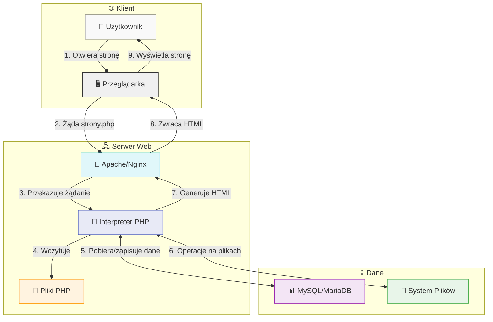

# **PHP - KOMPLETNY PRZEWODNIK**

## **SPIS TREŚCI**

<div style="display: flex; flex-wrap: wrap; gap: 20px;">

<div style="flex: 1; min-width: 250px; background-color: #E0F7FA; border-left: 5px solid #00BCD4; padding: 10px;">
<h3 style="color: #00838F;">📚 PODSTAWY</h3>
<ul style="color: #333333;">
  <li><a href="#1-wprowadzenie-do-php" style="color: #00838F;">1. Wprowadzenie do PHP</a></li>
  <li><a href="#2-podstawy-składni-php" style="color: #00838F;">2. Podstawy składni PHP</a></li>
  <li><a href="#3-zmienne---przechowywanie-danych" style="color: #00838F;">3. Zmienne i typy danych</a></li>
  <li><a href="#4-operatory---wykonywanie-działań-na-danych" style="color: #00838F;">4. Operatory</a></li>
  <li><a href="#5-instrukcje-sterujące---kontrola-przepływu-programu" style="color: #00838F;">5. Instrukcje sterujące</a></li>
</ul>
</div>

<div style="flex: 1; min-width: 250px; background-color: #FFF8E1; border-left: 5px solid #FFB300; padding: 10px;">
<h3 style="color: #FF8F00;">🛠️ NARZĘDZIA I TECHNIKI</h3>
<ul style="color: #333333;">
  <li><a href="#6-funkcje---organizacja-kodu" style="color: #FF8F00;">6. Funkcje</a></li>
  <li><a href="#7-obsługa-formularzy---komunikacja-z-użytkownikiem" style="color: #FF8F00;">7. Obsługa formularzy</a></li>
  <li><a href="#8-praca-z-bazą-danych---trwałe-przechowywanie-danych" style="color: #FF8F00;">8. Bazy danych</a></li>
  <li><a href="#9-sesje-i-ciasteczka---zapamiętywanie-użytkownika" style="color: #FF8F00;">9. Sesje i ciasteczka</a></li>
  <li><a href="#10-obsługa-plików---praca-z-systemem-plików" style="color: #FF8F00;">10. Obsługa plików</a></li>
</ul>
</div>

<div style="flex: 1; min-width: 250px; background-color: #F3E5F5; border-left: 5px solid #9C27B0; padding: 10px;">
<h3 style="color: #6A1B9A;">🔐 BEZPIECZEŃSTWO I DOBRE PRAKTYKI</h3>
<ul style="color: #333333;">
  <li><a href="#11-upload-plików---przyjmowanie-plików-od-użytkowników" style="color: #6A1B9A;">11. Upload plików</a></li>
  <li><a href="#12-obsługa-błędów---debugowanie-i-zarządzanie-problemami" style="color: #6A1B9A;">12. Obsługa błędów</a></li>
  <li><a href="#13-przydatne-funkcje---narzędzia-na-co-dzień" style="color: #6A1B9A;">13. Przydatne funkcje</a></li>
  <li><a href="#14-podstawy-bezpieczeństwa---ochrona-aplikacji" style="color: #6A1B9A;">14. Bezpieczeństwo</a></li>
  <li><a href="#podsumowanie---twoja-droga-z-php" style="color: #6A1B9A;">15. Podsumowanie</a></li>
</ul>
</div>

</div>

---

## **1. Wprowadzenie do PHP**


### Czym jest PHP?

PHP (PHP: Hypertext Preprocessor) to język skryptowy po stronie serwera, zaprojektowany specjalnie do tworzenia dynamicznych stron internetowych. W przeciwieństwie do języków takich jak HTML czy CSS, które działają w przeglądarce użytkownika, PHP wykonuje się na serwerze webowym przed wysłaniem strony do przeglądarki.

### Dlaczego PHP?

<table>
  <tr>
    <td width="50px" align="center">✨</td>
    <td><b>Łatwość nauki:</b> Składnia podobna do C i innych popularnych języków</td>
  </tr>
  <tr>
    <td align="center">🆓</td>
    <td><b>Darmowy i otwarty:</b> Całkowicie bezpłatny do użytku komercyjnego</td>
  </tr>
  <tr>
    <td align="center">🔄</td>
    <td><b>Wszechstronność:</b> Od prostych stron po złożone aplikacje</td>
  </tr>
  <tr>
    <td align="center">👥</td>
    <td><b>Ogromna społeczność:</b> Mnóstwo dokumentacji i pomocy online</td>
  </tr>
  <tr>
    <td align="center">⚡</td>
    <td><b>Szybkość rozwoju:</b> Szybkie prototypowanie i implementacja</td>
  </tr>
</table>

### Jak działa PHP?

<div style="background-color: #E0F7FA; border-left: 5px solid #00BCD4; padding: 10px;">
<h4 style="margin-top: 0;">Proces działania PHP:</h4>
<ol style="color: #333333;">
<li><b>Przeglądarka</b> wysyła żądanie do serwera (np. otwiera stronę.php)</li>
<li><b>Serwer</b> wykonuje kod PHP i generuje HTML</li>
<li><b>HTML</b> jest wysyłany do przeglądarki użytkownika</li>
<li><b>Przeglądarka</b> wyświetla gotową stronę</li>
</ol>
</div>
<div align="center">



</div>

### Konfiguracja środowiska:

<table>
  <tr>
    <td width="50px" align="center">1️⃣</td>
    <td>Zainstaluj <b>XAMPP</b> (Apache + PHP + MySQL)</td>
  </tr>
  <tr>
    <td align="center">2️⃣</td>
    <td>Pliki PHP zapisuj w katalogu <code>htdocs</code></td>
  </tr>
  <tr>
    <td align="center">3️⃣</td>
    <td>Uruchom Apache w panelu XAMPP</td>
  </tr>
  <tr>
    <td align="center">4️⃣</td>
    <td>Otwórz <code>localhost/twoj_plik.php</code> w przeglądarce</td>
  </tr>
</table>

<div style="background-color: #FFF3CD; border-left: 5px solid #FFC107; padding: 10px;">
<h4 style="margin-top: 0;">⚠️ WAŻNE!</h4>
<p style="color: #333333;">Upewnij się, że Twoje pliki mają rozszerzenie <code>.php</code>, a nie <code>.html</code> - inaczej kod PHP nie zostanie przetworzony!</p>
</div>

---

## **2. Podstawy składni PHP**

### Znaczniki PHP - Jak PHP wie, gdzie zaczyna się kod?

<div style="background-color: #EDE7F6; border-left: 5px solid #673AB7; padding: 10px;">
<p style="color: #333333;">PHP musi być wyraźnie oddzielony od HTML. Do tego służą specjalne znaczniki, które informują serwer gdzie zaczyna się i kończy kod PHP.</p>
</div>

```php
<?php
    echo "Hello World!";
?>
```

<table>
  <tr>
    <th>Element składni</th>
    <th>Wyjaśnienie</th>
  </tr>
  <tr>
    <td><code>&lt;?php</code></td>
    <td>Rozpoczyna blok kodu PHP</td>
  </tr>
  <tr>
    <td><code>echo</code></td>
    <td>Polecenie wyświetlające tekst</td>
  </tr>
  <tr>
    <td><code>;</code></td>
    <td>Średnik kończący instrukcję</td>
  </tr>
  <tr>
    <td><code>?&gt;</code></td>
    <td>Kończy blok kodu PHP (opcjonalny na końcu pliku)</td>
  </tr>
</table>

### Osadzanie PHP w HTML - Dynamiczne strony

<div style="background-color: #E8F5E9; border-left: 5px solid #4CAF50; padding: 10px;">
<p style="color: #333333;">Największą siłą PHP jest możliwość mieszania kodu z HTML, co pozwala tworzyć dynamiczne treści w statycznych szablonach.</p>
</div>

```php
<!DOCTYPE html>
<html>
<head>
    <title>PHP w HTML</title>
</head>
<body>
    <h1><?php echo "Dynamiczny tytuł"; ?></h1>
    <p>Dzisiaj jest: <?php echo date("Y-m-d"); ?></p>
</body>
</html>
```

<div style="background-color: #E3F2FD; border-left: 5px solid #2196F3; padding: 10px;">
<h4 style="margin-top: 0;">🔍 Dlaczego to potężne?</h4>
<ul style="color: #333333;">
<li>Treść może się zmieniać w zależności od danych</li>
<li>Jedna strona może wyświetlać różne informacje</li>
<li>Personalizacja strony dla każdego użytkownika</li>
</ul>
</div>

### Komentarze - Dokumentowanie kodu

<div style="background-color: #FEFAF0; border-left: 5px solid #8D6E63; padding: 10px;">
<p style="color: #333333;">Komentarze to tekst ignorowany przez PHP, służący do wyjaśniania kodu. To jak notatki na marginesie, które pomagają zrozumieć kod.</p>
</div>

```php
<?php
// Komentarz jednolinijkowy - wyjaśnia jedną linię
# Także jednolinijkowy (styl Unix)

/*
   Komentarz wielolinijkowy
   Służy do dłuższych wyjaśnień
   lub tymczasowego wyłączania kodu
*/

echo "Ten kod się wykona"; // Komentarz na końcu linii
?>
```

---

## **3. Zmienne - Przechowywanie danych**

### Czym są zmienne?

</div>

<div style="background-color: #F3E5F5; border-left: 5px solid #9C27B0; padding: 10px;">
<p style="color: #333333;">Zmienna to "pojemnik" na dane, który ma nazwę i może przechowywać różne wartości. To jak opisane pudełko, w którym możesz przechowywać różne rzeczy.</p>
</div>

### Dlaczego używamy zmiennych?

<table>
  <tr>
    <td width="50px" align="center">📦</td>
    <td><b>Przechowywanie danych:</b> Nazwa użytkownika, wiek, cena produktu</td>
  </tr>
  <tr>
    <td align="center">🔄</td>
    <td><b>Wielokrotne wykorzystanie:</b> Jedna wartość w wielu miejscach</td>
  </tr>
  <tr>
    <td align="center">📈</td>
    <td><b>Dynamiczność:</b> Wartości mogą się zmieniać podczas działania programu</td>
  </tr>
</table>

```php
<?php
$imie = "Jan";          // String (tekst)
$wiek = 25;             // Integer (liczba całkowita)
$wzrost = 175.5;        // Float (liczba dziesiętna)
$czyAktywny = true;     // Boolean (prawda/fałsz)
$pusty = null;          // NULL (brak wartości)

echo "Witaj $imie, masz $wiek lat";
?>
```

### Nazewnictwo zmiennych - Ważne zasady

<div style="background-color: #FFEBEE; border-left: 5px solid #F44336; padding: 10px;">
<h4 style="margin-top: 0; style="color: #333333;"">⚠️ Zasady nazewnictwa</h4>
<ul style="color: #333333;">
<li>Zawsze zaczynaj od znaku <code>$</code></li>
<li>Po <code>$</code> musi być litera lub znak podkreślenia (<code>_</code>)</li>
<li>Może zawierać litery, cyfry, <code>_</code></li>
<li>Wielkość liter ma znaczenie: <code>$imie</code> ≠ <code>$Imie</code></li>
<li>Używaj opisowych nazw: <code>$wiekUzytkownika</code> zamiast <code>$w</code></li>
</ul>
</div>

<div style="background-color: #E8EAF6; border-left: 5px solid #3F51B5; padding: 10px;">
<p style="color: #333333;">Stałe to wartości, które po zdefiniowaniu nie mogą się zmienić. Są jak wyryte w kamieniu napisy - raz zapisane, nie mogą być zmienione.</p>
</div>

<div style="background-color: #FBE9E7; border-left: 5px solid #FF5722; padding: 10px;">
<p style="color: #333333;">Tablica to zmienna, która może przechowywać wiele wartości jednocześnie. Wyobraź sobie szufladę z przegródkami - każda przegródka może zawierać inną rzecz.</p>
</div>
<p>

```php
<?php
// Tablica indeksowana (numerowana od 0)
$owoce = array("jabłko", "banan", "gruszka");
$owoce = ["jabłko", "banan", "gruszka"]; // Nowsza składnia

// Tablica asocjacyjna (klucz => wartość)
$osoba = array(
    "imie" => "Anna",
    "wiek" => 30,
    "miasto" => "Warszawa"
);

// Wyświetlanie
echo $owoce[0];           // jabłko (pierwszy element)
echo $osoba["imie"];      // Anna

// Dodawanie elementów
$owoce[] = "pomarańcza";               // Dodaje na koniec
$osoba["email"] = "anna@email.com";    // Dodaje nowy klucz
?>
```

<!-- Wizualizacja podstawowych tablic -->
<div style="display: flex; flex-wrap: wrap; gap: 20px; margin: 20px 0;">
    <!-- Przykład tablicy indeksowanej -->
    <div style="flex: 1; min-width: 300px; border-radius: 8px; overflow: hidden;">
        <div style="background-color: #4CAF50; color: white; padding: 8px; text-align: center; font-weight: bold;">
            Tablica indeksowana $owoce
        </div>
        <table style="width: 100%; border-collapse: collapse; background-color: white;">
            <tr style="background-color: #E8F5E9;">
                <th style="padding: 8px; border-right: 1px solid #C8E6C9; color: #1B5E20; font-weight: bold;">Indeks</th>
                <th style="padding: 8px; color: #1B5E20; font-weight: bold;">Wartość</th>
            </tr>
            <tr>
                <td style="padding: 8px; border-right: 1px solid #C8E6C9; text-align: center; color: #2E7D32; background-color: #F1F8E9;">0</td>
                <td style="padding: 8px; color:rgb(136, 109, 13)">jabłko</td>
            </tr>
            <tr>
                <td style="padding: 8px; border-right: 1px solid #C8E6C9; text-align: center; color: #2E7D32; background-color: #F1F8E9;">1</td>
                <td style="padding: 8px; color:rgb(136, 109, 13)">banan</td>
            </tr>
            <tr>
                <td style="padding: 8px; border-right: 1px solid #C8E6C9; text-align: center; color: #2E7D32; background-color: #F1F8E9;">2</td>
                <td style="padding: 8px; color:rgb(136, 109, 13)" >gruszka</td>
            </tr>
        </table>
    </div>

<div style="flex: 1; min-width: 300px; border-radius: 8px; overflow: hidden;">
        <div style="background-color: #FF9800; color: white; padding: 8px; text-align: center; font-weight: bold;">
            Tablica asocjacyjna $osoba
        </div>
        <table style="width: 100%; border-collapse: collapse; background-color: white;">
            <tr style="background-color: #FFF3E0;">
                <th style="padding: 8px; border-right: 1px solid #FFECB3; color: #E65100; font-weight: bold;">Klucz</th>
                <th style="padding: 8px; color: #E65100; font-weight: bold;">Wartość</th>
            </tr>
            <tr>
                <td style="padding: 8px; border-right: 1px solid #FFECB3; text-align: center; color: #FF6D00; background-color: #FFF8E1;">imie</td>
                <td style="padding: 8px; color:rgb(149, 25, 25)" >Anna</td>
            </tr>
            <tr>
                <td style="padding: 8px; border-right: 1px solid #FFECB3; text-align: center; color: #FF6D00; background-color: #FFF8E1;">wiek</td>
                <td style="padding: 8px; color:rgb(149, 25, 25)">30</td>
            </tr>
            <tr>
                <td style="padding: 8px; border-right: 1px solid #FFECB3; text-align: center; color: #FF6D00; background-color: #FFF8E1;">miasto</td>
                <td style="padding: 8px; color:rgb(149, 25, 25)">Warszawa</td>
            </tr>
        </table>
    </div>

</div>

<div style="background-color: #E3F2FD; border-left: 5px solid #2196F3; padding: 10px; margin-top: 20px;">
<h4 style="margin-top: 0;">💡 Wskazówki dotyczące pracy z tablicami</h4>
<ul style="color: #333333;">
  <li>Używaj <code>foreach</code> do iteracji po tablicach - jest prostsze i czytelniejsze</li>
  <li>Sprawdzaj istnienie kluczy w tablicach asocjacyjnych za pomocą <code>isset()</code> lub <code>array_key_exists()</code></li>
  <li>Używaj funkcji <code>array_values()</code>, aby przenieść indeksy po usunięciu elementów</li>
  <li>Dokumentuj złożone struktury tablic, aby ułatwić sobie i innym zrozumienie kodu</li>
  <li>Regularnie przeglądaj i refaktoryzuj kod, aby unikać nadmiarowości i poprawić wydajność</li>
</ul>
</div>

---

## **4. Operatory - Wykonywanie działań na danych**

### Operatory arytmetyczne - Matematyka w PHP

<div style="background-color: #E1F5FE; border-left: 5px solid #03A9F4; padding: 10px;">
<p style="color: #333333;">Operatory arytmetyczne pozwalają wykonywać działania matematyczne na liczbach, tak samo jak w matematyce szkolnej.</p>
</div>

<table>
  <tr>
    <th>Operator</th>
    <th>Nazwa</th>
    <th>Przykład</th>
    <th>Wynik</th>
  </tr>
  <tr>
    <td><code>+</code></td>
    <td>Dodawanie</td>
    <td><code>$a = 10 + 5;</code></td>
    <td>15</td>
  </tr>
  <tr>
    <td><code>-</code></td>
    <td>Odejmowanie</td>
    <td><code>$b = 10 - 5;</code></td>
    <td>5</td>
  </tr>
  <tr>
    <td><code>*</code></td>
    <td>Mnożenie</td>
    <td><code>$c = 10 * 5;</code></td>
    <td>50</td>
  </tr>
  <tr>
    <td><code>/</code></td>
    <td>Dzielenie</td>
    <td><code>$d = 10 / 5;</code></td>
    <td>2</td>
  </tr>
  <tr>
    <td><code>%</code></td>
    <td>Modulo (reszta)</td>
    <td><code>$e = 10 % 3;</code></td>
    <td>1 (reszta z dzielenia)</td>
  </tr>
  <tr>
    <td><code>**</code></td>
    <td>Potęgowanie</td>
    <td><code>$f = 2 ** 3;</code></td>
    <td>8 (2 do potęgi 3)</td>
  </tr>
</table>

<div style="background-color: #E8F5E9; border-left: 5px solid #4CAF50; padding: 10px;">
<h4 style="margin-top: 0;">💡 Zastosowanie praktyczne</h4>
<pre style="color: #333333;">
$cenaNetto = 100;
$stawkaVAT = 0.23;
$kwotaVAT = $cenaNetto * $stawkaVAT;    // 23
$cenaBrutto = $cenaNetto + $kwotaVAT;   // 123
</pre>
</div>

### Operatory porównania - Fundament logiki w PHP

<div style="background-color: #EDE7F6; border-left: 5px solid #673AB7; padding: 10px;">
<p style="color: #333333;">Operatory porównania pozwalają na zestawienie dwóch wartości i sprawdzenie relacji między nimi. Zwracają wartość logiczną <code>true</code> (prawda) lub <code>false</code> (fałsz).</p>
</div>

<table>
  <tr>
    <th>Operator</th>
    <th>Nazwa</th>
    <th>Przykład</th>
    <th>Wynik</th>
  </tr>
  <tr>
    <td><code>==</code></td>
    <td>Równe wartości</td>
    <td><code>5 == "5"</code></td>
    <td><code>true</code> (konwertuje typy)</td>
  </tr>
  <tr>
    <td><code>===</code></td>
    <td>Identyczne (wartość i typ)</td>
    <td><code>5 === "5"</code></td>
    <td><code>false</code> (różne typy)</td>
  </tr>
  <tr>
    <td><code>!=</code></td>
    <td>Różne wartości</td>
    <td><code>5 != "6"</code></td>
    <td><code>true</code></td>
  </tr>
  <tr>
    <td><code>!==</code></td>
    <td>Nieidentyczne</td>
    <td><code>5 !== "5"</code></td>
    <td><code>true</code> (różne typy)</td>
  </tr>
  <tr>
    <td><code>&lt;</code></td>
    <td>Mniejsze niż</td>
    <td><code>5 < 10</code></td>
    <td><code>true</code></td>
  </tr>
  <tr>
    <td><code>&gt;</code></td>
    <td>Większe niż</td>
    <td><code>5 > 10</code></td>
    <td><code>false</code></td>
  </tr>
  <tr>
    <td><code>&lt;=</code></td>
    <td>Mniejsze/równe</td>
    <td><code>5 <= 5</code></td>
    <td><code>true</code></td>
  </tr>
  <tr>
    <td><code>&gt;=</code></td>
    <td>Większe/równe</td>
    <td><code>5 >= 10</code></td>
    <td><code>false</code></td>
  </tr>
</table>

<div style="background-color: #FFEBEE; border-left: 5px solid #F44336; padding: 10px;">
<h4 style="margin-top: 0;">⚠️ Różnica między == a ===</h4>
<ul style="color: #333333;">
<li><code>==</code> porównuje <b>wartość</b> (zawartość), automatycznie konwertując typy</li>
<li><code>===</code> porównuje <b>wartość i typ</b> (muszą być identyczne)</li>
<li>Zalecane jest używanie <code>===</code> dla bezpieczeństwa</li>
</ul>
</div>

### Operatory logiczne - Łączenie warunków w złożone wyrażenia

<div style="background-color: #FFF3E0; border-left: 5px solid #FF9800; padding: 10px;">
<p style="color: #333333;">Operatory logiczne pozwalają łączyć wiele warunków w jedno wyrażenie, podobnie jak w matematycznej logice.</p>
</div>

<table>
  <tr>
    <th>Operator</th>
    <th>Nazwa</th>
    <th>Przykład</th>
    <th>Wynik</th>
  </tr>
  <tr>
    <td><code>&&</code> lub <code>and</code></td>
    <td>AND (i)</td>
    <td><code>$a && $b</code></td>
    <td>Prawda tylko gdy oba są prawdziwe</td>
  </tr>
  <tr>
    <td><code>||</code> lub <code>or</code></td>
    <td>OR (lub)</td>
    <td><code>$a || $b</code></td>
    <td>Prawda gdy przynajmniej jeden jest prawdziwy</td>
  </tr>
  <tr>
    <td><code>!</code></td>
    <td>NOT (negacja)</td>
    <td><code>!$a</code></td>
    <td>Odwraca wartość logiczną</td>
  </tr>
</table>

```php
<?php
$wiek = 25;
$maLicencje = true;

// AND (&&) - oba warunki muszą być prawdziwe
if ($wiek >= 18 && $maLicencje) {
    echo "Może prowadzić samochód"; // To się wykona
}

// OR (||) - jeden z warunków musi być prawdziwy
if ($wiek < 18 || !$maLicencje) {
    echo "Nie może prowadzić samochodu";
}

// Złożone warunki z nawiasami
if (($wiek >= 18 && $maLicencje) || ($wiek >= 16 && $czyKursant)) {
    echo "Może prowadzić pojazd";
}
?>
```

<div style="background-color: #E8F5E9; border-left: 5px solid #4CAF50; padding: 10px;">
<h4 style="margin-top: 0; color: #333333;">💡 Tabela prawdy - jak działają operatory logiczne</h4>
<pre >

AND (&&):
true && true = true
true && false = false
false && true = false
false && false = false

OR (||):
true || true = true
true || false = true
false || true = true
false || false = false

NOT (!):
!true = false
!false = true

</pre>
</div>

---

## **5. Instrukcje sterujące - Kontrola przepływu programu**

### Instrukcje warunkowe - Podejmowanie decyzji

<div style="background-color: #E0F2F1; border-left: 5px solid #009688; padding: 10px;">
<p style="color: #333333;">Instrukcje warunkowe pozwalają na wykonywanie różnych bloków kodu w zależności od spełnienia określonych warunków - to jak rozgałęzienia na drodze. Są podstawowym narzędziem do wprowadzania logiki decyzyjnej w programowaniu.</p>
</div>

#### Instrukcja if

```php
<?php
// Prosta instrukcja if
if (warunek) {
    // Kod wykonywany, gdy warunek jest prawdziwy (true)
}

if ($wiek >= 18) {
    echo "Jesteś dorosły.";
} else {
    // Kod wykonywany, gdy warunek jest fałszywy (false)
}

// Instrukcja if z wieloma alternatywami
if (warunek1) {
    // Kod wykonywany, gdy warunek1 jest prawdziwy
} elseif (warunek2) {
    // Kod wykonywany, gdy warunek1 jest fałszywy, ale warunek2 jest prawdziwy
} else {
    // Kod wykonywany, gdy wszystkie powyższe warunki są fałszywe
}
?>
```

##### Przykład podstawowy:

```php
<?php
$wiek = 20;

if ($wiek < 13) {
    echo "Dziecko";
} elseif ($wiek < 18) {
    echo "Nastolatek";
} else {
    echo "Dorosły";
}
?>
```

#### Instrukcja switch

```php
<?php
$kolor = "zielony";

switch ($kolor) {
    case "czerwony":
        echo "Wybrałeś kolor czerwony!";
        break;
    case "zielony":
        echo "Wybrałeś kolor zielony!";
        break;
    case "niebieski":
        echo "Wybrałeś kolor niebieski!";
        break;
    default:
        echo "Nieznany kolor!";
}
?>
```

### Pętle - powtarzanie działań

<div style="background-color: #E1F5FE; border-left: 5px solid #03A9F4; padding: 10px;">
<p style="color: #333333;">Pętle pozwalają na wielokrotne wykonywanie tego samego fragmentu kodu, co jest niezwykle przydatne przy pracy z dużymi zbiorami danych.</p>
</div>

#### Pętla while

```php
<?php
$licznik = 1;

while ($licznik <= 5) {
    echo "Licznik: $licznik<br>";
    $licznik++;
}
?>
```

#### Pętla do...while

```php
<?php
$licznik = 1;

do {
    echo "Licznik: $licznik<br>";
    $licznik++;
} while ($licznik <= 5);
?>
```

#### Pętla for

```php
<?php
for ($i = 1; $i <= 5; $i++) {
    echo "Liczba: $i<br>";
}

// Przykład z tablicą
$owoce = ["jabłko", "banan", "gruszka"];

for ($i = 0; $i < count($owoce); $i++) {
    echo "Owoc: " . $owoce[$i] . "<br>";
}
?>
```

---

## **6. Funkcje - Organizacja kodu**

### Czym są funkcje?


<div style="background-color: #E8EAF6; border-left: 5px solid #3F51B5; padding: 10px;">
<p style="color: #333333;">Funkcja to nazwany blok kodu, który można wywołać wielokrotnie. Funkcje są jak mini-programy wewnątrz programu głównego, które wykonują określone zadanie.</p>
</div>

### Dlaczego funkcje są ważne?

<table>
  <tr>
    <td width="50px" align="center">🔁</td>
    <td><b>Eliminacja powtórzeń:</b> Napisz kod raz, używaj wielokrotnie</td>
  </tr>
  <tr>
    <td align="center">🧩</td>
    <td><b>Organizacja:</b> Podział dużego problemu na mniejsze części</td>
  </tr>
  <tr>
    <td align="center">🧪</td>
    <td><b>Łatwość testowania:</b> Każda funkcja testowana osobno</td>
  </tr>
  <tr>
    <td align="center">♻️</td>
    <td><b>Ponowne wykorzystanie:</b> Te same funkcje w różnych projektach</td>
  </tr>
</table>

### Definiowanie i wywoływanie funkcji

```php
<?php
// Definicja funkcji
function powitaj($imie) {
    return "Witaj, $imie!";
}

// Wywołanie funkcji
$komunikat = powitaj("Anna");
echo $komunikat; // Witaj, Anna!

// Funkcja z domyślną wartością parametru
function obliczPodatek($kwota, $stawka = 0.23) {
    return $kwota * $stawka;
}

echo obliczPodatek(100);      // 23 (użyje domyślnej stawki)
echo obliczPodatek(100, 0.1); // 10 (użyje podanej stawki)
?>
```

<div style="background-color: #E3F2FD; border-left: 5px solid #2196F3; padding: 10px;">
<h4 style="margin-top: 0;">🧠 Anatomia funkcji</h4>
<ul style="color: #333333;">
<li><b>Słowo kluczowe <code>function</code></b> - deklaruje funkcję</li>
<li><b>Nazwa funkcji</b> - najlepiej opisowa, co funkcja robi</li>
<li><b>Parametry</b> - dane wejściowe w nawiasach ()</li>
<li><b>Ciało funkcji</b> - kod do wykonania w nawiasach {}</li>
<li><b>Instrukcja <code>return</code></b> - określa co funkcja zwraca</li>
</ul>
</div>

### Funkcje wbudowane - Gotowe narzędzia PHP

<div style="background-color: #FFF8E1; border-left: 5px solid #FFB300; padding: 10px;">
PHP zawiera setki gotowych funkcji, które możesz od razu używać w swoich skryptach. Poznanie najważniejszych z nich znacznie przyspieszy Twoją pracę.
</div>

#### Funkcje dla tekstu (string)

<table>
  <tr>
    <th>Funkcja</th>
    <th>Działanie</th>
    <th>Przykład</th>
    <th>Wynik</th>
  </tr>
  <tr>
    <td><code>strlen()</code></td>
    <td>Długość tekstu</td>
    <td><code>strlen("PHP")</code></td>
    <td>3</td>
  </tr>
  <tr>
    <td><code>strtoupper()</code></td>
    <td>Zamienia na wielkie litery</td>
    <td><code>strtoupper("php")</code></td>
    <td>"PHP"</td>
  </tr>
  <tr>
    <td><code>strtolower()</code></td>
    <td>Zamienia na małe litery</td>
    <td><code>strtolower("PHP")</code></td>
    <td>"php"</td>
  </tr>
  <tr>
    <td><code>str_replace()</code></td>
    <td>Zamienia tekst</td>
    <td><code>str_replace("PHP", "JS", "Lubię PHP")</code></td>
    <td>"Lubię JS"</td>
  </tr>
  <tr>
    <td><code>substr()</code></td>
    <td>Fragment tekstu</td>
    <td><code>substr("PHP jest super", 0, 3)</code></td>
    <td>"PHP"</td>
  </tr>
</table>

#### Funkcje dla tablic (array)

<table>
  <tr>
    <th>Funkcja</th>
    <th>Działanie</th>
    <th>Przykład</th>
  </tr>
  <tr>
    <td><code>count()</code></td>
    <td>Liczba elementów</td>
    <td><code>count([1,2,3])</code> → 3</td>
  </tr>
  <tr>
    <td><code>sort()</code></td>
    <td>Sortuje rosnąco</td>
    <td><code>sort($tablica)</code></td>
  </tr>
  <tr>
    <td><code>array_push()</code></td>
    <td>Dodaje element na koniec</td>
    <td><code>array_push($tablica, "nowy")</code></td>
  </tr>
  <tr>
    <td><code>in_array()</code></td>
    <td>Sprawdza czy element istnieje</td>
    <td><code>in_array("PHP", $jezyki)</code> → true/false</td>
  </tr>
  <tr>
    <td><code>array_merge()</code></td>
    <td>Łączy tablice</td>
    <td><code>array_merge($tab1, $tab2)</code></td>
  </tr>
</table>

<div style="background-color: #E8F5E9; border-left: 5px solid #4CAF50; padding: 10px;">
<h4 style="margin-top: 0;">💡 Porada</h4>
<p style="color: #333333;">Gdy nie wiesz jak coś zrobić w PHP, najpierw sprawdź czy nie istnieje już gotowa funkcja! Dokumentacja PHP zawiera wszystkie wbudowane funkcje: <a href="https://www.php.net/manual/en/funcref.php">php.net/manual</a></p>
</div>

---

## **7. Tablice - Efektywne zarządzanie zbiorami danych**

<div style="background-color: #E8F5E9; border-left: 5px solid #4CAF50; padding: 10px;">
<p style="color: #333333;">Tablice to jedne z najpotężniejszych struktur danych w PHP. Pozwalają na przechowywanie wielu wartości pod jedną nazwą zmiennej, co znacząco ułatwia zarządzanie powiązanymi danymi.</p>
</div>

### Czym są tablice i dlaczego są tak ważne?

<table>
  <tr>
    <td width="50px" align="center">📦</td>
    <td><b>Organizacja danych:</b> Przechowywanie wielu wartości w jednej strukturze</td>
  </tr>
  <tr>
    <td align="center">🔍</td>
    <td><b>Efektywny dostęp:</b> Szybkie pobieranie danych przez indeks lub klucz</td>
  </tr>
  <tr>
    <td align="center">🔄</td>
    <td><b>Elastyczność:</b> Dynamiczne dodawanie i usuwanie elementów</td>
  </tr>
  <tr>
    <td align="center">🧩</td>
    <td><b>Złożone struktury:</b> Możliwość tworzenia wielowymiarowych struktur danych</td>
  </tr>
</table>

### Rodzaje tablic w PHP

<div style="background-color: #E3F2FD; border-left: 5px solid #2196F3; padding: 10px;">
<h4 style="margin-top: 0;">PHP oferuje trzy główne typy tablic:</h4>
<ul style="color: #333333;">
<li><strong>Tablice indeksowane</strong> - używają liczb jako kluczy/indeksów (domyślnie od 0)</li>
<li><strong>Tablice asocjacyjne</strong> - używają nazw jako kluczy (zamiast liczb)</li>
<li><strong>Tablice wielowymiarowe</strong> - tablice zawierające inne tablice</li>
</ul>
</div>

### Tworzenie tablic

#### Tablice indeksowane

```php
<?php
// Metoda 1: Używanie funkcji array()
$owoce = array("jabłko", "banan", "pomarańcza");

// Metoda 2: Składnia krótka (zalecana od PHP 5.4+)
$kolory = ["czerwony", "zielony", "niebieski"];

// Metoda 3: Tworzenie element po elemencie
$liczby = [];
$liczby[] = 10;  // Stanie się $liczby[0]
$liczby[] = 20;  // Stanie się $liczby[1]
$liczby[] = 30;  // Stanie się $liczby[2]

// Dostęp do elementów przez indeks
echo $owoce[0];    // Wyświetli: jabłko
echo $kolory[1];   // Wyświetli: zielony
echo $liczby[2];   // Wyświetli: 30
?>
```

#### Tablice asocjacyjne

```php
<?php
// Metoda 1: Używanie funkcji array() z kluczami
$osoba = array(
    "imie" => "Anna",
    "wiek" => 30,
    "miasto" => "Warszawa"
);

// Metoda 2: Składnia krótka
$produkt = [
    "nazwa" => "Laptop",
    "cena" => 3500,
    "dostepny" => true
];

// Metoda 3: Tworzenie element po elemencie
$konfiguracja = [];
$konfiguracja["temat"] = "ciemny";
$konfiguracja["jezyk"] = "pl";
$konfiguracja["powiadomienia"] = false;

// Dostęp do elementów przez klucz
echo $osoba["imie"];                 // Wyświetli: Anna
echo $produkt["cena"] . " zł";       // Wyświetli: 3500 zł
echo $konfiguracja["jezyk"];         // Wyświetli: pl
?>
```

#### Tablice wielowymiarowe

```php
<?php
// Tablica dwuwymiarowa (tablica tablic)
$uczniowie = [
    ["Jan", "Kowalski", "5A", [4, 5, 3, 4]],
    ["Anna", "Nowak", "5B", [5, 5, 4, 5]],
    ["Piotr", "Wiśniewski", "5A", [3, 4, 4, 3]]
];

// Dostęp do danych
echo $uczniowie[0][0]; // Wyświetli: Jan (imię pierwszego ucznia)
echo $uczniowie[1][3][2]; // Wyświetli: 4 (trzecia ocena drugiego ucznia)

// Tablica wielowymiarowa z kluczami asocjacyjnymi
$produkty = [
    "elektronika" => [
        ["nazwa" => "Laptop", "cena" => 3500],
        ["nazwa" => "Smartfon", "cena" => 1800]
    ],
    "ksiazki" => [
        ["nazwa" => "PHP dla początkujących", "cena" => 49],
        ["nazwa" => "Mistrz programowania", "cena" => 59]
    ]
];

// Dostęp do danych
echo $produkty["elektronika"][0]["nazwa"]; // Wyświetli: Laptop
echo $produkty["ksiazki"][1]["cena"]; // Wyświetli: 59
?>
```

### Operacje na tablicach

#### Dodawanie elementów

```php
<?php
// Do tablicy indeksowanej
$owoce = ["jabłko", "banan"];
$owoce[] = "pomarańcza";  // Dodaje na koniec tablicy
array_push($owoce, "gruszka", "śliwka");  // Dodaje wiele elementów na koniec

// Do tablicy asocjacyjnej
$osoba = ["imie" => "Jan", "nazwisko" => "Kowalski"];
$osoba["wiek"] = 30;  // Dodaje nowy element z kluczem "wiek"
$osoba["miasto"] = "Kraków";  // Dodaje nowy element z kluczem "miasto"

// Wyświetlanie zawartości
print_r($owoce);  // Array ( [0] => jabłko [1] => banan [2] => pomarańcza [3] => gruszka [4] => śliwka )
print_r($osoba);  // Array ( [imie] => Jan [nazwisko] => Kowalski [wiek] => 30 [miasto] => Kraków )
?>
```

#### Usuwanie elementów

```php
<?php
$owoce = ["jabłko", "banan", "pomarańcza", "gruszka"];

// Usuwanie pojedynczego elementu
unset($owoce[1]); // Usuwa "banan" (indeks 1)
print_r($owoce);  // Array ( [0] => jabłko [2] => pomarańcza [3] => gruszka )

// UWAGA: unset() nie resetuje kluczy! Teraz indeks 1 nie istnieje

// Resetowanie indeksów
$owoce = array_values($owoce);
print_r($owoce);  // Array ( [0] => jabłko [1] => pomarańcza [2] => gruszka )

// Usuwanie ostatniego elementu
$ostatni = array_pop($owoce);
echo "Usunięto: " . $ostatni; // Wyświetli: Usunięto: gruszka

// Usuwanie pierwszego elementu
$pierwszy = array_shift($owoce);
echo "Usunięto: " . $pierwszy; // Wyświetli: Usunięto: jabłko
?>
```

#### Wyszukiwanie w tablicach

```php
<?php
$owoce = ["jabłko", "banan", "pomarańcza", "gruszka"];

// Sprawdzanie czy element istnieje
if (in_array("banan", $owoce)) {
    echo "Znaleziono banana!<br>";
}

// Znajdowanie indeksu elementu
$indeks = array_search("pomarańcza", $owoce);
echo "Pomarańcza jest pod indeksem: " . $indeks . "<br>"; // Wyświetli: 2

// Sprawdzanie czy klucz istnieje
$osoba = ["imie" => "Jan", "wiek" => 30];

if (array_key_exists("imie", $osoba)) {
    echo "Klucz 'imie' istnieje<br>";
}

// Bezpieczny dostęp do kluczy, które mogą nie istnieć
$zawod = isset($osoba["zawod"]) ? $osoba["zawod"] : "nieznany";
echo "Zawód: " . $zawod . "<br>"; // Wyświetli: Zawód: nieznany

// Lub używając operatora null coalescing (PHP 7+)
$zawod = $osoba["zawod"] ?? "nieznany";
echo "Zawód: " . $zawod . "<br>"; // Wyświetli: Zawód: nieznany
?>
```

#### Iteracja po tablicach

```php
<?php
$owoce = ["jabłko", "banan", "pomarańcza", "gruszka"];

echo "<h3>Pętla foreach z wartościami:</h3>";
foreach ($owoce as $owoc) {
    echo $owoc . "<br>";
}

echo "<h3>Pętla foreach z kluczami i wartościami:</h3>";
foreach ($owoce as $indeks => $owoc) {
    echo "Indeks $indeks: $owoc<br>";
}

// Iteracja po tablicy asocjacyjnej
$osoba = [
    "imie" => "Jan",
    "nazwisko" => "Kowalski",
    "wiek" => 30,
    "miasto" => "Warszawa"
];

echo "<h3>Tablica asocjacyjna:</h3>";
foreach ($osoba as $klucz => $wartosc) {
    echo "$klucz: $wartosc<br>";
}
?>
```

#### Sortowanie tablic

```php
<?php
$liczby = [5, 2, 8, 1, 9];
$owoce = ["jabłko", "banan", "pomarańcza", "gruszka"];
$osoby = [
    ["imie" => "Jan", "wiek" => 30],
    ["imie" => "Anna", "wiek" => 25],
    ["imie" => "Piotr", "wiek" => 35]
];

// Sortowanie tablicy liczbowej (rosnąco)
sort($liczby);
echo "Posortowane liczby: " . implode(", ", $liczby) . "<br>";
// Wyświetli: Posortowane liczby: 1, 2, 5, 8, 9

// Sortowanie tablicy tekstowej (alfabetycznie)
sort($owoce);
echo "Posortowane owoce: " . implode(", ", $owoce) . "<br>";
// Wyświetli: Posortowane owoce: banan, gruszka, jabłko, pomarańcza

// Tablica asocjacyjna - sortowanie według wartości
$produkty = ["laptop" => 3500, "mysz" => 120, "monitor" => 1000];

// Sortowanie według wartości (cen) rosnąco
asort($produkty);
echo "<h3>Produkty według ceny (rosnąco):</h3>";
foreach ($produkty as $nazwa => $cena) {
    echo "$nazwa: $cena zł<br>";
}
// Wyświetli: mysz: 120 zł, monitor: 1000 zł, laptop: 3500 zł

// Sortowanie według kluczy (nazw produktów) alfabetycznie
ksort($produkty);
echo "<h3>Produkty alfabetycznie:</h3>";
foreach ($produkty as $nazwa => $cena) {
    echo "$nazwa: $cena zł<br>";
}
// Wyświetli: laptop: 3500 zł, monitor: 1000 zł, mysz: 120 zł

// Sortowanie tablicy złożonej według określonego pola
usort($osoby, function($a, $b) {
    return $a["wiek"] <=> $b["wiek"]; // Operator porównania (PHP 7+)
});

echo "<h3>Osoby według wieku:</h3>";
foreach ($osoby as $osoba) {
    echo "{$osoba['imie']}: {$osoba['wiek']} lat<br>";
}
// Wyświetli: Anna: 25 lat, Jan: 30 lat, Piotr: 35 lat
?>
```

### Przydatne funkcje do pracy z tablicami

<div style="overflow-x: auto; margin: 20px 0;">
<table style="width: 100%; border-collapse: collapse; background-color: white; box-shadow: 0 2px 4px rgba(0,0,0,0.1);">
  <thead>
    <tr style="background-color: #3F51B5; color: white;">
      <th style="padding: 12px 15px;">Kategoria</th>
      <th style="padding: 12px 15px;">Funkcja</th>
      <th style="padding: 12px 15px;">Opis</th>
      <th style="padding: 12px 15px;">Przykład</th>
    </tr>
  </thead>
  <tbody>
    <tr style="border-bottom: 1px solid #ddd;">
      <td style="padding: 12px 15px; background-color: #E8EAF6;" rowspan="3"><strong>Informacje</strong></td>
      <td style="padding: 12px 15px;"><code>count()</code></td>
      <td style="padding: 12px 15px;">Zlicza elementy w tablicy</td>
      <td style="padding: 12px 15px;"><code>count($owoce)</code> → 3</td>
    </tr>
    <tr style="border-bottom: 1px solid #ddd;">
      <td style="padding: 12px 15px;"><code>array_key_exists()</code></td>
      <td style="padding: 12px 15px;">Sprawdza, czy klucz istnieje</td>
      <td style="padding: 12px 15px;"><code>array_key_exists("imie", $osoba)</code> → true</td>
    </tr>
    <tr style="border-bottom: 1px solid #ddd;">
      <td style="padding: 12px 15px;"><code>in_array()</code></td>
      <td style="padding: 12px 15px;">Sprawdza, czy wartość jest w tablicy</td>
      <td style="padding: 12px 15px;"><code>in_array("jabłko", $owoce)</code> → true</td>
    </tr>
    <tr style="border-bottom: 1px solid #ddd;">
      <td style="padding: 12px 15px; background-color: #FFF3E0;" rowspan="4"><strong>Sortowanie</strong></td>
      <td style="padding: 12px 15px;"><code>sort()</code></td>
      <td style="padding: 12px 15px;">Sortuje tablicę rosnąco</td>
      <td style="padding: 12px 15px;"><code>sort($owoce);</code> // modyfikuje oryginalną tablicę</td>
    </tr>
    <tr style="border-bottom: 1px solid #ddd;">
      <td style="padding: 12px 15px;"><code>rsort()</code></td>
      <td style="padding: 12px 15px;">Sortuje tablicę malejąco</td>
      <td style="padding: 12px 15px;"><code>rsort($liczby);</code></td>
    </tr>
    <tr style="border-bottom: 1px solid #ddd;">
      <td style="padding: 12px 15px;"><code>asort()</code></td>
      <td style="padding: 12px 15px;">Sortuje wartości zachowując klucze</td>
      <td style="padding: 12px 15px;"><code>asort($osoba);</code></td>
    </tr>
    <tr style="border-bottom: 1px solid #ddd;">
      <td style="padding: 12px 15px;"><code>ksort()</code></td>
      <td style="padding: 12px 15px;">Sortuje według kluczy</td>
      <td style="padding: 12px 15px;"><code>ksort($osoba);</code></td>
    </tr>
    <tr style="border-bottom: 1px solid #ddd;">
      <td style="padding: 12px 15px; background-color: #E8F5E9;" rowspan="4"><strong>Transformacje</strong></td>
      <td style="padding: 12px 15px;"><code>array_map()</code></td>
      <td style="padding: 12px 15px;">Aplikuje funkcję do każdego elementu</td>
      <td style="padding: 12px 15px;"><code>array_map('strtoupper', $owoce)</code></td>
    </tr>
    <tr style="border-bottom: 1px solid #ddd;">
      <td style="padding: 12px 15px;"><code>array_filter()</code></td>
      <td style="padding: 12px 15px;">Filtruje elementy wg funkcji</td>
      <td style="padding: 12px 15px;"><code>array_filter($liczby, fn($n) => $n > 10)</code></td>
    </tr>
    <tr style="border-bottom: 1px solid #ddd;">
      <td style="padding: 12px 15px;"><code>array_reduce()</code></td>
      <td style="padding: 12px 15px;">Redukuje tablicę do wartości</td>
      <td style="padding: 12px 15px;"><code>array_reduce($liczby, fn($a,$b) => $a+$b, 0)</code></td>
    </tr>
    <tr style="border-bottom: 1px solid #ddd;">
      <td style="padding: 12px 15px;"><code>array_merge()</code></td>
      <td style="padding: 12px 15px;">Łączy tablice</td>
      <td style="padding: 12px 15px;"><code>array_merge($t1, $t2)</code></td>
    </tr>
    <tr style="border-bottom: 1px solid #ddd;">
      <td style="padding: 12px 15px; background-color: #E0F7FA;" rowspan="3"><strong>Ekstrakcja</strong></td>
      <td style="padding: 12px 15px;"><code>array_slice()</code></td>
      <td style="padding: 12px 15px;">Pobiera fragment tablicy</td>
      <td style="padding: 12px 15px;"><code>array_slice($owoce, 1, 2)</code></td>
    </tr>
    <tr style="border-bottom: 1px solid #ddd;">
      <td style="padding: 12px 15px;"><code>array_keys()</code></td>
      <td style="padding: 12px 15px;">Zwraca klucze tablicy</td>
      <td style="padding: 12px 15px;"><code>array_keys($osoba)</code></td>
    </tr>
    <tr style="border-bottom: 1px solid #ddd;">
      <td style="padding: 12px 15px;"><code>array_values()</code></td>
      <td style="padding: 12px 15px;">Zwraca wartości tablicy</td>
      <td style="padding: 12px 15px;"><code>array_values($osoba)</code></td>
    </tr>
  </tbody>
</table>
</div>

### Wizualizacja tablic

<!-- Wizualizacja podstawowych tablic -->
<div style="display: flex; flex-wrap: wrap; gap: 20px; margin: 20px 0;">
    <!-- Przykład tablicy indeksowanej -->
    <div style="flex: 1; min-width: 300px; border-radius: 8px; overflow: hidden;">
        <div style="background-color: #4CAF50; color: white; padding: 8px; text-align: center; font-weight: bold;">
            Tablica indeksowana $owoce
        </div>
        <table style="width: 100%; border-collapse: collapse; background-color: white;">
            <tr style="background-color: #E8F5E9;">
                <th style="padding: 8px; border-right: 1px solid #C8E6C9; color: #1B5E20; font-weight: bold;">Indeks</th>
                <th style="padding: 8px; color: #1B5E20; font-weight: bold;">Wartość</th>
            </tr>
            <tr>
                <td style="padding: 8px; border-right: 1px solid #C8E6C9; text-align: center; color: #2E7D32; background-color: #F1F8E9;">0</td>
                <td style="padding: 8px; color:rgb(136, 109, 13)">jabłko</td>
            </tr>
            <tr>
                <td style="padding: 8px; border-right: 1px solid #C8E6C9; text-align: center; color: #2E7D32; background-color: #F1F8E9;">1</td>
                <td style="padding: 8px; color:rgb(136, 109, 13)">banan</td>
            </tr>
            <tr>
                <td style="padding: 8px; border-right: 1px solid #C8E6C9; text-align: center; color: #2E7D32; background-color: #F1F8E9;">2</td>
                <td style="padding: 8px; color:rgb(136, 109, 13)" >gruszka</td>
            </tr>
        </table>
    </div>

  <div style="flex: 1; min-width: 300px; border-radius: 8px; overflow: hidden;">
        <div style="background-color: #FF9800; color: white; padding: 8px; text-align: center; font-weight: bold;">
            Tablica asocjacyjna $osoba
        </div>
        <table style="width: 100%; border-collapse: collapse; background-color: white;">
            <tr style="background-color: #FFF3E0;">
                <th style="padding: 8px; border-right: 1px solid #FFECB3; color: #E65100; font-weight: bold;">Klucz</th>
                <th style="padding: 8px; color: #E65100; font-weight: bold;">Wartość</th>
            </tr>
            <tr>
                <td style="padding: 8px; border-right: 1px solid #FFECB3; text-align: center; color: #FF6D00; background-color: #FFF8E1;">imie</td>
                <td style="padding: 8px; color:rgb(149, 25, 25)" >Anna</td>
            </tr>
            <tr>
                <td style="padding: 8px; border-right: 1px solid #FFECB3; text-align: center; color: #FF6D00; background-color: #FFF8E1;">wiek</td>
                <td style="padding: 8px; color:rgb(149, 25, 25)">30</td>
            </tr>
            <tr>
                <td style="padding: 8px; border-right: 1px solid #FFECB3; text-align: center; color: #FF6D00; background-color: #FFF8E1;">miasto</td>
                <td style="padding: 8px; color:rgb(149, 25, 25)">Warszawa</td>
            </tr>
        </table>
    </div>

</div>

### Zaawansowane operacje na tablicach

#### 1. Łączenie tablic

```php
<?php
$owoce = ["jabłko", "banan", "gruszka"];
$warzywa = ["marchew", "pomidor", "ogórek"];

// Metoda 1: array_merge() - łączy tablice
$zdrowa_zywnosc = array_merge($owoce, $warzywa);
print_r($zdrowa_zywnosc);
// Array ( [0] => jabłko [1] => banan [2] => gruszka [3] => marchew [4] => pomidor [5] => ogórek )

// Metoda 2: operator + (zachowuje unikalne klucze)
$ceny1 = ["jabłko" => 2.5, "banan" => 3.0];
$ceny2 = ["banan" => 2.8, "gruszka" => 4.0]; // Uwaga na duplikaty!

$wszystkie_ceny = $ceny1 + $ceny2; // Zachowa wartości z $ceny1 dla duplikatów
print_r($wszystkie_ceny);
// Array ( [jabłko] => 2.5 [banan] => 3.0 [gruszka] => 4.0 )

// Metoda 3: array_merge_recursive() - dla bardziej złożonych struktur
$produkt1 = ["owoce" => ["jabłko", "banan"], "cena" => 10];
$produkt2 = ["owoce" => ["gruszka"], "kolor" => "czerwony"];

$polaczony = array_merge_recursive($produkt1, $produkt2);
print_r($polaczony);
/*
Array (
    [owoce] => Array (
        [0] => jabłko
        [1] => banan
        [2] => gruszka
    )
    [cena] => 10
    [kolor] => czerwony
)
*/
?>
```

#### 2. Filtrowanie tablic

```php
<?php
$liczby = [1, 2, 3, 4, 5, 6, 7, 8, 9, 10];

// Filtrowanie liczb parzystych
$parzyste = array_filter($liczby, function($n) {
    return $n % 2 === 0;
});
print_r($parzyste); // Array ( [1] => 2 [3] => 4 [5] => 6 [7] => 8 [9] => 10 )

// Krótszy zapis z arrow functions (PHP 7.4+)
$nieparzyste = array_filter($liczby, fn($n) => $n % 2 !== 0);
print_r($nieparzyste); // Array ( [0] => 1 [2] => 3 [4] => 5 [6] => 7 [8] => 9 )

// Filtrowanie z zachowaniem kluczy
$dane = ["jabłko" => 2.5, "banan" => 3.0, "gruszka" => 4.2, "cytryna" => 2.2];

// Produkty droższe niż 3.0
$drogie = array_filter($dane, function($cena) {
    return $cena > 3.0;
});
print_r($drogie); // Array ( [gruszka] => 4.2 )

// Od PHP 5.6 możemy używać ARRAY_FILTER_USE_KEY do filtrowania po kluczach
$owoce_na_c = array_filter($dane, function($klucz) {
    return $klucz[0] === "c"; // Pierwszy znak to "c"
}, ARRAY_FILTER_USE_KEY);
print_r($owoce_na_c); // Array ( [cytryna] => 2.2 )
?>
```

#### 3. Mapowanie tablic

```php
<?php
$liczby = [1, 2, 3, 4, 5];

// Podwojenie każdej liczby
$podwojone = array_map(function($n) {
    return $n * 2;
}, $liczby);
print_r($podwojone); // Array ( [0] => 2 [1] => 4 [2] => 6 [3] => 8 [4] => 10 )

// Mapowanie z wieloma tablicami
$imiona = ["Jan", "Anna", "Piotr"];
$nazwiska = ["Kowalski", "Nowak", "Wiśniewski"];

$pelne_imiona = array_map(function($imie, $nazwisko) {
    return $imie . " " . $nazwisko;
}, $imiona, $nazwiska);
print_r($pelne_imiona); // Array ( [0] => Jan Kowalski [1] => Anna Nowak [2] => Piotr Wiśniewski )

// Mapowanie tablicy asocjacyjnej
$produkty = [
    ["nazwa" => "Laptop", "cena" => 4000],
    ["nazwa" => "Telefon", "cena" => 2000],
    ["nazwa" => "Tablet", "cena" => 1500]
];

// Dodanie podatku VAT (23%)
$z_vatem = array_map(function($produkt) {
    $produkt["cena_z_vat"] = $produkt["cena"] * 1.23;
    return $produkt;
}, $produkty);

foreach ($z_vatem as $produkt) {
    echo "{$produkt['nazwa']}: {$produkt['cena']} zł netto, {$produkt['cena_z_vat']} zł brutto<br>";
}
?>
```

#### 4. Redukowanie tablic

```php
<?php
$liczby = [1, 2, 3, 4, 5];

// Suma wszystkich elementów
$suma = array_reduce($liczby, function($wynik, $element) {
    return $wynik + $element;
}, 0); // 0 to wartość początkowa
echo "Suma: $suma<br>"; // Suma: 15

// Iloczyn wszystkich elementów
$iloczyn = array_reduce($liczby, function($wynik, $element) {
    return $wynik * $element;
}, 1); // 1 to wartość początkowa
echo "Iloczyn: $iloczyn<br>"; // Iloczyn: 120

// Budowanie HTML na podstawie tablicy
$menu = ["Strona główna", "O nas", "Kontakt", "Blog"];

$html = array_reduce($menu, function($html, $element) {
    return $html . "<li><a href='#'>$element</a></li>\n";
}, "<ul>\n") . "</ul>";

echo $html;
/* Wyświetli:
<ul>
<li><a href='#'>Strona główna</a></li>
<li><a href='#'>O nas</a></li>
<li><a href='#'>Kontakt</a></li>
<li><a href='#'>Blog</a></li>
</ul>
*/
?>
```

### Praktyczne przykłady zastosowań tablic

#### 1. Obsługa formularza z wieloma wartościami

```php
<?php
// Symulowane dane z formularza (normalnie byłyby z $_POST)
$dane_formularza = [
    "imie" => "Jan",
    "nazwisko" => "Kowalski",
    "zainteresowania" => ["programowanie", "muzyka", "sport"],
    "jezyki" => ["php", "javascript"]
];

// Walidacja - sprawdzenie, czy wszystkie wymagane pola są wypełnione
$wymagane_pola = ["imie", "nazwisko", "email"];
$brakujace_pola = [];

foreach ($wymagane_pola as $pole) {
    if (!isset($dane_formularza[$pole]) || empty($dane_formularza[$pole])) {
        $brakujace_pola[] = $pole;
    }
}

if (!empty($brakujace_pola)) {
    echo "Proszę wypełnić następujące pola: " . implode(", ", $brakujace_pola);
} else {
    echo "Formularz wypełniony poprawnie!<br>";

    // Wyświetlenie danych z formularza
    echo "Imię i nazwisko: {$dane_formularza['imie']} {$dane_formularza['nazwisko']}<br>";

    if (!empty($dane_formularza["zainteresowania"])) {
        echo "Zainteresowania: " . implode(", ", $dane_formularza["zainteresowania"]) . "<br>";
    }

    if (!empty($dane_formularza["jezyki"])) {
        echo "Języki programowania: " . implode(", ", $dane_formularza["jezyki"]) . "<br>";
    }
}
?>
```

#### 2. Koszyk zakupowy

```php
<?php
// Symulacja koszyka zakupowego z użyciem sesji
session_start();

// Inicjalizacja koszyka, jeśli nie istnieje
if (!isset($_SESSION['koszyk'])) {
    $_SESSION['koszyk'] = [];
}

// Funkcja do dodawania produktu
function dodaj_do_koszyka($id, $nazwa, $cena, $ilosc = 1) {
    // Jeśli produkt już istnieje w koszyku, zwiększ ilość
    if (isset($_SESSION['koszyk'][$id])) {
        $_SESSION['koszyk'][$id]['ilosc'] += $ilosc;
    } else {
        // W przeciwnym razie dodaj nowy produkt
        $_SESSION['koszyk'][$id] = [
            'nazwa' => $nazwa,
            'cena' => $cena,
            'ilosc' => $ilosc
        ];
    }
}

// Funkcja do usuwania produktu
function usun_z_koszyka($id) {
    if (isset($_SESSION['koszyk'][$id])) {
        unset($_SESSION['koszyk'][$id]);
    }
}

// Funkcja do obliczania sumy koszyka
function oblicz_sume_koszyka() {
    $suma = 0;
    foreach ($_SESSION['koszyk'] as $produkt) {
        $suma += $produkt['cena'] * $produkt['ilosc'];
    }
    return $suma;
}

// Symulacja dodawania produktów
dodaj_do_koszyka(1, "Laptop Dell", 3500, 1);
dodaj_do_koszyka(2, "Mysz bezprzewodowa", 120, 2);
dodaj_do_koszyka(1, "Laptop Dell", 3500, 1); // Dodanie kolejnego tego samego produktu

// Wyświetlenie zawartości koszyka
echo "<h3>Zawartość koszyka:</h3>";
echo "<table border='1' cellpadding='5'>";
echo "<tr><th>Produkt</th><th>Cena</th><th>Ilość</th><th>Wartość</th></tr>";

foreach ($_SESSION['koszyk'] as $id => $produkt) {
    $wartosc = $produkt['cena'] * $produkt['ilosc'];
    echo "<tr>";
    echo "<td>{$produkt['nazwa']}</td>";
    echo "<td>{$produkt['cena']} zł</td>";
    echo "<td>{$produkt['ilosc']}</td>";
    echo "<td>{$wartosc} zł</td>";
    echo "</tr>";
}

$suma = oblicz_sume_koszyka();
echo "<tr><td colspan='3' align='right'><strong>SUMA:</strong></td><td>{$suma} zł</td></tr>";
echo "</table>";

// Usunięcie produktu i ponowne obliczenie
usun_z_koszyka(2);
echo "<p>Usunięto produkt o ID 2</p>";

$suma = oblicz_sume_koszyka();
echo "<p>Nowa suma koszyka: {$suma} zł</p>";
?>
```

#### 3. Przetwarzanie danych JSON

```php
<?php
// Przykładowe dane JSON (np. z API)
$json_data = '
{
    "produkty": [
        {"id": 1, "nazwa": "Laptop", "cena": 3500, "kategoria": "elektronika"},
        {"id": 2, "nazwa": "Smartfon", "cena": 2000, "kategoria": "elektronika"},
        {"id": 3, "nazwa": "Książka PHP", "cena": 59, "kategoria": "książki"},
        {"id": 4, "nazwa": "Mysz", "cena": 100, "kategoria": "elektronika"},
        {"id": 5, "nazwa": "Klawiatura", "cena": 150, "kategoria": "elektronika"}
    ]
}
';

// Dekodowanie JSON do tablicy PHP
$dane = json_decode($json_data, true);

// Sprawdzenie czy dekodowanie się powiodło
if (json_last_error() !== JSON_ERROR_NONE) {
    echo "Błąd dekodowania JSON: " . json_last_error_msg();
    exit;
}

// Filtrowanie produktów z kategorii "elektronika"
$elektronika = array_filter($dane['produkty'], function($produkt) {
    return $produkt['kategoria'] === 'elektronika';
});

// Liczenie średniej ceny produktów z kategorii "elektronika"
$suma_cen = array_reduce($elektronika, function($suma, $produkt) {
    return $suma + $produkt['cena'];
}, 0);

$srednia_cena = $suma_cen / count($elektronika);

echo "<h3>Produkty z kategorii elektronika:</h3>";
echo "<ul>";
foreach ($elektronika as $produkt) {
    echo "<li>{$produkt['nazwa']} - {$produkt['cena']} zł</li>";
}
echo "</ul>";
echo "<p>Średnia cena: " . number_format($srednia_cena, 2) . " zł</p>";

// Grupowanie produktów według kategorii
$grupy = [];
foreach ($dane['produkty'] as $produkt) {
    $kategoria = $produkt['kategoria'];
    if (!isset($grupy[$kategoria])) {
        $grupy[$kategoria] = [];
    }
    $grupy[$kategoria][] = $produkt;
}

// Wyświetlenie produktów pogrupowanych według kategorii
echo "<h3>Produkty według kategorii:</h3>";
foreach ($grupy as $kategoria => $produkty) {
    echo "<h4>$kategoria</h4>";
    echo "<ul>";
    foreach ($produkty as $produkt) {
        echo "<li>{$produkt['nazwa']} - {$produkt['cena']} zł</li>";
    }
    echo "</ul>";
}

// Kodowanie tablicy PHP z powrotem do JSON
$nowe_dane = [
    'produkty' => $dane['produkty'],
    'statystyki' => [
        'liczba_produktow' => count($dane['produkty']),
        'liczba_kategorii' => count($grupy),
        'srednia_cena_elektroniki' => $srednia_cena
    ]
];

$json_output = json_encode($nowe_dane, JSON_PRETTY_PRINT);
echo "<h3>Zaktualizowane dane JSON:</h3>";
echo "<pre>" . htmlspecialchars($json_output) . "</pre>";
?>
```

### Najlepsze praktyki pracy z tablicami

<div style="display: flex; flex-wrap: wrap; gap: 20px; margin: 20px 0;">
    <div style="flex: 1; min-width: 300px; background-color: #E8F5E9; border-radius: 8px; padding: 15px; box-shadow: 0 2px 4px rgba(0,0,0,0.1);">
        <h4 style="color: #2E7D32; border-bottom: 1px solid #A5D6A7; padding-bottom: 8px; margin-top: 0;">✅ Co robić</h4>
        <ul style="color: #333; margin-bottom: 0; padding-left: 20px; line-height: 1.5;">
            <li>Używaj <code>[]</code> zamiast przestarzałej funkcji <code>array()</code></li>
            <li>Stosuj opisowe nazwy kluczy w tablicach asocjacyjnych</li>
            <li>Preferuj <code>foreach</code> do iteracji po tablicach</li>
            <li>Sprawdzaj istnienie kluczy przez <code>isset()</code> lub <code>array_key_exists()</code></li>
            <li>Używaj wbudowanych funkcji zamiast własnych pętli</li>
            <li>Dokumentuj strukturę złożonych tablic wielowymiarowych</li>
            <li>Używaj operatora <code>??</code> dla wartości domyślnych (PHP 7+)</li>
            <li>Pamiętaj o użyciu <code>array_values()</code> po <code>unset()</code>, gdy potrzebujesz ciągłości indeksów</li>
        </ul>
    </div>
    
  <div style="flex: 1; min-width: 300px; background-color: #FFEBEE; border-radius: 8px; padding: 15px; box-shadow: 0 2px 4px rgba(0,0,0,0.1);">
        <h4 style="color: #C62828; border-bottom: 1px solid #FFCDD2; padding-bottom: 8px; margin-top: 0;">❌ Czego unikać</h4>
        <ul style="color: #333; margin-bottom: 0; padding-left: 20px; line-height: 1.5;">
            <li>Zbyt głębokiego zagnieżdżania tablic (>3 poziomy)</li>
            <li>Mieszania indeksów numerycznych i asocjacyjnych bez potrzeby</li>
            <li>Używania pętli <code>for</code> dla tablic asocjacyjnych</li>
            <li>Modyfikacji tablicy podczas iteracji (może prowadzić do błędów)</li>
            <li>Tworzenia dużych tablic w pamięci bez potrzeby</li>
            <li>Ponownego obliczania <code>count()</code> w każdej iteracji pętli</li>
            <li>Niejednolitej struktury danych (różne klucze dla podobnych rekordów)</li>
        </ul>
    </div>
</div>

### Wydajność i optymalizacja tablic

<div style="background-color: #FFEBEE; border-left: 5px solid #F44336; padding: 10px; margin-bottom: 20px;">
<h4 style="margin-top: 0;">⚠️ Uwagi dotyczące wydajności</h4>
<p style="color: #333333;">Tablice w PHP są potężne, ale przy niewłaściwym użyciu mogą wpłynąć na wydajność aplikacji:</p>

<ul style="color: #333333;">
  <li><strong>Duże tablice</strong> zużywają znaczną ilość pamięci</li>
  <li><strong>Głębokie zagnieżdżenia</strong> spowalniają dostęp do danych</li>
  <li><strong>Kopiowanie tablic</strong> jest kosztowne - używaj referencji gdy to możliwe</li>
  <li><strong>Funkcja count()</strong> na dużych tablicach może być wolna - zapisuj wynik w zmiennej</li>
</ul>
</div>

```php
<?php
// NIEOPTYMALNE - wyliczanie count() w każdej iteracji
$duza_tablica = range(1, 10000);
for ($i = 0; $i < count($duza_tablica); $i++) {
    // operacje...
}

// OPTYMALNE - wyliczenie count() raz przed pętlą
$duza_tablica = range(1, 10000);
$ilosc = count($duza_tablica);
for ($i = 0; $i < $ilosc; $i++) {
    // operacje...
}

// NIEOPTYMALNE - kopiowanie dużej tablicy
function zmien_dane($tablica) {
    $tablica[0] = 100;  // zmiana dotyczy tylko lokalnej kopii
    return $tablica;
}

// OPTYMALNE - użycie referencji
function zmien_dane_referencyjnie(&$tablica) {
    $tablica[0] = 100;  // zmiana oryginalnej tablicy
}

// Optymalne łączenie wielu tablic
$wynik = array_merge(...$tablice);  // zamiast wielu wywołań array_merge()
?>
```

### Wspólne błędy i jak ich unikać

<div style="background-color: #FFF3CD; border-left: 5px solid #FFC107; padding: 10px; margin-bottom: 20px;">
<h4 style="margin-top: 0;">⚠️ Typowe pułapki</h4>
<p style="color: #333333;">Oto najczęstsze błędy podczas pracy z tablicami w PHP i jak ich unikać:</p>
</div>

#### 1. Problem z odwołaniem do nieistniejącego indeksu

```php
// Problem:
$dane = ["nazwa" => "Produkt"];
echo $dane["cena"]; // Warning: Undefined array key "cena"

// Rozwiązanie:
echo $dane["cena"] ?? "Cena nieustalona"; // Używaj operatora null coalescing
// lub
echo isset($dane["cena"]) ? $dane["cena"] : "Cena nieustalona";
```

#### 2. Problem z referencjami w foreach

```php
// Problem:
$owoce = ["jabłko", "banan", "gruszka"];
foreach ($owoce as &$owoc) {
    $owoc = strtoupper($owoc);
}
// $owoc nadal istnieje jako referencja do ostatniego elementu!
$owoc = "KIWI"; // Nieoczekiwanie zmienia ostatni element tablicy!

// Rozwiązanie:
foreach ($owoce as &$owoc) {
    $owoc = strtoupper($owoc);
}
unset($owoc); // Zawsze usuwaj referencję po pętli foreach z &
```

#### 3. Problem z zagubionymi indeksami

```php
// Problem:
$tablica = [10, 20, 30, 40, 50];
unset($tablica[1]); // Usuwa 20
unset($tablica[3]); // Usuwa 40
// Teraz $tablica = [0 => 10, 2 => 30, 4 => 50] - brakujące indeksy!

// Przy iteracji może być to mylące:
foreach ($tablica as $klucz => $wartosc) {
    echo "$klucz: $wartosc<br>";
}

// Rozwiązanie gdy potrzebujemy ciągłych indeksów:
$tablica = array_values($tablica); // Reset indeksów
// Teraz $tablica = [0 => 10, 1 => 30, 2 => 50]
```

<div style="background-color: #F1F8E9; border-left: 5px solid #8BC34A; padding: 15px; margin: 20px 0; border-radius: 4px; box-shadow: 0 2px 4px rgba(0,0,0,0.1);">
<h4 style="margin-top: 0; color: #33691E;">📝 Najważniejsze wnioski</h4>

<p style="color: #333333; line-height: 1.6;">Tablice to jedna z fundamentalnych struktur danych w PHP, które znacząco upraszczają zarządzanie zbiorami danych. Ich elastyczność i wszechstronność pozwala na:</p>

<ul style="color: #333333; line-height: 1.6;">
<li><strong>Efektywną organizację danych</strong> różnych typów w jednej strukturze</li>
<li><strong>Łatwe przekształcanie i filtrowanie</strong> dużych zbiorów informacji</li>
<li><strong>Reprezentację złożonych struktur</strong> dzięki zagnieżdżonym tablicom</li>
<li><strong>Szybkie wyszukiwanie i dostęp</strong> do danych za pomocą kluczy</li>
</ul>

<p style="color: #333333; line-height: 1.6;">Umiejętność efektywnej pracy z tablicami jest niezbędna do tworzenia wydajnych i czytelnych aplikacji PHP. Pamiętaj o wykorzystaniu wbudowanych funkcji PHP, które często zapewniają najlepszą wydajność i czytelność kodu.</p>
</div>

---

# **8. Funkcje - Organizacja kodu**

<div style="background: linear-gradient(135deg, #667eea 0%, #764ba2 100%); color: white; padding: 20px; border-radius: 12px; box-shadow: 0 8px 32px rgba(0,0,0,0.1); margin-bottom: 30px;">
<h2 style="margin: 0; font-size: 24px; font-weight: 600;">🚀 Wprowadzenie do funkcji w PHP</h2>
<p style="margin: 10px 0 0 0; font-size: 16px; opacity: 0.9;">Funkcje to nazwane bloki kodu, które wykonują określone zadanie i można je wywoływać wielokrotnie. Są fundamentalnym narzędziem organizacji kodu w PHP.</p>
</div>

## **Czym są funkcje?**

<div style="background: linear-gradient(135deg, #f093fb 0%, #f5576c 100%); color: white; padding: 16px; border-radius: 10px; margin: 20px 0;">
<p style="margin: 0; font-size: 15px;">💡 <strong>Analogia:</strong> Wyobraź sobie, że piszesz przepis na ciasto. Zamiast opisywać za każdym razem, jak ubić jajka, możesz stworzyć osobny „podprzepis" o nazwie „Ubij jajka" i używać go wielokrotnie. W programowaniu funkcje działają podobnie!</p>
</div>

**Funkcja** to nazwany blok kodu, który wykonuje określone zadanie i można go wywoływać, kiedy tylko potrzebujesz.

### 🎯 **Funkcja to jak mały pomocnik, który:**

<div style="display: grid; grid-template-columns: repeat(auto-fit, minmax(280px, 1fr)); gap: 15px; margin: 20px 0;">
    <div style="background: linear-gradient(135deg, #4facfe 0%, #00f2fe 100%); color: white; padding: 15px; border-radius: 10px; box-shadow: 0 4px 15px rgba(79, 172, 254, 0.3);">
        <div style="font-size: 24px; margin-bottom: 8px;">⚡</div>
        <h4 style="margin: 0 0 8px 0; font-size: 16px;">Wykonuje konkretną pracę</h4>
        <p style="margin: 0; font-size: 14px; opacity: 0.9;">Oblicza coś lub wyświetla tekst</p>
    </div>
    
<div style="background: linear-gradient(135deg, #43e97b 0%, #38f9d7 100%); color: white; padding: 15px; border-radius: 10px; box-shadow: 0 4px 15px rgba(67, 233, 123, 0.3);">
    <div style="font-size: 24px; margin-bottom: 8px;">♻️</div>
        <h4 style="margin: 0 0 8px 0; font-size: 16px;">Może być użyty wielokrotnie</h4>
        <p style="margin: 0; font-size: 14px; opacity: 0.9;">W różnych miejscach programu</p>
    </div>
    
<div style="background: linear-gradient(135deg, #fa709a 0%, #fee140 100%); color: white; padding: 15px; border-radius: 10px; box-shadow: 0 4px 15px rgba(250, 112, 154, 0.3);">
        <div style="font-size: 24px; margin-bottom: 8px;">🧩</div>
        <h4 style="margin: 0 0 8px 0; font-size: 16px;">Ułatwia organizację</h4>
        <p style="margin: 0; font-size: 14px; opacity: 0.9;">Rozbija kod na mniejsze, łatwiejsze do zrozumienia części</p>
    </div>
</div>

---

## **Dlaczego warto używać funkcji?**

<div style="background: linear-gradient(135deg, #ffecd2 0%, #fcb69f 100%); padding: 16px; border-radius: 10px; margin: 20px 0; color: #2d3436;">
<p style="margin: 0; font-weight: 500;">🧱 <strong>Funkcje są jak klocki LEGO</strong> – pozwalają budować program z mniejszych, wielokrotnie używanych elementów.</p>
</div>

<div style="background: white; border-radius: 12px; overflow: hidden; box-shadow: 0 8px 25px rgba(0,0,0,0.1); margin: 25px 0;">
<table style="width: 100%; border-collapse: collapse;">
  <thead>
    <tr style="background: linear-gradient(135deg, #667eea 0%, #764ba2 100%); color: white;">
      <th style="padding: 16px 20px; text-align: left; font-weight: 600; font-size: 16px;">Korzyść</th>
      <th style="padding: 16px 20px; text-align: left; font-weight: 600; font-size: 16px;">Opis</th>
    </tr>
  </thead>
  <tbody>
    <tr style="border-bottom: 1px solid #f0f0f0;">
      <td style="padding: 16px 20px; font-weight: 600; color: #e74c3c;">🔁 Eliminują powtarzanie kodu</td>
      <td style="padding: 16px 20px; color: #555;">Zamiast pisać ten sam kod kilka razy, piszesz go raz w funkcji i wywołujesz, kiedy potrzebujesz</td>
    </tr>
    <tr style="border-bottom: 1px solid #f0f0f0;">
      <td style="padding: 16px 20px; font-weight: 600; color: #9b59b6;">🧩 Ułatwiają organizację</td>
      <td style="padding: 16px 20px; color: #555;">Duży program dzielisz na mniejsze, czytelne fragmenty</td>
    </tr>
    <tr style="border-bottom: 1px solid #f0f0f0;">
      <td style="padding: 16px 20px; font-weight: 600; color: #3498db;">🧪 Łatwo testować</td>
      <td style="padding: 16px 20px; color: #555;">Możesz sprawdzić, czy funkcja działa poprawnie, nie martwiąc się o resztę programu</td>
    </tr>
    <tr style="border-bottom: 1px solid #f0f0f0;">
      <td style="padding: 16px 20px; font-weight: 600; color: #27ae60;">♻️ Ponowne wykorzystanie</td>
      <td style="padding: 16px 20px; color: #555;">Funkcje można używać w różnych projektach, oszczędzając czas</td>
    </tr>
    <tr>
      <td style="padding: 16px 20px; font-weight: 600; color: #f39c12;">📖 Czytelność kodu</td>
      <td style="padding: 16px 20px; color: #555;">Kod staje się bardziej zrozumiały, bo nazwy funkcji opisują, co robią</td>
    </tr>
  </tbody>
</table>
</div>

---

## **Jak stworzyć i używać funkcję?**

Funkcje w PHP definiuje się za pomocą słowa kluczowego `function`, a następnie wywołuje się je po nazwie. Oto prosty przykład, który wyświetla powitanie:

<div style="background: #2d3748; border-radius: 10px; padding: 20px; margin: 20px 0; position: relative; overflow: hidden;">
<div style="position: absolute; top: 12px; right: 12px; background: rgba(255,255,255,0.1); padding: 4px 8px; border-radius: 4px; font-size: 12px; color: #cbd5e0;">PHP</div>

```php
<?php
// Definiowanie funkcji
function powitaj() {
    echo "Cześć, witaj w PHP!";
}

// Wywoływanie funkcji
powitaj(); // Wyświetli: Cześć, witaj w PHP!
?>
```

</div>

<div style="background: linear-gradient(135deg, #e3f2fd 0%, #bbdefb 100%); border-left: 5px solid #2196f3; padding: 20px; border-radius: 10px; margin: 25px 0;">
<h4 style="margin-top: 0; color: #1565c0; display: flex; align-items: center; gap: 8px;"><span style="font-size: 20px;">🧠</span> Analogia z przepisem kulinarnym</h4>
<div style="display: grid; grid-template-columns: repeat(auto-fit, minmax(200px, 1fr)); gap: 15px; margin-top: 15px;">
<div style="background: white; padding: 12px; border-radius: 6px; box-shadow: 0 2px 8px rgba(0,0,0,0.1);">
<strong style="color: #1976d2;">Nazwa funkcji</strong> (<code style="background: #f5f5f5; padding: 2px 4px; border-radius: 3px;">powitaj</code>)<br>
<span style="color: #666; font-size: 14px;">→ nazwa przepisu</span>
</div>
<div style="background: white; padding: 12px; border-radius: 6px; box-shadow: 0 2px 8px rgba(0,0,0,0.1);">
<strong style="color: #1976d2;">Ciało funkcji</strong> (kod w <code style="background: #f5f5f5; padding: 2px 4px; border-radius: 3px;">{}</code>)<br>
<span style="color: #666; font-size: 14px;">→ instrukcje wykonania</span>
</div>
<div style="background: white; padding: 12px; border-radius: 6px; box-shadow: 0 2px 8px rgba(0,0,0,0.1);">
<strong style="color: #1976d2;">Wywołanie funkcji</strong> (<code style="background: #f5f5f5; padding: 2px 4px; border-radius: 3px;">powitaj()</code>)<br>
<span style="color: #666; font-size: 14px;">→ moment użycia przepisu</span>
</div>
</div>
</div>

---

## **Anatomia funkcji**

<div style="background: white; border-radius: 12px; overflow: hidden; box-shadow: 0 8px 25px rgba(0,0,0,0.1); margin: 25px 0;">
<div style="background: linear-gradient(135deg, #667eea 0%, #764ba2 100%); color: white; padding: 16px 20px;">
<h3 style="margin: 0; font-size: 18px;">🔍 Elementy funkcji</h3>
</div>
<table style="width: 100%; border-collapse: collapse;">
  <thead>
    <tr style="background: #f8f9fa;">
      <th style="padding: 16px 20px; text-align: left; color: #495057; font-weight: 600;">Element</th>
      <th style="padding: 16px 20px; text-align: left; color: #495057; font-weight: 600;">Opis</th>
      <th style="padding: 16px 20px; text-align: left; color: #495057; font-weight: 600;">Przykład</th>
    </tr>
  </thead>
  <tbody>
    <tr style="border-bottom: 1px solid #f0f0f0;">
      <td style="padding: 16px 20px;"><code style="background: #e9ecef; padding: 4px 8px; border-radius: 4px; color: #d63384;">function</code></td>
      <td style="padding: 16px 20px; color: #555;">Słowo kluczowe rozpoczynające definicję</td>
      <td style="padding: 16px 20px;"><code style="background: #f8f9fa; padding: 4px 8px; border-radius: 4px;">function</code></td>
    </tr>
    <tr style="border-bottom: 1px solid #f0f0f0;">
      <td style="padding: 16px 20px; font-weight: 600; color: #6f42c1;">Nazwa funkcji</td>
      <td style="padding: 16px 20px; color: #555;">Opisowa nazwa funkcji</td>
      <td style="padding: 16px 20px;"><code style="background: #f8f9fa; padding: 4px 8px; border-radius: 4px;">obliczCeneBrutto</code></td>
    </tr>
    <tr style="border-bottom: 1px solid #f0f0f0;">
      <td style="padding: 16px 20px; font-weight: 600; color: #20c997;">Parametry</td>
      <td style="padding: 16px 20px; color: #555;">Dane wejściowe w nawiasach <code>()</code></td>
      <td style="padding: 16px 20px;"><code style="background: #f8f9fa; padding: 4px 8px; border-radius: 4px;">($cena, $vat)</code></td>
    </tr>
    <tr style="border-bottom: 1px solid #f0f0f0;">
      <td style="padding: 16px 20px; font-weight: 600; color: #fd7e14;">Ciało funkcji</td>
      <td style="padding: 16px 20px; color: #555;">Kod wykonawczy w nawiasach <code>{}</code></td>
      <td style="padding: 16px 20px;"><code style="background: #f8f9fa; padding: 4px 8px; border-radius: 4px;">{ return $cena * 1.23; }</code></td>
    </tr>
    <tr>
      <td style="padding: 16px 20px;"><code style="background: #e9ecef; padding: 4px 8px; border-radius: 4px; color: #d63384;">return</code></td>
      <td style="padding: 16px 20px; color: #555;">Zwraca wynik (opcjonalne)</td>
      <td style="padding: 16px 20px;"><code style="background: #f8f9fa; padding: 4px 8px; border-radius: 4px;">return $wynik;</code></td>
    </tr>
  </tbody>
</table>
</div>

### 📝 Przykład z return:

<div style="background: #2d3748; border-radius: 10px; padding: 20px; margin: 20px 0; position: relative;">
<div style="position: absolute; top: 12px; right: 12px; background: rgba(255,255,255,0.1); padding: 4px 8px; border-radius: 4px; font-size: 12px; color: #cbd5e0;">PHP</div>

```php
<?php
function dodajLiczby() {
    $suma = 5 + 10;
    return $suma; // Zwraca wynik
}

$wynik = dodajLiczby(); // Zapisujemy wynik do zmiennej
echo "Wynik dodawania: $wynik"; // Wyświetli: Wynik dodawania: 15
?>
```

</div>

---

## **Funkcje z parametrami – dane na wejściu**

<div style="background: linear-gradient(135deg, #ffeaa7 0%, #fdcb6e 100%); padding: 16px; border-radius: 10px; margin: 20px 0; color: #2d3436;">
<p style="margin: 0; font-weight: 500;">📊 <strong>Parametry</strong> to dane, które przekazujemy do funkcji. To jak podanie składników do przepisu – funkcja „przetwarza" je i daje wynik.</p>
</div>

### 🎯 Jeden parametr:

<div style="background: #2d3748; border-radius: 10px; padding: 20px; margin: 20px 0; position: relative;">
<div style="position: absolute; top: 12px; right: 12px; background: rgba(255,255,255,0.1); padding: 4px 8px; border-radius: 4px; font-size: 12px; color: #cbd5e0;">PHP</div>

```php
<?php
function powitajUzytkownika($imie) {
    echo "Cześć, $imie! Jak się masz?";
}

powitajUzytkownika("Anna"); // Wyświetli: Cześć, Anna! Jak się masz?
powitajUzytkownika("Jan");  // Wyświetli: Cześć, Jan! Jak się masz?
?>
```

</div>

### 🔢 Wiele parametrów:

<div style="background: #2d3748; border-radius: 10px; padding: 20px; margin: 20px 0; position: relative;">
<div style="position: absolute; top: 12px; right: 12px; background: rgba(255,255,255,0.1); padding: 4px 8px; border-radius: 4px; font-size: 12px; color: #cbd5e0;">PHP</div>

```php
<?php
function obliczCeneBrutto($cenaNetto, $vat) {
    $cenaBrutto = $cenaNetto * (1 + $vat);
    return $cenaBrutto;
}

$produkt1 = obliczCeneBrutto(100, 0.23); // 100 zł netto + 23% VAT
echo "Cena brutto: $produkt1 zł"; // Wyświetli: Cena brutto: 123 zł
?>
```

</div>

---

## **Wartości domyślne parametrów**

<div style="background: linear-gradient(135deg, #a8edea 0%, #fed6e3 100%); padding: 16px; border-radius: 10px; margin: 20px 0; color: #2d3436;">
<p style="margin: 0; font-weight: 500;">⚙️ <strong>Wartości domyślne</strong> to jak ustawienia fabryczne – jeśli nie podasz wartości, użyje się domyślnej.</p>
</div>

<div style="background: #2d3748; border-radius: 10px; padding: 20px; margin: 20px 0; position: relative;">
<div style="position: absolute; top: 12px; right: 12px; background: rgba(255,255,255,0.1); padding: 4px 8px; border-radius: 4px; font-size: 12px; color: #cbd5e0;">PHP</div>

```php
<?php
function ustawJezyk($jezyk = "polski") {
    echo "Wybrany język: $jezyk";
}

ustawJezyk();           // Wyświetli: Wybrany język: polski
ustawJezyk("angielski"); // Wyświetli: Wybrany język: angielski
?>
```

</div>

---

## **Zwracanie wartości z funkcji**

Funkcje mogą zwracać wyniki za pomocą `return`. To pozwala użyć wyniku w dalszej części programu. Bez `return` funkcja wykonuje zadanie, ale nie „oddaje" wyniku.

<div style="background: #2d3748; border-radius: 10px; padding: 20px; margin: 20px 0; position: relative;">
<div style="position: absolute; top: 12px; right: 12px; background: rgba(255,255,255,0.1); padding: 4px 8px; border-radius: 4px; font-size: 12px; color: #cbd5e0;">PHP</div>

```php
<?php
function czyPelnoletni($wiek) {
    if ($wiek >= 18) {
        return true;
    } else {
        return false;
    }
}

$wiekUzytkownika = 20;
if (czyPelnoletni($wiekUzytkownika)) {
    echo "Jesteś pełnoletni!";
} else {
    echo "Nie jesteś pełnoletni.";
}
// Wyświetli: Jesteś pełnoletni!
?>
```

</div>

<div style="background: linear-gradient(135deg, #fff3cd 0%, #ffeaa7 100%); border-left: 5px solid #ffc107; padding: 16px; border-radius: 10px; margin: 20px 0;">
<h4 style="margin-top: 0; color: #856404; display: flex; align-items: center; gap: 8px;"><span style="font-size: 18px;">⚠️</span> WAŻNE!</h4>
<p style="color: #856404; margin: 0;">Gdy funkcja napotka <code style="background: rgba(0,0,0,0.1); padding: 2px 6px; border-radius: 4px;">return</code>, natychmiast kończy swoje działanie i zwraca wartość.</p>
</div>

---

## **Funkcje wbudowane w PHP – gotowe narzędzia**

<div style="background: linear-gradient(135deg, #ff9a9e 0%, #fecfef 100%); padding: 20px; border-radius: 12px; margin: 25px 0; text-align: center;">
<h3 style="margin: 0 0 10px 0; color: #2d3436; font-size: 20px;">🛠️ Gotowy warsztat narzędzi</h3>
<p style="margin: 0; color: #2d3436; font-size: 16px;">PHP ma setki gotowych funkcji, które oszczędzają czas. To jak zestaw narzędzi w warsztacie – nie musisz budować młotka, wystarczy go użyć!</p>
</div>

### 📝 Funkcje dla tekstu (string)

<div style="background: white; border-radius: 12px; overflow: hidden; box-shadow: 0 8px 25px rgba(0,0,0,0.1); margin: 25px 0;">
<div style="background: linear-gradient(135deg, #4facfe 0%, #00f2fe 100%); color: white; padding: 16px 20px;">
<h4 style="margin: 0; font-size: 16px; display: flex; align-items: center; gap: 8px;"><span>📝</span> Funkcje tekstowe</h4>
</div>
<table style="width: 100%; border-collapse: collapse;">
  <thead>
    <tr style="background: #f8f9fa;">
      <th style="padding: 12px 16px; text-align: left; color: #495057; font-weight: 600; width: 120px;">Funkcja</th>
      <th style="padding: 12px 16px; text-align: left; color: #495057; font-weight: 600;">Działanie</th>
      <th style="padding: 12px 16px; text-align: left; color: #495057; font-weight: 600;">Przykład</th>
      <th style="padding: 12px 16px; text-align: left; color: #495057; font-weight: 600; width: 100px;">Wynik</th>
    </tr>
  </thead>
  <tbody>
    <tr style="border-bottom: 1px solid #f0f0f0;">
      <td style="padding: 12px 16px;"><code style="background: #e3f2fd; color: #1565c0; padding: 4px 6px; border-radius: 4px; font-weight: 600;">strlen()</code></td>
      <td style="padding: 12px 16px; color: #555;">Liczy znaki w tekście</td>
      <td style="padding: 12px 16px;"><code style="background: #f8f9fa; padding: 4px 6px; border-radius: 4px;">strlen("Cześć")</code></td>
      <td style="padding: 12px 16px;"><code style="background: #e8f5e9; color: #2e7d32; padding: 4px 6px; border-radius: 4px;">5</code></td>
    </tr>
    <tr style="border-bottom: 1px solid #f0f0f0;">
      <td style="padding: 12px 16px;"><code style="background: #e3f2fd; color: #1565c0; padding: 4px 6px; border-radius: 4px; font-weight: 600;">strtoupper()</code></td>
      <td style="padding: 12px 16px; color: #555;">Zamienia na wielkie litery</td>
      <td style="padding: 12px 16px;"><code style="background: #f8f9fa; padding: 4px 6px; border-radius: 4px;">strtoupper("php")</code></td>
      <td style="padding: 12px 16px;"><code style="background: #e8f5e9; color: #2e7d32; padding: 4px 6px; border-radius: 4px;">"PHP"</code></td>
    </tr>
    <tr style="border-bottom: 1px solid #f0f0f0;">
      <td style="padding: 12px 16px;"><code style="background: #e3f2fd; color: #1565c0; padding: 4px 6px; border-radius: 4px; font-weight: 600;">strtolower()</code></td>
      <td style="padding: 12px 16px; color: #555;">Zamienia na małe litery</td>
      <td style="padding: 12px 16px;"><code style="background: #f8f9fa; padding: 4px 6px; border-radius: 4px;">strtolower("PHP")</code></td>
      <td style="padding: 12px 16px;"><code style="background: #e8f5e9; color: #2e7d32; padding: 4px 6px; border-radius: 4px;">"php"</code></td>
    </tr>
    <tr style="border-bottom: 1px solid #f0f0f0;">
      <td style="padding: 12px 16px;"><code style="background: #e3f2fd; color: #1565c0; padding: 4px 6px; border-radius: 4px; font-weight: 600;">str_replace()</code></td>
      <td style="padding: 12px 16px; color: #555;">Zamienia fragment tekstu</td>
      <td style="padding: 12px 16px; font-size: 13px;"><code style="background: #f8f9fa; padding: 4px 6px; border-radius: 4px;">str_replace("PHP", "Python", "Kocham PHP")</code></td>
      <td style="padding: 12px 16px;"><code style="background: #e8f5e9; color: #2e7d32; padding: 4px 6px; border-radius: 4px; font-size: 12px;">"Kocham Python"</code></td>
    </tr>
    <tr>
      <td style="padding: 12px 16px;"><code style="background: #e3f2fd; color: #1565c0; padding: 4px 6px; border-radius: 4px; font-weight: 600;">trim()</code></td>
      <td style="padding: 12px 16px; color: #555;">Usuwa białe znaki z początku i końca</td>
      <td style="padding: 12px 16px;"><code style="background: #f8f9fa; padding: 4px 6px; border-radius: 4px;">trim("  Cześć  ")</code></td>
      <td style="padding: 12px 16px;"><code style="background: #e8f5e9; color: #2e7d32; padding: 4px 6px; border-radius: 4px;">"Cześć"</code></td>
    </tr>
  </tbody>
</table>
</div>

#### 💻 Przykład użycia:

<div style="background: #2d3748; border-radius: 10px; padding: 20px; margin: 20px 0; position: relative;">
<div style="position: absolute; top: 12px; right: 12px; background: rgba(255,255,255,0.1); padding: 4px 8px; border-radius: 4px; font-size: 12px; color: #cbd5e0;">PHP</div>

```php
<?php
$tekst = "  Witaj w PHP!  ";
echo trim($tekst); // Wyświetli: Witaj w PHP!
echo strtoupper($tekst); // Wyświetli:   WITAJ W PHP!
?>
```

</div>

### 📋 Funkcje dla tablic (array)

<div style="background: white; border-radius: 12px; overflow: hidden; box-shadow: 0 8px 25px rgba(0,0,0,0.1); margin: 25px 0;">
<div style="background: linear-gradient(135deg, #43e97b 0%, #38f9d7 100%); color: white; padding: 16px 20px;">
<h4 style="margin: 0; font-size: 16px; display: flex; align-items: center; gap: 8px;"><span>📋</span> Funkcje tablicowe</h4>
</div>
<table style="width: 100%; border-collapse: collapse;">
  <thead>
    <tr style="background: #f8f9fa;">
      <th style="padding: 12px 16px; text-align: left; color: #495057; font-weight: 600; width: 140px;">Funkcja</th>
      <th style="padding: 12px 16px; text-align: left; color: #495057; font-weight: 600;">Działanie</th>
      <th style="padding: 12px 16px; text-align: left; color: #495057; font-weight: 600;">Przykład</th>
      <th style="padding: 12px 16px; text-align: left; color: #495057; font-weight: 600; width: 100px;">Wynik</th>
    </tr>
  </thead>
  <tbody>
    <tr style="border-bottom: 1px solid #f0f0f0;">
      <td style="padding: 12px 16px;"><code style="background: #e8f5e9; color: #2e7d32; padding: 4px 6px; border-radius: 4px; font-weight: 600;">count()</code></td>
      <td style="padding: 12px 16px; color: #555;">Liczy elementy tablicy</td>
      <td style="padding: 12px 16px;"><code style="background: #f8f9fa; padding: 4px 6px; border-radius: 4px;">count([1, 2, 3])</code></td>
      <td style="padding: 12px 16px;"><code style="background: #e3f2fd; color: #1565c0; padding: 4px 6px; border-radius: 4px;">3</code></td>
    </tr>
    <tr style="border-bottom: 1px solid #f0f0f0;">
      <td style="padding: 12px 16px;"><code style="background: #e8f5e9; color: #2e7d32; padding: 4px 6px; border-radius: 4px; font-weight: 600;">array_push()</code></td>
      <td style="padding: 12px 16px; color: #555;">Dodaje element na koniec tablicy</td>
      <td style="padding: 12px 16px;"><code style="background: #f8f9fa; padding: 4px 6px; border-radius: 4px;">array_push($tab, "nowy")</code></td>
      <td style="padding: 12px 16px; color: #666; font-style: italic;">Dodaje element</td>
    </tr>
    <tr style="border-bottom: 1px solid #f0f0f0;">
      <td style="padding: 12px 16px;"><code style="background: #e8f5e9; color: #2e7d32; padding: 4px 6px; border-radius: 4px; font-weight: 600;">in_array()</code></td>
      <td style="padding: 12px 16px; color: #555;">Sprawdza, czy element jest w tablicy</td>
      <td style="padding: 12px 16px;"><code style="background: #f8f9fa; padding: 4px 6px; border-radius: 4px;">in_array("PHP", ["PHP", "JS"])</code></td>
      <td style="padding: 12px 16px;"><code style="background: #e3f2fd; color: #1565c0; padding: 4px 6px; border-radius: 4px;">true</code></td>
    </tr>
    <tr>
      <td style="padding: 12px 16px;"><code style="background: #e8f5e9; color: #2e7d32; padding: 4px 6px; border-radius: 4px; font-weight: 600;">array_merge()</code></td>
      <td style="padding: 12px 16px; color: #555;">Łączy dwie tablice</td>
      <td style="padding: 12px 16px;"><code style="background: #f8f9fa; padding: 4px 6px; border-radius: 4px;">array_merge([1,2], [3,4])</code></td>
      <td style="padding: 12px 16px;"><code style="background: #e3f2fd; color: #1565c0; padding: 4px 6px; border-radius: 4px;">[1,2,3,4]</code></td>
    </tr>
  </tbody>
</table>
</div>

#### 💻 Przykład użycia:

<div style="background: #2d3748; border-radius: 10px; padding: 20px; margin: 20px 0; position: relative;">
<div style="position: absolute; top: 12px; right: 12px; background: rgba(255,255,255,0.1); padding: 4px 8px; border-radius: 4px; font-size: 12px; color: #cbd5e0;">PHP</div>

```php
<?php
$jezyki = ["PHP", "JavaScript"];
array_push($jezyki, "Python");
echo count($jezyki); // Wyświetli: 3
if (in_array("PHP", $jezyki)) {
    echo "PHP jest na liście!";
} // Wyświetli: PHP jest na liście!
?>
```

</div>

<div style="background: linear-gradient(135deg, #e8f5e9 0%, #c8e6c9 100%); border-left: 5px solid #4caf50; padding: 16px; border-radius: 10px; margin: 20px 0;">
<h4 style="margin-top: 0; color: #2e7d32; display: flex; align-items: center; gap: 8px;"><span style="font-size: 18px;">💡</span> Porada</h4>
<p style="color: #2e7d32; margin: 0; font-size: 16px; line-height: 1.6;">Zaglądaj do dokumentacji PHP na <a href="https://www.php.net/manual" style="color: #1976d2; text-decoration: none; font-weight: 600;">php.net</a>. Znajdziesz tam opisy wszystkich wbudowanych funkcji z przykładami!</p>
</div>

---

## **Praktyczne przykłady funkcji**

<div style="background: linear-gradient(135deg, #667eea 0%, #764ba2 100%); color: white; padding: 20px; border-radius: 12px; margin: 25px 0; text-align: center;">
<h3 style="margin: 0 0 10px 0; font-size: 20px;">🚀 Przykłady z prawdziwego świata</h3>
<p style="margin: 0; font-size: 16px; opacity: 0.9;">Poznaj praktyczne zastosowania funkcji w rzeczywistych projektach!</p>
</div>

### 🛒 Przykład 1: Kalkulator rabatu

Stwórzmy funkcję, która oblicza cenę po rabacie:

<div style="background: #2d3748; border-radius: 10px; padding: 20px; margin: 20px 0; position: relative;">
<div style="position: absolute; top: 12px; right: 12px; background: rgba(255,255,255,0.1); padding: 4px 8px; border-radius: 4px; font-size: 12px; color: #cbd5e0;">PHP</div>

```php
<?php
function obliczCenePoRabacie($cena, $rabatProcent) {
    $rabat = $cena * ($rabatProcent / 100);
    return $cena - $rabat;
}

$produkt = 200; // Cena początkowa
$rabat = 20; // 20% rabatu
$cenaKoncowa = obliczCenePoRabacie($produkt, $rabat);
echo "Cena po rabacie: $cenaKoncowa zł"; // Wyświetli: Cena po rabacie: 160 zł
?>
```

</div>

### 👤 Przykład 2: Formatowanie imienia i nazwiska

Funkcja, która formatuje imię i nazwisko:

<div style="background: #2d3748; border-radius: 10px; padding: 20px; margin: 20px 0; position: relative;">
<div style="position: absolute; top: 12px; right: 12px; background: rgba(255,255,255,0.1); padding: 4px 8px; border-radius: 4px; font-size: 12px; color: #cbd5e0;">PHP</div>

```php
<?php
function formatujImieNazwisko($imie, $nazwisko) {
    $imie = ucfirst(strtolower($imie)); // Pierwsza litera wielka, reszta mała
    $nazwisko = ucfirst(strtolower($nazwisko));
    return "$imie $nazwisko";
}

echo formatujImieNazwisko("jan", "KOWALSKI"); // Wyświetli: Jan Kowalski
?>
```

</div>

### 🔐 Przykład 3: Sprawdzanie hasła

Funkcja sprawdzająca, czy hasło jest wystarczająco długie:

<div style="background: #2d3748; border-radius: 10px; padding: 20px; margin: 20px 0; position: relative;">
<div style="position: absolute; top: 12px; right: 12px; background: rgba(255,255,255,0.1); padding: 4px 8px; border-radius: 4px; font-size: 12px; color: #cbd5e0;">PHP</div>

```php
<?php
function sprawdzHaslo($haslo, $minDlugosc = 8) {
    if (strlen($haslo) >= $minDlugosc) {
        return "Hasło jest wystarczająco długie!";
    } else {
        return "Hasło za krótkie! Minimum $minDlugosc znaków.";
    }
}

echo sprawdzHaslo("tajne123"); // Wyświetli: Hasło jest wystarczająco długie!
echo sprawdzHaslo("krótki"); // Wyświetli: Hasło za krótkie! Minimum 8 znaków.
?>
```

</div>

---

## **Najlepsze praktyki przy pracy z funkcjami**

<div style="display: grid; grid-template-columns: repeat(auto-fit, minmax(350px, 1fr)); gap: 25px; margin: 30px 0;">
    <div style="background: linear-gradient(135deg, #e8f5e9 0%, #c8e6c9 100%); border-radius: 12px; padding: 20px; box-shadow: 0 6px 20px rgba(76, 175, 80, 0.2);">
        <h4 style="color: #2e7d32; margin-top: 0; font-size: 18px; display: flex; align-items: center; gap: 8px;">
            <span style="font-size: 24px;">✅</span> Co robić
        </h4>
        <ul style="color: #2e7d32; line-height: 1.6; margin: 0; padding-left: 20px;">
            <li style="margin-bottom: 8px;">Nadawaj funkcjom jasne, opisowe nazwy</li>
            <li style="margin-bottom: 8px;">Używaj parametrów z wartościami domyślnymi, gdy to ma sens</li>
            <li style="margin-bottom: 8px;">Zawsze dokumentuj, co robi funkcja</li>
            <li style="margin-bottom: 8px;">Sprawdzaj poprawność danych wejściowych w funkcji</li>
            <li style="margin-bottom: 0;">Używaj <code style="background: rgba(0,0,0,0.1); padding: 2px 6px; border-radius: 4px;">return</code> zamiast <code style="background: rgba(0,0,0,0.1); padding: 2px 6px; border-radius: 4px;">echo</code>, jeśli funkcja ma zwracać wynik</li>
        </ul>
    </div>
    
<div style="background: linear-gradient(135deg, #ffebee 0%, #ffcdd2 100%); border-radius: 12px; padding: 20px; box-shadow: 0 6px 20px rgba(244, 67, 54, 0.2);">
        <h4 style="color: #c62828; margin-top: 0; font-size: 18px; display: flex; align-items: center; gap: 8px;">
            <span style="font-size: 24px;">❌</span> Czego unikać
        </h4>
        <ul style="color: #c62828; line-height: 1.6; margin: 0; padding-left: 20px;">
            <li style="margin-bottom: 8px;">Pisania zbyt długich funkcji – powinny robić jedną rzecz i robić to dobrze</li>
            <li style="margin-bottom: 8px;">Mieszania <code style="background: rgba(0,0,0,0.1); padding: 2px 6px; border-radius: 4px;">echo</code> i <code style="background: rgba(0,0,0,0.1); padding: 2px 6px; border-radius: 4px;">return</code> w tej samej funkcji</li>
            <li style="margin-bottom: 8px;">Tworzenia funkcji bez parametrów, jeśli można je uogólnić</li>
            <li style="margin-bottom: 0;">Ignorowania wbudowanych funkcji PHP</li>
        </ul>
    </div>
</div>

---

## **Typowe błędy i jak ich unikać**

<div style="background: linear-gradient(135deg, #ff6b6b 0%, #feca57 100%); color: white; padding: 20px; border-radius: 12px; margin: 25px 0; text-align: center;">
<h3 style="margin: 0 0 10px 0; font-size: 20px;">⚠️ Pułapki dla początkucych</h3>
<p style="margin: 0; font-size: 16px; opacity: 0.9;">Poznaj najczęstsze błędy i naucz się ich unikać!</p>
</div>

### 🚫 1. Zapominanie o `return`

<div style="background: white; border-radius: 10px; padding: 20px; margin: 20px 0; box-shadow: 0 4px 15px rgba(0,0,0,0.1);">
<div style="display: flex; gap: 20px; align-items: flex-start;">

<div style="flex: 1; min-width: 0;">
<h5 style="color: #e74c3c; margin-top: 0; display: flex; align-items: center; gap: 8px;">
<span>❌</span> ZŁY PRZYKŁAD
</h5>

<div style="background: #2d3748; border-radius: 8px; padding: 16px; margin: 10px 0;">
<div style="color: #cbd5e0; font-family: 'Courier New', monospace; font-size: 14px; line-height: 1.4;">
<span style="color: #81c784;">&lt;?php</span><br>
<span style="color: #64b5f6;">function</span> <span style="color: #ffb74d;">zlyPrzyklad</span>(<span style="color: #f06292;">$a</span>, <span style="color: #f06292;">$b</span>) {<br>
&nbsp;&nbsp;&nbsp;&nbsp;<span style="color: #f06292;">$suma</span> = <span style="color: #f06292;">$a</span> + <span style="color: #f06292;">$b</span>;<br>
&nbsp;&nbsp;&nbsp;&nbsp;<span style="color: #66bb6a;">// Brak return - funkcja nic nie zwraca!</span><br>
}<br>
<span style="color: #f06292;">$wynik</span> = <span style="color: #ffb74d;">zlyPrzyklad</span>(<span style="color: #42a5f5;">2</span>, <span style="color: #42a5f5;">3</span>);<br>
<span style="color: #64b5f6;">echo</span> <span style="color: #f06292;">$wynik</span>; <span style="color: #66bb6a;">// Nic nie wyświetli!</span><br>
<span style="color: #81c784;">?&gt;</span>
</div>
</div>

</div>

<div style="flex: 1; min-width: 0;">
<h5 style="color: #27ae60; margin-top: 0; display: flex; align-items: center; gap: 8px;">
<span>✅</span> POPRAWNE ROZWIĄZANIE
</h5>

<div style="background: #2d3748; border-radius: 8px; padding: 16px; margin: 10px 0;">
<div style="color: #cbd5e0; font-family: 'Courier New', monospace; font-size: 14px; line-height: 1.4;">
<span style="color: #81c784;">&lt;?php</span><br>
<span style="color: #64b5f6;">function</span> <span style="color: #ffb74d;">dobryPrzyklad</span>(<span style="color: #f06292;">$a</span>, <span style="color: #f06292;">$b</span>) {<br>
&nbsp;&nbsp;&nbsp;&nbsp;<span style="color: #f06292;">$suma</span> = <span style="color: #f06292;">$a</span> + <span style="color: #f06292;">$b</span>;<br>
&nbsp;&nbsp;&nbsp;&nbsp;<span style="color: #64b5f6;">return</span> <span style="color: #f06292;">$suma</span>; <span style="color: #66bb6a;">// Zawsze używaj return!</span><br>
}<br>
<span style="color: #f06292;">$wynik</span> = <span style="color: #ffb74d;">dobryPrzyklad</span>(<span style="color: #42a5f5;">2</span>, <span style="color: #42a5f5;">3</span>);<br>
<span style="color: #64b5f6;">echo</span> <span style="color: #f06292;">$wynik</span>; <span style="color: #66bb6a;">// Wyświetli: 5</span><br>
<span style="color: #81c784;">?&gt;</span>
</div>
</div>

</div>

</div>
</div>

### 🚫 2. Nieprawidłowe nazwy parametrów

<div style="background: white; border-radius: 10px; padding: 20px; margin: 20px 0; box-shadow: 0 4px 15px rgba(0,0,0,0.1);">
<div style="display: flex; gap: 20px; align-items: flex-start;">

<div style="flex: 1; min-width: 0;">
<h5 style="color: #e74c3c; margin-top: 0; display: flex; align-items: center; gap: 8px;">
<span>❌</span> PROBLEM
</h5>

<div style="background: #2d3748; border-radius: 8px; padding: 16px; margin: 10px 0;">
<div style="color: #cbd5e0; font-family: 'Courier New', monospace; font-size: 14px; line-height: 1.4;">
<span style="color: #81c784;">&lt;?php</span><br>
<span style="color: #64b5f6;">function</span> <span style="color: #ffb74d;">dodaj</span>(<span style="color: #f06292;">$x</span>, <span style="color: #f06292;">$y</span>) {<br>
&nbsp;&nbsp;&nbsp;&nbsp;<span style="color: #64b5f6;">return</span> <span style="color: #f06292;">$x</span> + <span style="color: #f06292;">$y</span>;<br>
}<br>
<span style="color: #64b5f6;">echo</span> <span style="color: #ffb74d;">dodaj</span>(<span style="color: #42a5f5;">5</span>); <span style="color: #66bb6a;">// Błąd: brak drugiego parametru!</span><br>
<span style="color: #81c784;">?&gt;</span>
</div>
</div>

</div>

<div style="flex: 1; min-width: 0;">
<h5 style="color: #27ae60; margin-top: 0; display: flex; align-items: center; gap: 8px;">
<span>✅</span> ROZWIĄZANIE
</h5>

<div style="background: #2d3748; border-radius: 8px; padding: 16px; margin: 10px 0;">
<div style="color: #cbd5e0; font-family: 'Courier New', monospace; font-size: 14px; line-height: 1.4;">
<span style="color: #81c784;">&lt;?php</span><br>
<span style="color: #64b5f6;">function</span> <span style="color: #ffb74d;">dodajBezpieczne</span>(<span style="color: #f06292;">$x</span>, <span style="color: #f06292;">$y</span> = <span style="color: #42a5f5;">0</span>) {<br>
&nbsp;&nbsp;&nbsp;&nbsp;<span style="color: #64b5f6;">return</span> <span style="color: #f06292;">$x</span> + <span style="color: #f06292;">$y</span>; <span style="color: #66bb6a;">// Ustaw wartości domyślne</span><br>
}<br>
<span style="color: #64b5f6;">echo</span> <span style="color: #ffb74d;">dodajBezpieczne</span>(<span style="color: #42a5f5;">5</span>); <span style="color: #66bb6a;">// Wyświetli: 5</span><br>
<span style="color: #81c784;">?&gt;</span>
</div>
</div>

</div>

</div>
</div>

### 🚫 3. Zbyt skomplikowane funkcje

<div style="background: white; border-radius: 10px; padding: 20px; margin: 20px 0; box-shadow: 0 4px 15px rgba(0,0,0,0.1);">
<div style="display: flex; gap: 20px; align-items: flex-start;">

<div style="flex: 1; min-width: 0;">
<h5 style="color: #e74c3c; margin-top: 0; display: flex; align-items: center; gap: 8px;">
<span>❌</span> ŹLE - funkcja robi za dużo
</h5>

<div style="background: #2d3748; border-radius: 8px; padding: 16px; margin: 10px 0;">
<div style="color: #cbd5e0; font-family: 'Courier New', monospace; font-size: 14px; line-height: 1.4;">
<span style="color: #81c784;">&lt;?php</span><br>
<span style="color: #64b5f6;">function</span> <span style="color: #ffb74d;">zrobWszystko</span>(<span style="color: #f06292;">$dane</span>) {<br>
&nbsp;&nbsp;&nbsp;&nbsp;<span style="color: #66bb6a;">// 100 linii kodu robiących wszystko...</span><br>
&nbsp;&nbsp;&nbsp;&nbsp;<span style="color: #66bb6a;">// Walidacja, przetwarzanie, zapis...</span><br>
&nbsp;&nbsp;&nbsp;&nbsp;<span style="color: #66bb6a;">// Bardzo trudne do utrzymania!</span><br>
}<br>
<span style="color: #81c784;">?&gt;</span>
</div>
</div>

</div>

<div style="flex: 1; min-width: 0;">
<h5 style="color: #27ae60; margin-top: 0; display: flex; align-items: center; gap: 8px;">
<span>✅</span> DOBRZE - podzielone na mniejsze funkcje
</h5>

<div style="background: #2d3748; border-radius: 8px; padding: 16px; margin: 10px 0;">
<div style="color: #cbd5e0; font-family: 'Courier New', monospace; font-size: 14px; line-height: 1.4;">
<span style="color: #81c784;">&lt;?php</span><br>
<span style="color: #64b5f6;">function</span> <span style="color: #ffb74d;">walidujDane</span>(<span style="color: #f06292;">$dane</span>) { <span style="color: #66bb6a;">/* ... */</span> }<br>
<span style="color: #64b5f6;">function</span> <span style="color: #ffb74d;">przetworzDane</span>(<span style="color: #f06292;">$dane</span>) { <span style="color: #66bb6a;">/* ... */</span> }<br>
<span style="color: #64b5f6;">function</span> <span style="color: #ffb74d;">zapiszDane</span>(<span style="color: #f06292;">$dane</span>) { <span style="color: #66bb6a;">/* ... */</span> }<br>
<br>
<span style="color: #66bb6a;">// Każda funkcja ma jedno zadanie!</span><br>
<span style="color: #81c784;">?&gt;</span>
</div>
</div>

</div>

</div>
</div>

---

## **Zadania do ćwiczeń**

<div style="background: linear-gradient(135deg, #a8edea 0%, #fed6e3 100%); padding: 20px; border-radius: 12px; margin: 25px 0;">
<h3 style="margin: 0 0 15px 0; color: #2d3436; font-size: 20px; text-align: center;">🏋️ Czas na praktykę!</h3>
<p style="margin: 0; color: #2d3436; text-align: center; font-size: 16px;">Sprawdź swoją wiedzę wykonując poniższe zadania</p>
</div>

<div style="background: white; border-radius: 12px; overflow: hidden; box-shadow: 0 8px 25px rgba(0,0,0,0.1); margin: 25px 0;">
<table style="width: 100%; border-collapse: collapse;">
  <thead>
    <tr style="background: linear-gradient(135deg, #667eea 0%, #764ba2 100%); color: white;">
      <th style="padding: 16px 20px; text-align: left; font-weight: 600; width: 200px;">Zadanie</th>
      <th style="padding: 16px 20px; text-align: left; font-weight: 600;">Opis</th>
    </tr>
  </thead>
  <tbody>
    <tr style="border-bottom: 1px solid #f0f0f0;">
      <td style="padding: 16px 20px; font-weight: 600; color: #6f42c1;">📐 1. Pole koła</td>
      <td style="padding: 16px 20px; color: #555;">Napisz funkcję <code style="background: #f8f9fa; padding: 2px 6px; border-radius: 4px;">poleKola($promien)</code>, która oblicza pole koła (wzór: π × r²). Użyj stałej <code style="background: #f8f9fa; padding: 2px 6px; border-radius: 4px;">M_PI</code> w PHP.</td>
    </tr>
    <tr style="border-bottom: 1px solid #f0f0f0;">
      <td style="padding: 16px 20px; font-weight: 600; color: #e74c3c;">📧 2. Walidacja email</td>
      <td style="padding: 16px 20px; color: #555;">Stwórz funkcję <code style="background: #f8f9fa; padding: 2px 6px; border-radius: 4px;">sprawdzEmail($email)</code>, która sprawdza, czy podany email zawiera znak <code style="background: #f8f9fa; padding: 2px 6px; border-radius: 4px;">@</code> (użyj <code style="background: #f8f9fa; padding: 2px 6px; border-radius: 4px">strpos()</code>).</td>
    </tr>
    <tr>
      <td style="padding: 16px 20px; font-weight: 600; color: #27ae60;">📝 3. Generator listy HTML</td>
      <td style="padding: 16px 20px; color: #555;">Napisz funkcję <code style="background: #f8f9fa; padding: 2px 6px; border-radius: 4px;">generujListe($elementy)</code>, która przyjmuje tablicę i zwraca HTML w postaci listy <code style="background: #f8f9fa; padding: 2px 6px; border-radius: 4px; font-size: 12px;">&lt;ul&gt;&lt;li&gt;element&lt;/li&gt;...&lt;/ul&gt;</code>.</td>
    </tr>
  </tbody>
</table>
</div>

---

## **Podsumowanie**

<div style="background: linear-gradient(135deg, #667eea 0%, #764ba2 100%); color: white; padding: 30px; border-radius: 15px; margin: 30px 0; text-align: center; position: relative; overflow: hidden;">
<div style="position: absolute; top: -50px; right: -50px; width: 100px; height: 100px; background: rgba(255,255,255,0.1); border-radius: 50%;"></div>
<div style="position: absolute; bottom: -30px; left: -30px; width: 60px; height: 60px; background: rgba(255,255,255,0.1); border-radius: 50%;"></div>
<h3 style="margin: 0 0 15px 0; font-size: 24px; position: relative;">🎯 Najważniejsze wnioski</h3>
<p style="margin: 0 0 20px 0; font-size: 18px; opacity: 0.95; position: relative;">Gratulacje! Właśnie opanowałeś sztukę tworzenia funkcji w PHP!</p>
</div>

<div style="background: white; border-radius: 15px; padding: 25px; margin: 25px 0; box-shadow: 0 10px 30px rgba(0,0,0,0.1);">
<div style="display: grid; grid-template-columns: repeat(auto-fit, minmax(250px, 1fr)); gap: 20px;">

<div style="text-align: center; padding: 20px;">
<div style="background: linear-gradient(135deg, #4facfe 0%, #00f2fe 100%); width: 60px; height: 60px; border-radius: 50%; display: flex; align-items: center; justify-content: center; margin: 0 auto 15px; color: white; font-size: 24px;">🔧</div>
<h4 style="margin: 0 0 10px 0; color: #2d3436;">Reużywalne bloki kodu</h4>
<p style="margin: 0; color: #666; font-size: 14px; line-height: 1.5;">Funkcje pozwalają na wielokrotne wykorzystanie tego samego kodu</p>
</div>

<div style="text-align: center; padding: 20px;">
<div style="background: linear-gradient(135deg, #43e97b 0%, #38f9d7 100%); width: 60px; height: 60px; border-radius: 50%; display: flex; align-items: center; justify-content: center; margin: 0 auto 15px; color: white; font-size: 24px;">🧩</div>
<h4 style="margin: 0 0 10px 0; color: #2d3436;">Organizacja kodu</h4>
<p style="margin: 0; color: #666; font-size: 14px; line-height: 1.5;">Dzielenie programu na mniejsze, czytelne części</p>
</div>

<div style="text-align: center; padding: 20px;">
<div style="background: linear-gradient(135deg, #fa709a 0%, #fee140 100%); width: 60px; height: 60px; border-radius: 50%; display: flex; align-items: center; justify-content: center; margin: 0 auto 15px; color: white; font-size: 24px;">⚡</div>
<h4 style="margin: 0 0 10px 0; color: #2d3436;">Wbudowane funkcje PHP</h4>
<p style="margin: 0; color: #666; font-size: 14px; line-height: 1.5;">Setki gotowych narzędzi przyspieszających pracę</p>
</div>

<div style="text-align: center; padding: 20px;">
<div style="background: linear-gradient(135deg, #667eea 0%, #764ba2 100%); width: 60px; height: 60px; border-radius: 50%; display: flex; align-items: center; justify-content: center; margin: 0 auto 15px; color: white; font-size: 24px;">🚀</div>
<h4 style="margin: 0 0 10px 0; color: #2d3436;">Czysty kod</h4>
<p style="margin: 0; color: #666; font-size: 14px; line-height: 1.5;">Unikanie powtórzeń i błędów w kodzie</p>
</div>

</div>

<div style="background: linear-gradient(135deg, #f093fb 0%, #f5576c 100%); color: white; padding: 20px; border-radius: 10px; margin-top: 25px; text-align: center;">
<p style="margin: 0; font-size: 16px; font-weight: 500;">🎓 <strong>Praktykuj pisanie funkcji</strong>, zaczynając od prostych przykładów, takich jak obliczanie cen czy formatowanie tekstu. Z czasem zaczniesz używać ich do bardziej złożonych zadań, jak budowa aplikacji webowych!</p>
</div>
</div>

<div style="background: linear-gradient(135deg, #a8edea 0%, #fed6e3 100%); border-left: 5px solid #00bcd4; padding: 20px; border-radius: 10px; margin: 25px 0;">
<h4 style="margin-top: 0; color: #006064; display: flex; align-items: center; gap: 8px; font-size: 18px;"><span style="font-size: 22px;">💡</span> Wskazówka na zakończenie</h4>
<p style="color: #006064; margin: 0; font-size: 16px; line-height: 1.6;">Zaglądaj do dokumentacji PHP i eksperymentuj z przykładami. Tworzenie własnych funkcji to świetny sposób, by stać się lepszym programistą! Pamiętaj: najlepsza nauka to praktyka! 🚀</p>
</div>

## **9. Obsługa formularzy - Komunikacja z użytkownikiem**

<div style="background-color: #E0F7FA; border-left: 5px solid #00BCD4; padding: 10px;">
<p style="color: #333333;">Formularze to podstawowy sposób komunikacji między użytkownikiem a aplikacją webową. Pozwalają zbierać dane od użytkowników, które następnie mogą być przetwarzane przez PHP.</p>
</div>

### Metody przesyłania danych

<table>
  <tr>
    <th width="100px">Metoda</th>
    <th>Charakterystyka</th>
    <th>Kiedy używać?</th>
  </tr>
  <tr>
    <td><code>POST</code></td>
    <td>
      • Dane niewidoczne w URL<br>
      • Większy limit rozmiaru danych<br>
      • Większe bezpieczeństwo
    </td>
    <td>
      • Logowanie, rejestracja<br>
      • Wysyłanie poufnych danych<br>
      • Formularze zmieniające dane<br>
      • Upload plików
    </td>
  </tr>
  <tr>
    <td><code>GET</code></td>
    <td>
      • Dane widoczne w URL (parametry)<br>
      • Limit długości URL<br>
      • Można dodać do zakładek
    </td>
    <td>
      • Wyszukiwarki<br>
      • Filtry i sortowanie<br>
      • Paginacja (podział na strony)<br>
      • Linki, które można udostępniać
    </td>
  </tr>
</table>

### Formularz HTML

```html
<form action="proces.php" method="POST">
  <div>
    <label>Imię:</label>
    <input type="text" name="imie" placeholder="Twoje imię" required />
  </div>

  <div>
    <label>Email:</label>
    <input type="email" name="email" placeholder="twoj@email.com" required />
  </div>

  <div>
    <label>Wiek:</label>
    <input type="number" name="wiek" min="0" max="120" />
  </div>

  <div>
    <label>Wiadomość:</label>
    <textarea name="wiadomosc" rows="4"></textarea>
  </div>

  <button type="submit">Wyślij</button>
</form>
```

<div style="background-color: #FFF3CD; border-left: 5px solid #FFC107; padding: 10px;">
<h4 style="margin-top: 0;">⚠️ WAŻNE!</h4>
<ul style="color: #333333;">
<li>Atrybut <code>name</code> jest kluczowy - określa nazwę zmiennej w PHP</li>
<li>Atrybut <code>action</code> określa plik PHP, który odbierze dane</li>
<li>Atrybut <code>method</code> określa sposób przesyłania danych</li>
</ul>
</div>

### Przetwarzanie formularza w PHP

```php
<?php
// proces.php
if ($_SERVER["REQUEST_METHOD"] == "POST") {
    // ZAWSZE waliduj i oczyszczaj dane!
    $imie = htmlspecialchars(trim($_POST['imie']));
    $email = filter_var($_POST['email'], FILTER_VALIDATE_EMAIL);
    $wiek = isset($_POST['wiek']) ? (int)$_POST['wiek'] : 0;
    $wiadomosc = htmlspecialchars(trim($_POST['wiadomosc']));

    // Walidacja
    $bledy = [];

    if (empty($imie)) {
        $bledy[] = "Imię jest wymagane!";
    }

    if (!$email) {
        $bledy[] = "Niepoprawny email!";
    }

    if ($wiek < 0 || $wiek > 120) {
        $bledy[] = "Niepoprawny wiek!";
    }

    // Wyświetlenie błędów lub potwierdzenia
    if (!empty($bledy)) {
        foreach ($bledy as $blad) {
            echo "<p style='color: red;'>$blad</p>";
        }
    } else {
        echo "<p style='color: green;'>Formularz wysłany poprawnie!</p>";

        // Tutaj można zapisać dane do bazy danych
        // lub wysłać email itp.
    }
}
?>
```

<div style="background-color: #FFEBEE; border-left: 5px solid #F44336; padding: 10px;">
<h4 style="margin-top: 0;">🛡️ Bezpieczeństwo formularzy</h4>
<p>Nigdy nie ufaj danym przesyłanym przez użytkowników! Zawsze:</p>
<ul style="color: #333333;">
<li>Waliduj wszystkie dane (czy mają poprawny format)</li>
<li>Sanityzuj dane (usuwaj niebezpieczne znaki)</li>
<li>Używaj <code>htmlspecialchars()</code> przed wyświetleniem</li>
<li>Konwertuj wartości na odpowiednie typy (np. <code>(int)</code> dla liczb)</li>
</ul>
</div>

---

## **9. Praca z bazą danych - Trwałe przechowywanie danych**

<div style="background-color: #F3E5F5; border-left: 5px solid #9C27B0; padding: 10px;">
<p style="color: #333333;">Bazy danych są niezbędne do przechowywania trwałych informacji w aplikacjach. PHP doskonale współpracuje z MySQL, najpopularniejszą bazą danych webową.</p>
</div>

### Dlaczego potrzebujemy baz danych?

<table>
  <tr>
    <td width="50px" align="center">💾</td>
    <td><b>Trwałe przechowywanie:</b> Dane nie znikają po zakończeniu skryptu</td>
  </tr>
  <tr>
    <td align="center">🔍</td>
    <td><b>Szybkie wyszukiwanie:</b> Efektywne przeszukiwanie dużych zbiorów danych</td>
  </tr>
  <tr>
    <td align="center">🔒</td>
    <td><b>Bezpieczeństwo:</b> Kontrola dostępu i ochrona danych</td>
  </tr>
  <tr>
    <td align="center">🔄</td>
    <td><b>Spójność danych:</b> Transakcje i relacje między danymi</td>
  </tr>
</table>

### Połączenie z bazą danych MySQL

```php
<?php
$host = "localhost";        // Adres serwera bazy danych
$username = "root";         // Nazwa użytkownika MySQL
$password = "";             // Hasło (domyślnie puste w XAMPP)
$database = "moja_baza";    // Nazwa bazy danych

// Utworzenie połączenia
$conn = new mysqli($host, $username, $password, $database);

// Sprawdzenie połączenia
if ($conn->connect_error) {
    die("❌ Błąd połączenia: " . $conn->connect_error);
}
echo "✅ Połączenie z bazą danych udane!";
?>
```

<div style="background-color: #E3F2FD; border-left: 5px solid #2196F3; padding: 10px;">
<h4 style="margin-top: 0;">💡 Porada profesjonalisty</h4>
<p style="color: #333333;">W rzeczywistych aplikacjach dane połączenia przechowuj w osobnym pliku konfiguracyjnym, który można łatwo zmienić bez modyfikacji kodu.</p>
</div>

### Operacje CRUD - Podstawowe operacje na danych


#### Create (Dodawanie) - Zapisywanie nowych danych

```php
<?php
// Przygotowanie danych
$imie = "Jan";
$email = "jan@example.com";
$wiek = 28;

// Zapytanie SQL do dodania rekordu
$sql = "INSERT INTO uzytkownicy (imie, email, wiek)
        VALUES ('$imie', '$email', $wiek)";

// Wykonanie zapytania
if ($conn->query($sql) === TRUE) {
    echo "✅ Nowy rekord dodany pomyślnie. ID: " . $conn->insert_id;
} else {
    echo "❌ Błąd: " . $conn->error;
}
?>
```

#### Read (Odczyt) - Pobieranie danych z bazy

```php
<?php
// Zapytanie SELECT
$sql = "SELECT id, imie, email, wiek FROM uzytkownicy";
$result = $conn->query($sql);

// Sprawdzenie wyników
if ($result->num_rows > 0) {
    echo "<table border='1'>
    <tr><th>ID</th><th>Imię</th><th>Email</th><th>Wiek</th></tr>";

    // Iteracja przez wyniki
    while($row = $result->fetch_assoc()) {
        echo "<tr>
            <td>" . $row["id"] . "</td>
            <td>" . $row["imie"] . "</td>
            <td>" . $row["email"] . "</td>
            <td>" . $row["wiek"] . "</td>
        </tr>";
    }
    echo "</table>";
} else {
    echo "Brak wyników";
}
?>
```

#### Update (Aktualizacja) - Modyfikacja istniejących danych

```php
<?php
// Przygotowanie danych
$id = 5; // ID użytkownika do zaktualizowania
$nowyEmail = "nowy@example.com";
$nowyWiek = 30;

// Zapytanie UPDATE
$sql = "UPDATE uzytkownicy
        SET email='$nowyEmail', wiek=$nowyWiek
        WHERE id=$id";

// Wykonanie zapytania
if ($conn->query($sql) === TRUE) {
    echo "✅ Rekord zaktualizowany pomyślnie";
} else {
    echo "❌ Błąd aktualizacji: " . $conn->error;
}
?>
```

#### Delete (Usuwanie) - Usuwanie rekordów

```php
<?php
// ID użytkownika do usunięcia
$id = 5;

// Zapytanie DELETE
$sql = "DELETE FROM uzytkownicy WHERE id=$id";

// Wykonanie zapytania
if ($conn->query($sql) === TRUE) {
    echo "✅ Rekord usunięty pomyślnie";
} else {
    echo "❌ Błąd usuwania: " . $conn->error;
}

// Zamknięcie połączenia po zakończeniu pracy
$conn->close();
?>
```

### Bezpieczne zapytania - Ochrona przed SQL Injection

<div style="background-color: #FFEBEE; border-left: 5px solid #F44336; padding: 10px;">
<h4 style="margin-top: 0;">⚠️ Zagrożenie: SQL Injection</h4>
<p style="color: #333333;">SQL Injection to atak, w którym złośliwy użytkownik wstrzykuje kod SQL do zapytania, co może prowadzić do:</p>
<ul style="color: #333333;">
<li>Nieautoryzowanego dostępu do danych</li>
<li>Usunięcia całej bazy danych</li>
<li>Przejęcia kontroli nad serwerem</li>
</ul>
</div>

#### Używanie Prepared Statements - Bezpieczne rozwiązanie

```php
<?php
// Przygotowanie danych (potencjalnie niebezpiecznych)
$imie = "Jan'; DROP TABLE uzytkownicy; --"; // Próba ataku
$email = "jan@example.com";

// Bezpieczne zapytanie używające Prepared Statement
$stmt = $conn->prepare("INSERT INTO uzytkownicy (imie, email) VALUES (?, ?)");
$stmt->bind_param("ss", $imie, $email); // "ss" oznacza dwa stringi

// Wykonanie bezpiecznego zapytania
$stmt->execute();
echo "✅ Dodano rekord bezpiecznie. ID: " . $conn->insert_id;
$stmt->close();
?>
```

<table>
  <tr>
    <th>Zwykłe zapytanie</th>
    <th>Prepared Statement</th>
  </tr>
  <tr>
    <td>❌ Podatne na SQL Injection</td>
    <td>✅ Bezpieczne - dane nie są częścią zapytania</td>
  </tr>
  <tr>
    <td>❌ Wymaga ręcznego eskejpowania danych</td>
    <td>✅ Automatyczne eskejpowanie wartości</td>
  </tr>
  <tr>
    <td>❌ Trudniejsze w debugowaniu</td>
    <td>✅ Czytelniejszy kod, łatwiejszy w utrzymaniu</td>
  </tr>
</table>

---

## **9. Sesje i ciasteczka - Zapamiętywanie użytkownika**

<div style="background-color: #F1F8E9; border-left: 5px solid #8BC34A; padding: 10px;">
<p style="color: #333333;">Sesje i ciasteczka to mechanizmy pozwalające na przechowywanie danych o użytkownikach pomiędzy kolejnymi żądaniami HTTP. Dzięki nim, aplikacja może "pamiętać" użytkownika i jego preferencje.</p>
</div>

### Sesje - Przechowywanie danych po stronie serwera

```php
<?php
// Rozpoczęcie sesji - MUSI być na początku pliku
session_start();

// Zapisywanie danych w sesji
$_SESSION["user_id"] = 123;
$_SESSION["username"] = "jan_kowalski";
$_SESSION["is_admin"] = false;
$_SESSION["last_login"] = time();

echo "Utworzono sesję dla użytkownika: " . $_SESSION["username"];
?>
```

```php
<?php
// Na innej stronie - odczytywanie danych z sesji
session_start();

// Sprawdzanie czy użytkownik jest zalogowany
if (isset($_SESSION["user_id"])) {
    echo "Witaj ponownie, " . $_SESSION["username"];
    echo "Ostatnie logowanie: " . date("Y-m-d H:i:s", $_SESSION["last_login"]);
} else {
    echo "Nie jesteś zalogowany. <a href='login.php'>Zaloguj się</a>";
}
?>
```

#### Usuwanie sesji - wylogowanie użytkownika

```php
<?php
session_start();

// Usunięcie wszystkich zmiennych sesji
$_SESSION = array();

// Usunięcie ciasteczka sesji
if (ini_get("session.use_cookies")) {
    $params = session_get_cookie_params();
    setcookie(session_name(), '', time() - 42000,
        $params["path"], $params["domain"],
        $params["secure"], $params["httponly"]
    );
}

// Zniszczenie sesji
session_destroy();

echo "Zostałeś wylogowany pomyślnie!";
?>
```

### Ciasteczka (Cookies) - Pamięć po stronie klienta

<div style="background-color: #FFF3E0; border-left: 5px solid #FF9800; padding: 10px;">
<p style="color: #333333;">Ciasteczka to małe pliki tekstowe przechowywane w przeglądarce użytkownika. Mogą trwać dłużej niż sesja i są dostępne na wielu podstronach.</p>
</div>

#### Ustawianie ciasteczek

```php
<?php
// Ciasteczko ważne 30 dni (czas w sekundach)
setcookie(
    "user_preferences",           // nazwa ciasteczka
    "dark_theme,pl_language",     // wartość
    time() + (30 * 24 * 60 * 60), // czas ważności (30 dni)
    "/",                          // ścieżka na serwerze
    "",                           // domena (pusta = aktualna)
    false,                        // secure (true = tylko HTTPS)
    true                          // httponly (true = niedostępne dla JS)
);

// Proste ciasteczko zapamietujące ostatnią wizytę
setcookie("last_visit", date("Y-m-d H:i:s"), time() + (365 * 24 * 60 * 60));

echo "Ciasteczka ustawione!";
?>
```

#### Odczytywanie ciasteczek

```php
<?php
// Odczytywanie ciasteczek
if (isset($_COOKIE["user_preferences"])) {
    $preferencje = $_COOKIE["user_preferences"];
    $ustawienia = explode(",", $preferencje);

    $motyw = $ustawienia[0]; // dark_theme
    $jezyk = $ustawienia[1]; // pl_language

    echo "Twoje preferencje: Motyw - $motyw, Język - $jezyk";
}

if (isset($_COOKIE["last_visit"])) {
    echo "Twoja ostatnia wizyta: " . $_COOKIE["last_visit"];
} else {
    echo "To Twoja pierwsza wizyta!";
}
?>
```

#### Usuwanie ciasteczek

```php
<?php
// Usunięcie ciasteczka - ustawienie daty ważności w przeszłości
setcookie("user_preferences", "", time() - 3600); // -1 godzina
echo "Ciasteczko user_preferences zostało usunięte.";
?>
```

<table>
  <tr>
    <th width="150px">Cecha</th>
    <th>Sesje</th>
    <th>Ciasteczka</th>
  </tr>
  <tr>
    <td>Miejsce przechowywania</td>
    <td>Serwer (tylko ID sesji u klienta)</td>
    <td>Przeglądarka klienta</td>
  </tr>
  <tr>
    <td>Bezpieczeństwo</td>
    <td>✅ Wyższe - dane nie są dostępne dla klienta</td>
    <td>❌ Niższe - dane mogą być modyfikowane</td>
  </tr>
  <tr>
    <td>Czas życia</td>
    <td>Do zamknięcia przeglądarki (domyślnie)</td>
    <td>Możliwe wielomiesięczne przechowywanie</td>
  </tr>
  <tr>
    <td>Rozmiar danych</td>
    <td>Praktycznie nieograniczony</td>
    <td>Ograniczony (zwykle 4KB)</td>
  </tr>
  <tr>
    <td>Zastosowanie</td>
    <td>Dane logowania, koszyki, dane wrażliwe</td>
    <td>Preferencje, śledzenie, ustawienia UI</td>
  </tr>
</table>

---

## **10. Obsługa plików - Praca z systemem plików**

<div style="background-color: #E8F5E9; border-left: 5px solid #3F51B5; padding: 10px;">
<p style="color: #333333;">PHP umożliwia pełną manipulację plikami na serwerze - odczytywanie, zapisywanie, kopiowanie czy usuwanie plików. To niezbędne do wielu praktycznych zastosowań.</p>
</div>

### Przydatne funkcje plików

<table>
  <tr>
    <th>Operacja</th>
    <th>Funkcja</th>
    <th>Przykład</th>
  </tr>
  <tr>
    <td>Odczyt całego pliku</td>
    <td><code>file_get_contents()</code></td>
    <td><code>$tekst = file_get_contents("plik.txt");</code></td>
  </tr>
  <tr>
    <td>Zapis do pliku</td>
    <td><code>file_put_contents()</code></td>
    <td><code>file_put_contents("plik.txt", "Nowa zawartość");</code></td>
  </tr>
  <tr>
    <td>Dopisanie do pliku</td>
    <td><code>file_put_contents()</code> z flagą</td>
    <td><code>file_put_contents("log.txt", "Nowy wpis\n", FILE_APPEND);</code></td>
  </tr>
  <tr>
    <td>Sprawdzenie istnienia</td>
    <td><code>file_exists()</code></td>
    <td><code>if (file_exists("plik.txt")) { /* kod */ }</code></td>
  </tr>
  <tr>
    <td>Usunięcie pliku</td>
    <td><code>unlink()</code></td>
    <td><code>unlink("stary-plik.txt");</code></td>
  </tr>
</table>

### Zaawansowana praca z plikami

```php
<?php
// Otwarcie pliku w trybie odczytu
$file = fopen("plik.txt", "r");

// Odczyt linia po linii (oszczędność pamięci przy dużych plikach)
if ($file) {
    while (($line = fgets($file)) !== false) {
        echo "Linia: " . htmlspecialchars($line) . "<br>";
    }
    fclose($file); // Ważne - zamykanie pliku
} else {
    echo "❌ Nie można otworzyć pliku";
}
?>
```

<div style="background-color: #E3F2FD; border-left: 5px solid #2196F3; padding: 10px; margin: 15px 0;">
<h4 style="margin-top: 0;">💡 Przydatne tryby otwarcia pliku</h4>
<ul style="color: #333333;">
<li><code>"r"</code> - Tylko do odczytu</li>
<li><code>"w"</code> - Tylko do zapisu (tworzy nowy plik lub usuwa zawartość)</li>
<li><code>"a"</code> - Dopisywanie (zachowuje zawartość)</li>
<li><code>"r+"</code> - Odczyt i zapis</li>
<li><code>"w+"</code> - Odczyt i zapis (tworzy nowy plik lub usuwa zawartość)</li>
</ul>
</div>

### Praktyczne zastosowania operacji plikowych

```php
<?php
// 1. Logowanie zdarzeń do pliku
function log_event($message) {
    $timestamp = date("Y-m-d H:i:s");
    $log_entry = "[$timestamp] $message\n";
    return file_put_contents("logs/app.log", $log_entry, FILE_APPEND);
}

log_event("Użytkownik zalogował się.");
log_event("Wystąpił błąd połączenia z bazą danych!");

// 2. Odczyt pliku CSV
$users = [];
if (($handle = fopen("users.csv", "r")) !== FALSE) {
    // Pominięcie wiersza nagłówkowego
    fgetcsv($handle);

    // Odczyt danych
    while (($data = fgetcsv($handle)) !== FALSE) {
        $users[] = [
            'id' => $data[0],
            'name' => $data[1],
            'email' => $data[2]
        ];
    }
    fclose($handle);

    // Użycie danych
    foreach ($users as $user) {
        echo "Użytkownik: " . $user['name'] . "<br>";
    }
}
?>
```

<div style="background-color: #FFF3CD; border-left: 5px solid #FFC107; padding: 10px;">
<h4 style="margin-top: 0;">⚠️ Uwagi dotyczące bezpieczeństwa</h4>
<ul style="color: #333333;">
<li>Zawsze sprawdzaj uprawnienia plików i folderów</li>
<li>Nigdy nie przechowuj wrażliwych danych (hasła, klucze API) w plikach publicznie dostępnych</li>
<li>Limituj dostęp do operacji plikowych dla zwykłych użytkowników</li>
<li>Zawsze sprawdzaj czy operacja się powiodła przed kontynuowaniem</li>
</ul>
</div>

---

## **11. Upload plików - Przyjmowanie plików od użytkowników**

<div style="background-color: #FFEBEE; border-left: 5px solid #F44336; padding: 10px;">
<h4 style="margin-top: 0;">🔒 Bezpieczeństwo to priorytet!</h4>
<p style="color: #333333;">Upload plików to jedna z najbardziej wrażliwych funkcjonalności strony internetowej pod względem bezpieczeństwa. Nieodpowiednio zabezpieczony upload może prowadzić do poważnych luk.</p>
</div>

### Formularz HTML do uploadu plików

```html
<!-- enctype="multipart/form-data" jest NIEZBĘDNY dla formularzy z plikami -->
<form action="upload.php" method="POST" enctype="multipart/form-data">
  <div>
    <label>Wybierz plik:</label>
    <input type="file" name="plik" required />
  </div>

  <div>
    <label>Opis pliku:</label>
    <input type="text" name="opis" placeholder="Opis pliku" />
  </div>

  <button type="submit">Prześlij plik</button>
</form>
```

### Przetwarzanie przesłanych plików w PHP

```php
<?php
// upload.php
if ($_SERVER["REQUEST_METHOD"] == "POST" && isset($_FILES["plik"])) {
    // Informacje o przesłanym pliku
    $file_name = $_FILES["plik"]["name"];      // Oryginalna nazwa
    $file_tmp  = $_FILES["plik"]["tmp_name"];  // Tymczasowa lokalizacja
    $file_size = $_FILES["plik"]["size"];      // Rozmiar w bajtach
    $file_type = $_FILES["plik"]["type"];      // Typ MIME
    $file_ext  = strtolower(pathinfo($file_name, PATHINFO_EXTENSION)); // Rozszerzenie

    // 1. Walidacja - rozszerzenie
    $allowed_extensions = ["jpg", "jpeg", "png", "gif", "pdf", "doc", "docx"];

    if (!in_array($file_ext, $allowed_extensions)) {
        die("❌ Niedozwolony typ pliku! Dozwolone: " . implode(", ", $allowed_extensions));
    }

    // 2. Walidacja - rozmiar (maks 5MB)
    $max_size = 5 * 1024 * 1024; // 5MB w bajtach

    if ($file_size > $max_size) {
        die("❌ Plik jest za duży! Maksymalny rozmiar to 5MB.");
    }

    // 3. Generowanie bezpiecznej nazwy pliku
    $new_file_name = time() . "_" . md5($file_name) . "." . $file_ext;
    $upload_dir = "uploads/";
    $target_path = $upload_dir . $new_file_name;

    // 4. Sprawdzanie czy folder uploads istnieje
    if (!is_dir($upload_dir)) {
        mkdir($upload_dir, 0755, true); // Tworzenie folderu jeśli nie istnieje
    }

    // 5. Przeniesienie pliku do docelowego folderu
    if (move_uploaded_file($file_tmp, $target_path)) {
        echo "✅ Plik został przesłany pomyślnie!<br>";
        echo "📂 Zapisano jako: $new_file_name<br>";

        // Opcjonalnie: zapis informacji o pliku do bazy danych
        $opis = isset($_POST['opis']) ? htmlspecialchars($_POST['opis']) : "";
        echo "📝 Opis: $opis";
    } else {
        echo "❌ Wystąpił błąd podczas przesyłania pliku.";
    }
}
?>
```

### Dodatkowe zabezpieczenia dla plików graficznych

<div style="background-color: #E8F5E9; border-left: 5px solid #4CAF50; padding: 10px;">
<h4 style="margin-top: 0;">🔍 Dodatkowa walidacja obrazów</h4>
<p style="color: #333333;">Dla obrazów warto dodać dodatkowe sprawdzenie czy plik faktycznie jest tym za co się podaje:</p>
</div>

```php
<?php
// Sprawdzanie czy plik jest faktycznie obrazem
if (in_array($file_ext, ["jpg", "jpeg", "png", "gif"])) {
    $image_info = getimagesize($file_tmp);

    if ($image_info === false) {
        die("❌ Przesłany plik nie jest prawidłowym obrazem!");
    }

    // Dodatkowe sprawdzenie typu MIME
    $allowed_mime = ["image/jpeg", "image/png", "image/gif"];

    if (!in_array($image_info["mime"], $allowed_mime)) {
        die("❌ Nieprawidłowy typ obrazu!");
    }

    // Opcjonalnie: Zmiana rozmiaru obrazu
    list($width, $height) = $image_info;

    if ($width > 2000 || $height > 2000) {
        // Tutaj kod do zmiany rozmiaru obrazu
        echo "ℹ️ Obraz zostanie przeskalowany.";
    }
}
?>
```

<table>
  <tr>
    <th>Bezpieczny upload plików</th>
  </tr>
  <tr>
    <td>✅ Sprawdzaj rozszerzenie pliku</td>
  </tr>
  <tr>
    <td>✅ Sprawdzaj rozmiar pliku</td>
  </tr>
  <tr>
    <td>✅ Używaj unikalnych nazw plików</td>
  </tr>
  <tr>
    <td>✅ Sprawdzaj typ MIME pliku</td>
  </tr>
  <tr>
    <td>✅ Ogranicz liczbę przesyłanych plików</td>
  </tr>
  <tr>
    <td>✅ Używaj folderów z ograniczonym dostępem</td>
  </tr>
  <tr>
    <td>✅ Regularnie aktualizuj skrypty i biblioteki</td>
  </tr>
</table>

---

## **12. Obsługa błędów - Debugowanie i zarządzanie problemami**

<div style="background-color: #E0F7FA; border-left: 5px solid #00BCD4; padding: 10px;">
<p style="color: #333333;">Profesjonalny kod PHP to nie tylko funkcjonalność, ale także odpowiednia obsługa błędów. Dobrze zaprojektowany system obsługi błędów pomaga w szybszym znajdowaniu i naprawianiu problemów.</p>
</div>

### Konfiguracja raportowania błędów

```php
<?php
// TYLKO PODCZAS ROZWOJU - wyświetla wszystkie błędy
error_reporting(E_ALL);
ini_set('display_errors', 1);

// W ŚRODOWISKU PRODUKCYJNYM - ukrywa błędy przed użytkownikami, ale zapisuje do logów
error_reporting(E_ALL);
ini_set('display_errors', 0);
ini_set('log_errors', 1);
ini_set('error_log', '/path/to/php-errors.log');
?>
```

<table>
  <tr>
    <th>Stała raportowania</th>
    <th>Co obejmuje?</th>
  </tr>
  <tr>
    <td><code>E_ALL</code></td>
    <td>Wszystkie błędy i ostrzeżenia</td>
  </tr>
  <tr>
    <td><code>E_ERROR</code></td>
    <td>Tylko błędy fatalne wykonania</td>
  </tr>
  <tr>
    <td><code>E_WARNING</code></td>
    <td>Ostrzeżenia wykonania (niekrytyczne błędy)</td>
  </tr>
  <tr>
    <td><code>E_NOTICE</code></td>
    <td>Powiadomienia o nieoptymalnym kodzie</td>
  </tr>
  <tr>
    <td><code>E_STRICT</code></td>
    <td>Sugestie poprawności kodu</td>
  </tr>
</table>

### Try-Catch - Obsługa wyjątków

```php
<?php
// Obsługa wyjątków pozwala na eleganckie radzenie sobie z błędami
try {
    // Potencjalnie problematyczny kod
    $plik = "dane.txt";

    if (!file_exists($plik)) {
        throw new Exception("Plik $plik nie istnieje!");
    }

    $dane = file_get_contents($plik);

    if ($dane === false) {
        throw new Exception("Nie można odczytać pliku $plik!");
    }

    echo "Sukces! Odczytano " . strlen($dane) . " bajtów.";

} catch (Exception $e) {
    // Kod obsługi błędu
    echo "❌ Błąd: " . $e->getMessage();

    // Zapis szczegółów do pliku logów
    error_log("Błąd odczytu pliku: " . $e->getMessage());

} finally {
    // Ten kod wykona się zawsze, niezależnie czy wystąpił błąd czy nie
    echo "<br>Operacja pliku zakończona.";
}
?>
```

### Własna obsługa błędów

```php
<?php
// Definiowanie własnej funkcji obsługi błędów
function mojaObslugaBledu($errno, $errstr, $errfile, $errline) {
    // Formatowanie wiadomości o błędzie
    $errorMessage = date("Y-m-d H:i:s") . " - Błąd [$errno]: $errstr w pliku $errfile, linia $errline\n";

    // Zapis do logu
    error_log($errorMessage, 3, "moje-bledy.log");

    // Informacja dla użytkownika końcowego (bez szczegółów technicznych)
    if (in_array($errno, [E_ERROR, E_PARSE, E_CORE_ERROR, E_COMPILE_ERROR])) {
        echo "<div style='color: red; border: 1px solid red; padding: 5px;>
              Wystąpił krytyczny błąd. Administrator został powiadomiony.</div>";
    }

    // Czy pozwolić standardowej obsłudze błędów na kontynuację?
    // return false; // zatrzymuje domyślną obsługę
    return true; // pozwala na domyślną obsługę
}

// Rejestracja funkcji obsługi błędów
set_error_handler("mojaObslugaBledu");

// Testowy błąd
echo $nieistniejaca_zmienna; // Wygeneruje błąd
?>
```

<div style="background-color: #FFF3CD; border-left: 5px solid #FFC107; padding: 10px;">
<h4 style="margin-top: 0;">⚠️ Najważniejsze zasady obsługi błędów</h4>
<ul style="color: #333333;">
<li>Nigdy nie pokazuj szczegółów technicznych błędów użytkownikom</li>
<li>Zawsze rejestruj (loguj) błędy w produkcji</li>
<li>Używaj try-catch do obsługi przewidywalnych błędów</li>
<li>Tworząc własne wyjątki, dziedzicz po klasie Exception</li>
<li>Dbaj o przyjazne komunikaty dla użytkowników</li>
</ul>
</div>

---

## **13. Przydatne funkcje - Narzędzia na co dzień**

<div style="background-color: #E8F5E9; border-left: 5px solid #4CAF50; padding: 10px;">
PHP udostępnia bogaty zestaw wbudowanych funkcji, które przyspieszają codzienną pracę programisty. Oto kilka najważniejszych kategorii.
</div>

### Walidacja danych - Sprawdzanie poprawności

```php
<?php
// Walidacja adresu email
$email = "uzytkownik@domena.pl";
if (filter_var($email, FILTER_VALIDATE_EMAIL)) {
    echo "✅ Email jest poprawny<br>";
} else {
    echo "❌ Niepoprawny format adresu email<br>";
}

// Walidacja URL
$url = "https://www.example.com";
if (filter_var($url, FILTER_VALIDATE_URL)) {
    echo "✅ URL jest poprawny<br>";
}

// Walidacja liczb całkowitych w zakresie
$wiek = 25;
$opcje = [
    "options" => [
        "min_range" => 18,
        "max_range" => 65
    ]
];

if (filter_var($wiek, FILTER_VALIDATE_INT, $opcje)) {
    echo "✅ Wiek w dozwolonym zakresie<br>";
}

// Sanityzacja danych (usuwanie potencjalnie niebezpiecznych elementów)
$niebezpiecznyHTML = "<script>alert('XSS')</script>Tekst ze skryptem";
$bezpiecznyTekst = filter_var($niebezpiecznyHTML, FILTER_SANITIZE_STRING);
echo "Bezpieczny tekst: $bezpiecznyTekst<br>"; // Wyświetli tylko: Tekst ze skryptem
?>
```

### Praca z datami i czasem

```php
<?php
// Aktualna data i czas
echo "Teraz jest: " . date("Y-m-d H:i:s") . "<br>";

// Formatowanie daty
echo "Data polska: " . date("d.m.Y") . "<br>";
echo "Data amerykańska: " . date("m/d/Y") . "<br>";
echo "Dzień tygodnia: " . date("l") . "<br>";
echo "Miesiąc: " . date("F") . "<br>";

// Obliczenia na datach
$jutro = time() + (24 * 60 * 60); // +1 dzień w sekundach
echo "Jutro będzie: " . date("Y-m-d", $jutro) . "<br>";

// Timestamp dla określonej daty
$timestamp = strtotime("2023-12-31");
echo "Sylwester: " . date("d.m.Y", $timestamp) . "<br>";

// Obliczanie różnicy między datami
$data1 = new DateTime("2023-01-01");
$data2 = new DateTime("2023-12-31");
$roznica = $data1->diff($data2);
echo "Różnica: " . $roznica->days . " dni<br>";

// Dodawanie i odejmowanie okresów czasu
$data = new DateTime(); // teraz
$data->add(new DateInterval("P1M")); // dodaj 1 miesiąc
echo "Za miesiąc będzie: " . $data->format("Y-m-d") . "<br>";
?>
```

<table>
  <tr>
    <th>Symbol formatu daty</th>
    <th>Znaczenie</th>
    <th>Przykład</th>
  </tr>
  <tr>
    <td><code>Y</code></td>
    <td>Rok (4 cyfry)</td>
    <td>2023</td>
  </tr>
  <tr>
    <td><code>m</code></td>
    <td>Miesiąc (2 cyfry)</td>
    <td>01-12</td>
  </tr>
  <tr>
    <td><code>d</code></td>
    <td>Dzień miesiąca (2 cyfry)</td>
    <td>01-31</td>
  </tr>
  <tr>
    <td><code>H</code></td>
    <td>Godzina w formacie 24h</td>
    <td>00-23</td>
  </tr>
  <tr>
    <td><code>i</code></td>
    <td>Minuty</td>
    <td>00-59</td>
  </tr>
  <tr>
    <td><code>s</code></td>
    <td>Sekundy</td>
    <td>00-59</td>
  </tr>
</table>

### JSON - Wymiana danych

```php
<?php
// Konwersja tablicy PHP na JSON
$dane = [
    "imie" => "Jan",
    "wiek" => 30,
    "email" => "jan@example.com",
    "aktywny" => true,
    "hobby" => ["sport", "książki", "podróże"]
];

// Konwersja na JSON
$json = json_encode($dane, JSON_PRETTY_PRINT | JSON_UNESCAPED_UNICODE);
echo "<pre>$json</pre>";

// Konwersja JSON z powrotem na tablicę PHP
$json_string = '{"produkt":"Laptop","cena":3499.99,"dostepny":true}';
$produkt = json_decode($json_string, true); // true = konwersja na tablicę asocjacyjną

echo "Produkt: " . $produkt["produkt"] . "<br>";
echo "Cena: " . $produkt["cena"] . " zł<br>";
echo "Dostępność: " . ($produkt["dostepny"] ? "Na magazynie" : "Niedostępny") . "<br>";

// Sprawdzanie błędów JSON
if (json_last_error() !== JSON_ERROR_NONE) {
    echo "Błąd parsowania JSON: " . json_last_error_msg();
}
?>
```

### Inne przydatne funkcje

```php
<?php
// Generowanie unikalnego identyfikatora
$unique_id = uniqid("prefix_", true);
echo "Unikalny ID: $unique_id<br>";

// Skrót MD5 (np. do sum kontrolnych plików)
$md5 = md5("tekst do zahashowania");
echo "MD5: $md5<br>";

// Hashowanie haseł (ZAWSZE używaj dla haseł!)
$haslo = "moje_tajne_haslo123";
$hash = password_hash($haslo, PASSWORD_DEFAULT);
echo "Bezpieczny hash: $hash<br>";

// Weryfikacja hasła
if (password_verify($haslo, $hash)) {
    echo "✅ Hasło poprawne - logowanie udane";
} else {
    echo "❌ Niepoprawne hasło";
}

// Random - generowanie losowych liczb
$losowa = rand(1, 100); // liczba od 1 do 100
echo "Wylosowana liczba: $losowa<br>";

// Zaokrąglanie liczb
echo round(3.49) . "<br>";  // 3
echo round(3.50) . "<br>";  // 4
echo ceil(3.01) . "<br>";   // 4 (zawsze w górę)
echo floor(3.99) . "<br>";  // 3 (zawsze w dół)
?>
```

---

## **14. Podstawy bezpieczeństwa - Ochrona aplikacji**

<div style="background-color: #FFEBEE; border-left: 5px solid #F44336; padding: 10px;">
<h4 style="margin-top: 0;">🔒 Bezpieczeństwo to priorytet!</h4>
<p style="color: #333333;">Bezpieczeństwo aplikacji webowych jest krytycznie ważne - jeden błąd może prowadzić do wycieku danych, utraty zaufania użytkowników i poważnych konsekwencji prawnych.</p>
</div>

### Najczęstsze zagrożenia dla aplikacji PHP

<table>
  <tr>
    <th>Zagrożenie</th>
    <th>Opis</th>
    <th>Ochrona</th>
  </tr>
  <tr>
    <td><b>SQL Injection</b></td>
    <td>Wstrzyknięcie złośliwego kodu SQL poprzez dane wejściowe</td>
    <td>Prepared Statements, walidacja danych</td>
  </tr>
  <tr>
    <td><b>XSS (Cross-Site Scripting)</b></td>
    <td>Wstrzyknięcie złośliwego JavaScript na stronę</td>
    <td>htmlspecialchars(), sanityzacja danych wyjściowych</td>
  </tr>
  <tr>
    <td><b>CSRF (Cross-Site Request Forgery)</b></td>
    <td>Wykonanie akcji w imieniu użytkownika bez jego wiedzy</td>
    <td>Tokeny CSRF, sprawdzanie referer</td>
  </tr>
  <tr>
    <td><b>Niebezpieczny Upload</b></td>
    <td>Przesłanie złośliwych plików na serwer</td>
    <td>Walidacja plików, zmiana nazw, odpowiednie uprawnienia</td>
  </tr>
  <tr>
    <td><b>Session Hijacking</b></td>
    <td>Kradzież identyfikatora sesji</td>
    <td>httponly cookies, regeneracja ID sesji</td>
  </tr>
</table>

### Ochrona przed XSS (Cross-Site Scripting)

```php
<?php
// NIEBEZPIECZNE - podatne na XSS
$input = $_GET['komentarz'];
echo "Twój komentarz: " . $input;  // NIGDY tak nie rób!

// BEZPIECZNE - zawsze sanityzuj dane wyjściowe
$input = $_GET['komentarz'];
echo "Twój komentarz: " . htmlspecialchars($input, ENT_QUOTES, 'UTF-8');
?>
```

### Zabezpieczenie przed CSRF (Cross-Site Request Forgery)

```php
<?php
// Na stronie z formularzem
session_start();

// Generowanie tokenu CSRF
if (empty($_SESSION['csrf_token'])) {
    $_SESSION['csrf_token'] = bin2hex(random_bytes(32));
}

// Dodanie ukrytego pola z tokenem w formularzu
echo '<form method="POST" action="process.php">
      <input type="hidden" name="csrf_token" value="' . $_SESSION['csrf_token'] . '">
      <!-- Inne pola formularza -->
      <button type="submit">Wyślij</button>
      </form>';

// Na stronie przetwarzającej formularz (process.php)
session_start();

// Sprawdzenie tokenu CSRF
if (!isset($_POST['csrf_token']) || !isset($_SESSION['csrf_token']) ||
    $_POST['csrf_token'] !== $_SESSION['csrf_token']) {
    die("❌ Weryfikacja CSRF nieudana!");
}

// Jeśli token jest poprawny, przetwórz dane formularza
// ...
?>
```

### Bezpieczne przechowywanie haseł

```php
<?php
// NIGDY nie przechowuj jawnych haseł!
$plain_password = "MojeHaslo123"; // Od użytkownika

// Hashowanie przy rejestracji
$hash = password_hash($plain_password, PASSWORD_DEFAULT);

// Zapis hashu do bazy zamiast jawnego hasła
$sql = "INSERT INTO users (username, password_hash) VALUES (?, ?)";
$stmt = $conn->prepare($sql);
$stmt->bind_param("ss", $username, $hash);
$stmt->execute();

// Przy logowaniu
$user_input = "MojeHaslo123"; // Od użytkownika
$hash_from_db = "..."; // Hash pobrany z bazy danych

if (password_verify($user_input, $hash_from_db)) {
    echo "✅ Hasło poprawne - logowanie udane";
} else {
    echo "❌ Niepoprawne hasło";
}
?>
```

<div style="background-color: #E3F2FD; border-left: 5px solid #2196F3; padding: 10px;">
<h4 style="margin-top: 0;">💡 Wskazówki dot. haseł</h4>
<ul style="color: #333333;">
<li>Funkcja <code>password_hash()</code> automatycznie dodaje sól (salt)</li>
<li>W miarę wzrostu mocy obliczeniowych, algorytmy są automatycznie aktualizowane</li>
<li>Nigdy nie próbuj tworzyć własnych algorytmów hashowania haseł</li>
<li>Rozważ dodanie dwuskładnikowego uwierzytelniania (2FA) dla krytycznych systemów</li>
</ul>
</div>

### Lista kontrolna bezpieczeństwa PHP

<table>
  <tr>
    <td width="30px" align="center">✅</td>
    <td><b>Aktualizuj regularnie PHP i wszystkie biblioteki</b></td>
  </tr>
  <tr>
    <td align="center">✅</td>
    <td><b>Używaj Prepared Statements dla wszystkich zapytań SQL</b></td>
  </tr>
  <tr>
    <td align="center">✅</td>
    <td><b>Waliduj i sanityzuj wszystkie dane wejściowe</b></td>
  </tr>
  <tr>
    <td align="center">✅</td>
    <td><b>Używaj htmlspecialchars() dla wszystkich danych wyjściowych</b></td>
  </tr>
  <tr>
    <td align="center">✅</td>
    <td><b>Hashuj hasła z password_hash() i password_verify()</b></td>
  </tr>
  <tr>
    <td align="center">✅</td>
    <td><b>Stosuj tokeny CSRF dla wszystkich formularzy</b></td>
  </tr>
  <tr>
    <td align="center">✅</td>
    <td><b>Ustaw flagi httponly i secure dla ciasteczek</b></td>
  </tr>
  <tr>
    <td align="center">✅</td>
    <td><b>Dodaj limit liczby plików przesyłanych przez użytkownika</b></td>
  </tr>
  <tr>
    <td align="center">✅</td>
    <td><b>Regularnie aktualizuj skrypty i biblioteki</b></td>
  </tr>
</table>

---

## **Podsumowanie - Twoja droga z PHP**

<div style="background-color: #E8F5E9; border-left: 5px solid #4CAF50; padding: 10px;">
<h4 style="margin-top: 0;">🎓 Gratulacje!</h4>
<p style="color: #333333;">Przeszedłeś przez kompleksowy przewodnik po PHP! Zdobyta wiedza pozwoli Ci tworzyć dynamiczne strony internetowe i aplikacje webowe.</p>
</div>

### Co już umiesz:

<table>
  <tr>
    <th>Kategoria</th>
    <th>Zdobyte umiejętności</th>
  </tr>
  <tr>
    <td>Podstawy PHP</td>
    <td>Składnia, zmienne, operatory, instrukcje sterujące</td>
  </tr>
  <tr>
    <td>Funkcje i organizacja kodu</td>
    <td>Definiowanie funkcji, parametry, zwracanie wartości</td>
  </tr>
  <tr>
    <td>Formularze</td>
    <td>Odbieranie i przetwarzanie danych, walidacja</td>
  </tr>
  <tr>
    <td>Bazy danych</td>
    <td>Połączenia MySQL, operacje CRUD, bezpieczne zapytania</td>
  </tr>
  <tr>
    <td>Zarządzanie stanem</td>
    <td>Sesje, ciasteczka, przechowywanie danych użytkownika</td>
  </tr>
  <tr>
    <td>Pliki i upload</td>
    <td>Praca z plikami, odbieranie plików od użytkowników</td>
  </tr>
  <tr>
    <td>Bezpieczeństwo</td>
    <td>Ochrona przed XSS, CSRF, SQL Injection</td>
  </tr>
</table>

### Następne kroki - Dalsza nauka:

<div style="display: flex; flex-wrap: wrap; gap: 15px;">

<div style="flex: 1; min-width: 200px; background-color: #EDE7F6; border-radius: 5px; padding: 10px;">
<h4 style="margin-top: 0;">🧩 Paradygmaty i wzorce</h4>
<ul style="color: #333333;">
<li>Programowanie obiektowe w PHP</li>
<li>Wzorce projektowe (MVC, Singleton, Factory)</li>
<li>Architektura aplikacji</li>
</ul>
</div>

<div style="flex: 1; min-width: 200px; background-color: #E8EAF6; border-radius: 5px; padding: 10px;">
<h4 style="margin-top: 0;">🛠️ Narzędzia i ekosystem</h4>
<ul style="color: #333333;">
<li>Composer (zarządzanie zależnościami)</li>
<li>Frameworki (Laravel, Symfony)</li>
<li>Systemy szablonów (Twig, Blade)</li>
</ul>
</div>

<div style="flex: 1; min-width: 200px; background-color: #E0F7FA; border-radius: 5px; padding: 10px;">
<h4 style="margin-top: 0;">🔌 Integracje i API</h4>
<ul style="color: #333333;">
<li>Tworzenie i konsumpcja API REST</li>
<li>Integracje z serwisami zewnętrznymi</li>
<li>JSON Web Tokens (JWT)</li>
</ul>
</div>

</div>

### Złote zasady programisty PHP:

<div style="background-color: #FFF8E1; border-left: 5px solid #FFB300; margin: 20px 0; padding: 10px;">
<h4 style="margin-top: 0;">🏆 Wskazówki od ekspertów</h4>

<p><strong>DRY - Don't Repeat Yourself</strong><br>
Unikaj powtarzania kodu. Jeśli widzisz ten sam kod w kilku miejscach, utwórz z niego funkcję.</p>

<p><strong>KISS - Keep It Simple, Stupid</strong><br>
Prostota jest kluczem do utrzymywalnego kodu. Unikaj nadmiernie skomplikowanych rozwiązań.</p>

<p><strong>YAGNI - You Aren't Gonna Need It</strong><br>
Nie dodawaj funkcjonalności "na zapas". Implementuj tylko to, co jest potrzebne teraz.</p>

<p><strong>Bezpieczeństwo przede wszystkim</strong><br>
Zawsze zakładaj, że dane wejściowe od użytkowników są potencjalnie złośliwe.</p>

<p><strong>Testuj swój kod</strong><br>
Regularne testowanie pozwala wcześnie wykryć problemy i zapewnia jakość kodu.</p>

<p><strong>Dbaj o czytelność</strong><br>
Kod jest czytany znacznie częściej niż pisany. Pisz go tak, jakbyś tłumaczył komuś swoje intencje.</p>
</div>

<div style="text-align: center; margin-top: 30px;">
<h3>Powodzenia w Twojej przygodzie z PHP! 🚀</h3>
<p><em>Pamiętaj, że najlepsza nauka to praktyka - zacznij tworzyć własne projekty!</em></p>
</div>
