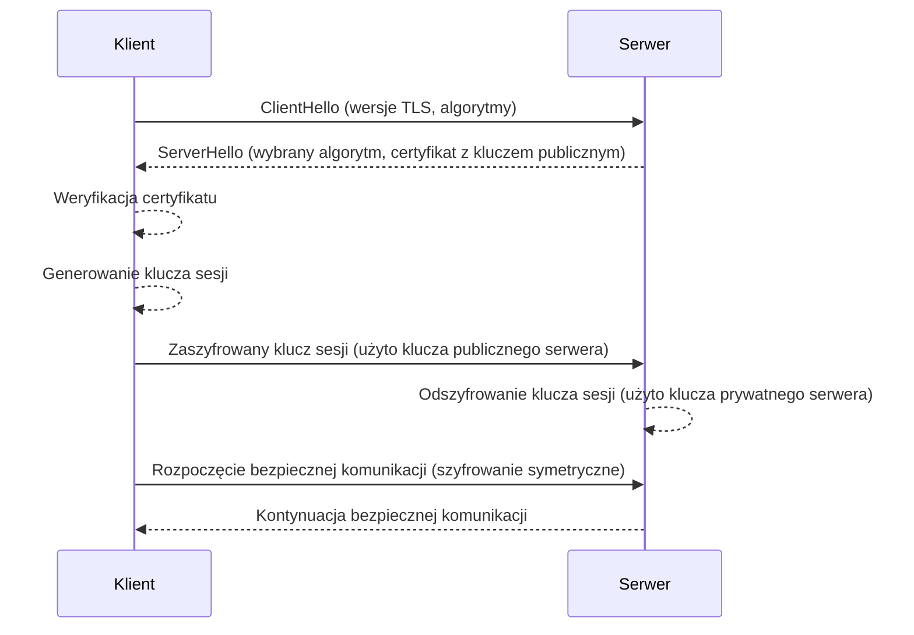

# Kurs: Protokoły Sieciowe i Kryptografia — Od Podstaw do Bezpiecznej Komunikacji

Witaj w kursie, który wprowadzi Cię w fascynujący świat protokołów sieciowych i kryptografii. W dzisiejszym cyfrowym świecie ochrona danych i prywatności jest kluczowa. Ten kurs wyjaśni, jak działa komunikacja w Internecie i jak jest zabezpieczana, od prostego przeglądania stron WWW po zaawansowane mechanizmy szyfrowania.

### Czego się nauczysz?

- Jak działają fundamentalne modele komunikacji sieciowej (OSI i TCP/IP).
- Do czego służą najważniejsze protokoły, takie jak TCP, UDP, HTTP, HTTPS i DNS.
- Na czym polega szyfrowanie symetryczne i asymetryczne.
- Jak działa protokół TLS/SSL, który zabezpiecza Twoje dane podczas przeglądania internetu.
- Czym są funkcje skrótu (hashe) i podpisy cyfrowe oraz gdzie się je stosuje.
- Jakie są praktyczne zastosowania kryptografii, np. w VPN.

---

## Spis treści

1. [Modele Komunikacji Sieciowej: OSI i TCP/IP](#1-modele-komunikacji-sieciowej-osi-i-tcpip)
2. [Przegląd Kluczowych Protokołów Sieciowych](#2-przegląd-kluczowych-protokołów-sieciowych)
3. [Fundamenty Kryptografii: Jak Chronimy Dane?](#3-fundamenty-kryptografii-jak-chronimy-dane)
4. [Szyfrowanie w Praktyce: TLS/SSL i Bezpieczna Komunikacja](#4-szyfrowanie-w-praktyce-tlsssl-i-bezpieczna-komunikacja)
5. [Integralność i Uwierzytelnianie: Funkcje Skrótu i Podpisy Cyfrowe](#5-integralność-i-uwierzytelnianie-funkcje-skrótu-i-podpisy-cyfrowe)
6. [Praktyczne Zastosowania: VPN i Bezpieczeństwo DNS](#6-praktyczne-zastosowania-vpn-i-bezpieczeństwo-dns)
7. [Podsumowanie i Spojrzenie w Przyszłość](#7-podsumowanie-i-spojrzenie-w-przyszłość)

---

## 1. Modele Komunikacji Sieciowej: OSI i TCP/IP

Aby zrozumieć komunikację w sieci, używamy modeli, które dzielą ten skomplikowany proces na mniejsze, zarządzalne **warstwy**. Każda warstwa ma określone zadanie i współpracuje z warstwami sąsiednimi.

- **Model OSI (Open Systems Interconnection):** Model teoretyczny, składający się z 7 warstw (Fizyczna, Łącza danych, Sieciowa, Transportowa, Sesji, Prezentacji, Aplikacji). Jest świetnym narzędziem do nauki i diagnostyki problemów sieciowych.
- **Model TCP/IP:** Bardziej praktyczny model, na którym opiera się dzisiejszy Internet. Składa się z 4 warstw:
  1.  **Dostępu do Sieci (Link Layer):** Odpowiada za fizyczne przesyłanie danych (np. przez Wi-Fi, Ethernet).
  2.  **Internetu (Internet Layer):** Zarządza adresowaniem i routingiem pakietów (tutaj działa protokół IP).
  3.  **Transportu (Transport Layer):** Zapewnia komunikację między punktami końcowymi (np. protokoły TCP i UDP).
  4.  **Aplikacji (Application Layer):** Warstwa, z którą bezpośrednio interagują aplikacje użytkownika (np. przeglądarka internetowa używająca HTTP).

---

## 2. Przegląd Kluczowych Protokołów Sieciowych

### Warstwa Transportowa: TCP vs. UDP

- **TCP (Transmission Control Protocol):** Protokół **połączeniowy**. Można go porównać do rozmowy telefonicznej – najpierw trzeba nawiązać połączenie. Gwarantuje, że wszystkie dane dotrą w całości i w odpowiedniej kolejności. Idealny do przeglądania stron WWW, wysyłania e-maili czy pobierania plików.
- **UDP (User Datagram Protocol):** Protokół **bezpołączeniowy**. Działa jak wysyłanie pocztówki – nie ma gwarancji, czy i kiedy dotrze. Jest znacznie szybszy, ponieważ nie ma mechanizmów weryfikacji. Używany tam, gdzie liczy się szybkość, a niewielkie straty danych są akceptowalne (np. streaming wideo, gry online, rozmowy VoIP).

### Warstwa Aplikacji: Języki Internetu

- **HTTP (Hypertext Transfer Protocol):** Podstawa komunikacji w sieci WWW. Działa domyślnie na porcie 80. **Uwaga: Przesyła dane otwartym tekstem**, co oznacza, że każdy, kto podsłuchuje ruch sieciowy, może je odczytać (np. loginy i hasła).
- **HTTPS (HTTP Secure):** Bezpieczna, szyfrowana wersja HTTP. Wykorzystuje protokół TLS/SSL do ochrony danych. Działa na porcie 443. Obecnie standard dla wszystkich stron internetowych.
- **FTP (File Transfer Protocol):** Służy do przesyłania plików. Podobnie jak HTTP, jest w podstawowej wersji niezabezpieczony. Jego bezpieczniejszymi alternatywami są FTPS lub SFTP (który działa w oparciu o SSH).
- **SSH (Secure Shell):** Niezbędne narzędzie do bezpiecznego, zdalnego zarządzania serwerami. Szyfruje całą sesję terminala, chroniąc polecenia i dane przed podsłuchem.
- **DNS (Domain Name System):** "Książka telefoniczna Internetu". Tłumaczy zrozumiałe dla ludzi nazwy domen (np. `google.com`) na adresy IP (np. `142.250.190.46`), które rozumieją komputery.

---

## 3. Fundamenty Kryptografii: Jak Chronimy Dane?

Kryptografia to nauka o technikach zabezpieczania informacji. Jej dwa główne filary to szyfrowanie symetryczne i asymetryczne.

### Szyfrowanie Symetryczne (z kluczem tajnym)

Wykorzystuje **jeden i ten sam klucz** do szyfrowania i deszyfrowania danych.

- **Analogia:** Działa jak tradycyjny zamek i klucz. Jeśli zamkniesz skrzynię na kłódkę, potrzebujesz tego samego klucza, aby ją otworzyć.
- **Zalety:** Bardzo szybkie i wydajne. Idealne do szyfrowania dużych ilości danych (np. całych dysków twardych, transmisji wideo).
- **Wady:** **Problem dystrybucji klucza** – jak bezpiecznie przekazać klucz drugiej stronie, aby nikt go nie przechwycił?
- **Przykłady algorytmów:** AES (Advanced Encryption Standard – złoty standard), ChaCha20.

### Szyfrowanie Asymetryczne (z kluczem publicznym)

Wykorzystuje **parę powiązanych matematycznie kluczy**:

1.  **Klucz publiczny:** Może być udostępniony każdemu. Służy wyłącznie do **szyfrowania** danych.
2.  **Klucz prywatny:** Musi być trzymany w absolutnej tajemnicy przez właściciela. Służy do **deszyfrowania** danych zaszyfrowanych kluczem publicznym.

- **Analogia:** Działa jak skrzynka na listy z dwoma rodzajami otworów. Każdy może wrzucić list (zaszyfrować wiadomość) przez ogólnodostępny otwór (klucz publiczny), ale tylko właściciel ze swoim specjalnym kluczem (klucz prywatny) może tę skrzynkę otworzyć i odczytać listy.
- **Zalety:** Rozwiązuje problem bezpiecznej wymiany kluczy. Umożliwia weryfikację tożsamości (dzięki podpisom cyfrowym).
- **Wady:** Jest znacznie wolniejsze od szyfrowania symetrycznego.
- **Przykłady algorytmów:** RSA, ECC (Elliptic-Curve Cryptography – nowocześniejszy i wydajniejszy przy krótszych kluczach).

---

## 4. Szyfrowanie w Praktyce: TLS/SSL i Bezpieczna Komunikacja

W praktyce, aby połączyć szybkość kryptografii symetrycznej z bezpieczeństwem asymetrycznej, stosuje się **podejście hybrydowe**. Najlepszym przykładem jest protokół **TLS (Transport Layer Security)**, następca SSL (Secure Sockets Layer), który zabezpiecza połączenia HTTPS.

### Jak działa TLS Handshake (Uścisk Dłoni)?

Zanim przeglądarka zacznie przesyłać dane na serwer, muszą one "dogadać się" co do sposobu szyfrowania. Ten proces negocjacji nazywa się "handshake".

1.  **ClientHello:** Przeglądarka wysyła do serwera wiadomość, przedstawiając się i informując, jakie wersje TLS i algorytmy szyfrowania obsługuje.
2.  **ServerHello:** Serwer wybiera najsilniejszy wspólny algorytm i odsyła swój **certyfikat SSL/TLS**. Certyfikat ten zawiera **klucz publiczny serwera** i jest podpisany przez zaufany **Urząd Certyfikacji (CA)**, co potwierdza tożsamość serwera.
3.  **Weryfikacja i wymiana klucza:**
    - Przeglądarka weryfikuje certyfikat serwera (sprawdza, czy jest ważny i wystawiony dla tej domeny).
    - Przeglądarka generuje losowy **klucz sesji** (który będzie używany do szyfrowania symetrycznego).
    - Szyfruje ten klucz sesji za pomocą **klucza publicznego serwera** (otrzymanego w certyfikacie) i odsyła go na serwer.
4.  **Nawiązanie bezpiecznego połączenia:**
    - Serwer używa swojego **klucza prywatnego**, aby odszyfrować klucz sesji.
    - Od tej pory obie strony mają ten sam, tajny klucz sesji. Cała dalsza komunikacja jest już szyfrowana za pomocą szybkiego **szyfrowania symetrycznego** (np. AES) z użyciem tego klucza.

Poniższy diagram ilustruje ten proces:

---

## 5. Integralność i Uwierzytelnianie: Funkcje Skrótu i Podpisy Cyfrowe

### Funkcje Skrótu (Hashing)

Hashing to proces **jednokierunkowy**, który przekształca dowolne dane wejściowe w unikalny ciąg znaków o stałej długości, zwany **hashem** lub **skrótem**.

- **Kluczowa cecha:** Z hasha nie da się odtworzyć oryginalnych danych. Nawet najmniejsza zmiana w danych wejściowych powoduje lawinową zmianę hasha.
- **Zastosowania:**
  - **Przechowywanie haseł:** W bazach danych nigdy nie przechowuje się haseł w formie jawnej. Zamiast tego przechowuje się ich hashe. Podczas logowania system hashuje podane hasło i porównuje wynik z hashem w bazie.
  - **Weryfikacja integralności plików:** Po pobraniu pliku można obliczyć jego hash i porównać z hashem podanym przez autora. Jeśli hashe są identyczne, mamy pewność, że plik nie został uszkodzony ani zmodyfikowany.
- **Ważne:** Starsze algorytmy, takie jak **MD5** i **SHA-1**, są uznawane za niezabezpieczone i nie należy ich używać do celów bezpieczeństwa. Nowoczesne standardy to **SHA-256**, **SHA-3** oraz algorytmy dedykowane do haseł, jak **bcrypt** i **Argon2**.

#### Solenie Haseł (Salting)

Aby dodatkowo zabezpieczyć hasła przed atakami (np. tęczowymi tablicami), do każdego hasła przed hashowaniem dodaje się unikalną, losową wartość zwaną **"solą" (salt)**. Sól jest przechowywana w bazie danych razem z hashem. Dzięki temu nawet dwa identyczne hasła będą miały zupełnie inne hashe.

### Podpisy Cyfrowe

Podpisy cyfrowe wykorzystują kryptografię asymetryczną do zapewnienia autentyczności i integralności danych.

- **Jak to działa?**
  1.  Nadawca tworzy hash wiadomości.
  2.  Szyfruje ten hash swoim **kluczem prywatnym**. Wynik to **podpis cyfrowy**.
  3.  Wysyła wiadomość razem z podpisem.
  4.  Odbiorca deszyfruje podpis za pomocą **klucza publicznego** nadawcy, otrzymując oryginalny hash.
  5.  Następnie sam oblicza hash z otrzymanej wiadomości i porównuje go z hashem z podpisu.
- **Co to daje?**
  - **Autentyczność:** Tylko właściciel klucza prywatnego mógł stworzyć ten podpis.
  - **Integralność:** Jeśli hashe się zgadzają, wiadomość nie została zmieniona po drodze.
  - **Niezaprzeczalność (Non-repudiation):** Nadawca nie może wyprzeć się wysłania wiadomości.

---

## 6. Praktyczne Zastosowania: VPN i Bezpieczeństwo DNS

### VPN (Virtual Private Network)

VPN tworzy bezpieczny, szyfrowany "tunel" dla całego ruchu internetowego z Twojego urządzenia. Działa jak prywatna, zaszyfrowana sieć wewnątrz publicznego internetu.

- **Jak działa?** Twoje dane są szyfrowane na Twoim urządzeniu, przesyłane do serwera VPN, a dopiero stamtąd trafiają do docelowego miejsca w internecie.
- **Główne zastosowania:**
  - **Prywatność:** Ukrywa Twój prawdziwy adres IP i uniemożliwia dostawcy internetu (ISP) śledzenie Twojej aktywności.
  - **Bezpieczeństwo:** Chroni Twoje dane w publicznych sieciach Wi-Fi (np. w kawiarniach, na lotniskach).
  - **Omijanie cenzury i geolokalizacji:** Pozwala uzyskać dostęp do treści zablokowanych w danym regionie.

### Bezpieczeństwo DNS: DNSSEC

Standardowy protokół DNS jest podatny na ataki typu "man-in-the-middle", gdzie atakujący może podmienić odpowiedź serwera DNS i przekierować Cię na fałszywą stronę (np. stronę banku).
**DNSSEC (Domain Name System Security Extensions)** to rozszerzenie, które dodaje do zapytań DNS podpisy cyfrowe. Dzięki temu Twoje urządzenie może zweryfikować, czy odpowiedź z serwera DNS jest autentyczna i nie została zmodyfikowana.

---

## 7. Podsumowanie i Spojrzenie w Przyszłość

Gratulacje! Ukończyłeś kurs podstaw protokołów sieciowych i kryptografii. Wiesz już, jak dane podróżują po internecie i jakie mechanizmy chronią je przed nieautoryzowanym dostępem.

### Kluczowe Punkty:

- Komunikacja sieciowa jest warstwowa (model TCP/IP).
- Protokoły TCP (niezawodny) i UDP (szybki) służą do transportu danych.
- Kryptografia hybrydowa (asymetryczna do wymiany klucza, symetryczna do reszty komunikacji) jest podstawą bezpieczeństwa w sieci (np. w TLS/HTTPS).
- Hashe zapewniają integralność danych, a podpisy cyfrowe – autentyczność.
- Technologie takie jak VPN i DNSSEC wykorzystują te zasady do zapewnienia prywatności i bezpieczeństwa na co dzień.

### Co dalej? Kryptografia Kwantowa

Warto wspomnieć, że rozwój komputerów kwantowych stanowi zagrożenie dla obecnych algorytmów kryptografii asymetrycznej (np. RSA). Dlatego już teraz trwają prace nad **kryptografią postkwantową (PQC)** – nowymi algorytmami, które będą odporne na ataki z użyciem komputerów kwantowych. To fascynująca dziedzina, która zdefiniuje przyszłość bezpieczeństwa cyfrowego.
