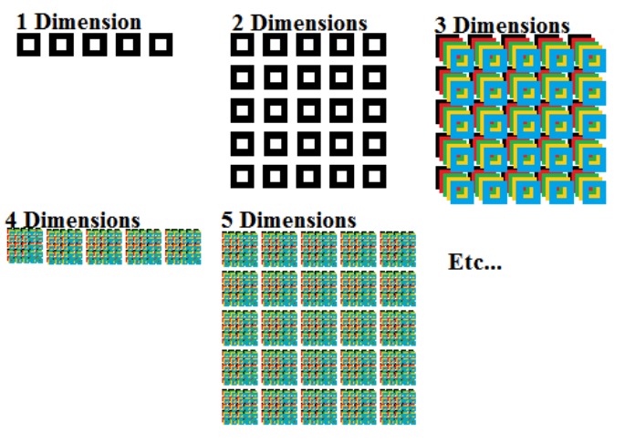

# 🐍 Kurs Python

## 📄 Spis Treści

- 📖 [Wprowadzenie](#wprowadzenie)
- 🔢 [Typy Danych](#typy-danych)
- 🔁 [Struktury Kontrolne](#struktury-kontrolne)
  - ⛓️‍💥 [Łańcuchy Znaków](#łańcuchy-znaków)
  - 📜 [Instrukcje Warunkowe](#instrukcje-warunkowe)
  - 🔄 [Pętle](#pętle)
    - 🔁 [Petla For](#petla-for)
    - 🔂 [Petla While](#petla-while)
  - 📋 [Listy i słowniki](#listy-i-słowniki)
- 🗃️ [Praca z Plikami](#praca-z-plikami)
- 🧰 [Funkcje](#funkcje)
- 🚀 [Programowanie Obiektowe](#programowanie-obiektowe)
- ⚠️ [Obsługa Błędów](#obsługa-błędów)
- 🗄️ [SQLite](#sqlite)
- 🖼️ [Tkinter](#tkinter)
- 📊 [Matplotlib](#matplotlib) <- _Niedostępne_
- 🐼 [Biblioteka Pandas](#biblioteka-pandas) <- _Niedostępne_
- 🔍 [Debugowanie i Testowanie](#debugowanie-i-testowanie) <- _Niedostępne_

## Wprowadzenie

Python to wszechstronny i popularny język programowania, znany ze swojej prostoty i czytelności. Umożliwia szybkie i efektywne tworzenie aplikacji, od skryptów automatyzujących codzienne zadania po złożone systemy i aplikacje webowe. Python jest językiem wysokiego poziomu, co oznacza, że skupia się na czytelności i prostocie składni, co ułatwia programowanie i zrozumienie kodu. Język Python ma bogatą bibliotekę standardową, która zawiera wiele gotowych modułów i funkcji.

## Typy Danych

Python jest dynamicznie typowanym językiem, co oznacza, że typ zmiennej jest określany automatycznie w czasie wykonywania programu. Oto tabela przedstawiająca niektóre z najpopularniejszych typów danych w Pythonie:

| Typ Danych  | Opis                                                                            | Przykład                                       |
| ----------- | ------------------------------------------------------------------------------- | ---------------------------------------------- |
| `int`       | Reprezentuje liczby całkowite.                                                  | `x = 42`                                       |
| `float`     | Reprezentuje liczby zmiennoprzecinkowe.                                         | `pi = 3.14`                                    |
| `str`       | Reprezentuje ciągi znaków.                                                      | `message = "Hello, World!"`                    |
| `bool`      | Reprezentuje wartości logiczne (TRUE/FALSE).                                    | `is_true = True`                               |
| `list`      | Reprezentuje uporządkowaną kolekcję elementów.                                  | `numbers = [1, 2, 3]`                          |
| `tuple`     | Reprezentuje uporządkowaną kolekcję elementów, które nie mogą być modyfikowane. | `coordinates = (1, 2, 3)`                      |
| `dict`      | Reprezentuje kolekcję par klucz-wartość.                                        | `person = {"name": "John", "age": 30}`         |
| `set`       | Reprezentuje kolekcję unikalnych elementów.                                     | `unique_numbers = {1, 2, 3}`                   |
| `datetime`  | Reprezentuje datę i czas.                                                       | `current_time = datetime.datetime(2022, 1, 1)` |
| `bytes`     | Reprezentuje sekwencję bajtów.                                                  | `data = b"Hello"`                              |
| `bytearray` | Reprezentuje modyfikowalną sekwencję bajtów.                                    | `mutable_data = bytearray(b"Hello")`           |
| `None`      | Reprezentuje brak wartości.                                                     | `value = None`                                 |
| `complex`   | Reprezentuje liczby zespolone.                                                  | `z = 3 + 4j`                                   |

### **Konwencje nazewnictwa zmiennych**

W Pythonie obowiązują pewne zasady i konwencje nazewnictwa zmiennych:

- Zmienne mogą zaczynać się od litery lub podkreślenia (\_), ale nie od cyfry.
- Mogą zawierać litery, cyfry i podkreślenia.
- Python rozróżnia wielkość liter, więc name i Name to dwie różne zmienne.
- Stosowanie konwencji snake_case do nazewnictwa zmiennych (np. user_name, total_amount).

Tworzenie zmiennej w języku Python zaczyna się od podania nazwy zmiennej, po której następuje znak równości = oraz przypisana wartość.

```python
zmienna_nazwa = 1
```

Opcjonalnie, na początku można dodać nazwę typu danych, aby kod był bardziej przejrzysty i czytelny

```python
int zmienna_nazwa = 1
```

## Struktury Kontrolne

Struktury kontrolne w Pythonie pozwalają na sterowanie przepływem wykonania programu. Umożliwiają one podejmowanie decyzji, powtarzanie bloków kodu i wykonywanie różnych operacji w zależności od określonych warunków.

## Łańcuchy Znaków

Łańcuchy znaków, zwane stringami, są jednym z podstawowych typów danych w Pythonie. To sekwencje znaków znajdujące się między
cudzysłowami pojedynczymi lub podwójnymi. Łańcuch znaków to układ występujących po sobie
znaków. Niekoniecznie musi być to układ liter.

### Funkcje Łańcuchów Znaków

- 🖨️ **`print()`** - wyświetla wynik na ekranie.

```python
print("Witaj, świecie!")  # Output: Witaj, świecie!
```

- 📏 **`len()`** - zwraca długość łańcucha.

```python
print(len("Python"))  # Output: 6
```

- 🔢 **`count()`** - zwraca liczbę wystąpień podłańcucha w łańcuchu.

```python
text = "banana"
print(text.count("a"))  # Output: 3
```

- 🚀 **`max()`** - zwraca największy element w łańcuchu (alfabetycznie).

```python
text = "banana"
print(max(text))  # Output: n
```

- ➕ **`append()`** - dodaje element na końcu listy (nie dotyczy łańcuchów, tylko list).

```python
my_list = [1, 2, 3]
my_list.append(4)
print(my_list)  # Output: [1, 2, 3, 4]
```

- 🔡 **`lower()`** - Zmienia wszytskie duze litery na małe w stringu

```python
zmienna = "TO JEST NAPIS"
print(zmeinna.lower()) #to jest napis
```

- 🔠 **`upper()`** - Zmienia wszytskie małe litery na duze w stringu

```python
zmienna = "to jest napis"
print(zmeinna.upper()) #TO JEST NAPIS
```

- 🔁 **`swapcase()`** - Odwraca rodzaj kazdej litery - małe na duze, duze na małe

```python
zmienna = "to JEST napis PODSTAWOWY"
print(zmeinna.swapcase()) #TO jest NAPIS podstawowy
```

- 🔠 **`capitalize()`** - Zmienia pierwszą literę w ciągu na dużą

```python
zmienna1 = "to jest napis podstawowy"
print(zmienna1.capitalize()) #To jest napis podstawowy
```

- ✂️ **`split()`** - używana do dzielenia łańcucha znaków (stringa) na mniejsze części, zazwyczaj według określonego separatora

```python
# Bez argumentów
text = "To jest przykładowe zdanie"
words = text.split()
print(words)  # Output: ['To', 'jest', 'przykładowe', 'zdanie']

# Z określonym separatorem
text = "jabłko,banan,gruszka"
fruits = text.split(',')
print(fruits)  # Output: ['jabłko', 'banan', 'gruszka']

```

- 📝 **`title()`** Zwraca string – tytuł, w którym wszystkie wyrazy zaczynają się dużą literą, a reszta jest małymi lub są to znaki nieliterowe

```python
zmienna1 = "To jest napis podstawowy"
print(zmienna1.title()) #To Jest Napis Podstawowy
```

- 🔗 **`join(seq)`** - Łączenie (konkatenacja) wyrazów w napisie seq w jeden napis, według separatora/stringu na jakim wywołujemy metodę. W przykładzie separatorem jest #

```python
lista1=["1","2","3","4","5"]
zmienna2 = "#".join(lista1)
print(zmienna2) #1#2#3#4#5

#Ciekawostka: Można nie ustawiać żadnego separatora i uzyskać ciągłość zapisu:

lista1=["1","2","3","4","5"]
zmienna2 = "".join(lista1)
print(zmienna2) 12345
```

- 🧹 **`lstrip()`** - Usuwa białe znaki z początku napisu

```python
zmienna1="   to jest napis podstawowy"
print(zmienna1.lstrip()) #to jest napis podstawowy
```

- 🧹 **`rstrip()`** - Usuwa białe znaki z końca napisu

```python
zmienna1="to jest napis podstawowy     "
print(zmienna1.rstrip()) #to jest napis podstawowy
```

- 🧼 **`strip()`** - Usuwa białe znaki z początku oraz końca napisu

```python
zmienna1="     to jest napis podstawowy     "
print(zmienna1.rstrip()) #to jest napis podstawowy
```

- 🔄 **`replace(old,new)`** - Zamienia wszystkie wystąpienia na wskazany. ,,Jest mozliwość dodania parametru max, mający na celu wskazanie ilości zamienionych ciagów znaków''

```python
zmienna = "Michał Ola Kuba Wiktoria Kacper"

zmiana = zmienna.replace("Michał", "Paweł")

print(zmiana) #Paweł Ola Kuba Wiktoria Kacper

zmienna2 = "Michał Ola Kuba Ola Kacper Ola"

zmiana2 = zmienna.replace("Ola", "Wiktoria", 2)

print(zmiana2) #Michał Wiktoria Kuba Wiktoria Kacper Ola
```

- 📏 **`len(string)`** - Zwraca długość ciągu znaków

```python
zmienna = "To jest napis"

print(len(zmienna)) #13 znaki specjalne są liczone
```

- 🔍 **`count(str,start,end)`** - Zlicza ilość wystąpień w ciagu znaków, zaczyna się od indeksu start a konczy sie indeksem end

```python
zmienna = "Michał Ola Kuba Ola Kacper Ola"
print(zmienna.count("Ola",0,28)) #2
```

- 🔎 **`find(str,start,end)`** - zwraca ilość wystąpień danego stringa w ciagu znaków, zwraca -1 jesli nie znajdzie stringa w łańcuchu

```python
zmienna = "Michał ma syna o imieniu Michał"
print(zmienna.find("Michał",0,len(zmienna))) #0
```

### Formatowanie ciągów znaków

- Występują trzy podstawowe sposoby formatowania łańcuchów znaków:
  - Łączenie danych za pomocą przecinka
    ```python
    print("ten napis nie posiada zmiennych")
    print("ten napis posiada zmienna x, która wynosi, x")
    ```
- Łączenie danych za pomocą funkcji format:

```python
print(" Liczba {} oraz liczba {} to liczby naturalne "
.format(4,5))
#Liczba 4 oraz liczba 5 to liczby naturalne
```

- Łączenie danych za pomocą f-stringa:

Aby utworzyć f-string, wystarczy dodać literę f przed cudzysłowem otwierającym ciąg znaków. Wewnątrz takiego ciągu możemy umieszczać wyrażenia w nawiasach klamrowych `{}`

```python
x=3
y=5
print(f"Liczby {x} oraz {y} to liczby naturalne")
#Liczby 3 oraz 5 to liczby naturalne
```

### Indeksowanie Łańcucha Znaków

Łańcuch znaków indeksuje się na dwa sposoby:

- `Od lewej strony do prawej`
- Od prawej strony do lewej

| Łańcuch znaków | P   | Y   | T   | H   | O   | N   |
| -------------- | --- | --- | --- | --- | --- | --- |
| `Indesks`      | `0` | `1` | `2` | `3` | `4` | `5` |
| Indesks        | -5  | -4  | -3  | -2  | -1  | 0   |

### Slicing string

To proces polegający na wykonaniu wycinka z łańcucha znaków.
Wycinek tekstu nazywany jest podłańcuchem lub substringkiem

`S[Start:Stop:Step]`

Pozycje `Start` i `Stop` są obowiązkowe, natomiast pozycja `Step` jest opcjonalna.

```python
zmienna1= "abcdefghijk" <start:stop) <0;4)

print(zmienna1[0:4]) #abcd
print(zmienna1[1:]) #bcdefghijk
print(zmienna1[:5]) #abcde
print(zmienna1[:]) #abcdefghijk
print(zmienna1[::-1]) #kjihgfedcba
print(zmienna1[-5:-2]) #ghi
print(zmienna1[-10:-4:2])# bdf
print(zmienna1[-4:-10:-2]) #hfd
```

## Instrukcje Warunkowe

Instrukcje warunkowe pozwalają na wykonywanie różnych bloków kodu w zależności od warunków logicznych.

## Operatory logiczne i porównania

Operatory logiczne i porównania są używane do tworzenia warunków w instrukcjach warunkowych.

| Operator | Nazwa              | Przykład         | Opis                                                  |
| -------- | ------------------ | ---------------- | ----------------------------------------------------- |
| ==       | Równość            | x == y           | Sprawdza, czy x jest równe y                          |
| !=       | Nierówność         | x != y           | Sprawdza, czy x nie jest równe y                      |
| >        | Większe            | x > y            | Sprawdza, czy x jest większe od y                     |
| <        | Mniejsze           | x < y            | Sprawdza, czy x jest mniejsze od y                    |
| >=       | Większe lub równe  | x >= y           | Sprawdza, czy x jest większe lub równe y              |
| <=       | Mniejsze lub równe | x <= y           | Sprawdza, czy x jest mniejsze lub równe y             |
| and      | I                  | x > 0 and x < 10 | Sprawdza, czy oba warunki są prawdziwe                |
| or       | Lub                | x < 0 or x > 10  | Sprawdza, czy którykolwiek warunek jest prawdziwy     |
| not      | Negacja            | not x == y       | Neguje warunek, zmieniając True na False i vice versa |

### Instrukcja `if`:

Instrukcja `if` sprawdza, czy warunek jest prawdziwy, i jeśli tak, wykonuje blok kodu.

```python
x = 10

if x > 5:
    print(" x jest wieksze od 5")
```

### Instrukcja `if else`

Instrukcja `if`...`else` pozwala na wykonanie alternatywnego bloku kodu, jeśli warunek jest fałszywy.

```python
x = 3

if x > 5:
    print(" x jest wieksze od 5")
else:
    print("x jest mniejsze lub równe 5")
```

### Instrukcja `if elif else`

Instrukcja `if`...`elif`...`else` pozwala na sprawdzenie wielu warunków po kolei.

```python
x = 5
if x > 5:
    print("x jest większe od 5")
elif x == 5:
    print("x jest równe 5")
else:
    print("x jest mniejsze od 5")
```

### Instrukcja `match case`

Instrukcja **`match case`** w Pythonie, wprowadzona w Pythonie 3.10, służy do dopasowywania wzorców. Pozwala ona na dopasowywanie wzorców do wartości, zapewniając bardziej czytelny.

```python
dzien = str(input("Poodaj dzień tygodnia"))
match dzien:
    case 1:
        print("Poniedziałek")
    case 2:
        print("Wtorek")
    case 3:
        print("Środa")
    case 4:
        print("Czwartek")
    case 5:
        print("Piątek")
    case 6:
        print("Sobota")
    case 7:
        print("Niedziela")
    case _:
        print("Nieznany dzień tygodnia")
```

Podkreślenie `_` jest używane jako znak wieloznaczny, który pasuje do dowolnej wartości nie dopasowanej przez wcześniejsze przypadki.

Isnieje równiez uzycie operatorów logicznych:

```python
day = input("Podaj dzien tygodnia")

match day:
    case "Sobota" | "Niedziela":
        print("Weekend")

    case "Poniedziałek" | "Wtorek" | "Środa" | "Czwartek" | "Piątek":
        print("Dzień roboczy")

    case _:
        print("Nieprawidłowy dzień")
```

### Hybryda if-match case

Brak znaku logicznego oznacza operację logiczną AND

```python
numer1 = int(input("Pierwsza liczba: "))
numer2 = int(input("Druga liczba: "))

match numer1:
    case 1 if numer2 > 20:
        print(f"Pierwsza liczba to {numer1}, a druga liczba jest większa od 20")
    case 2 if numer2 == 20:
        print(f"Pierwsza liczba to {numer1}, a druga liczba jest równa 20")
    case 3 if numer2 < 20:
        print(f"Pierwsza liczba to {numer1}, a druga liczba jest mniejsza od 20")
    case _:
        print("Niepasujący przypadek")
```

## Pętle

Pętle w Pythonie są używane do wielokrotnego wykonywania bloku kodu. Pozwalają one na efektywne przetwarzanie danych, powtarzanie operacji oraz automatyzację zadań

### Petla **`For`**

Co to są obiekty iterowalne (iterable):

W Pythonie, obiekty sekwencyjne to obiekty, które przechowują sekwencje elementów wokreślonym porządku. Do najczęściej używanych obiektów sekwencyjnych w Pythonie należą:

1. **`Listy (lists)`**: listy to obiekty sekwencyjne, które przechowują kolekcje wartości w określonym porządku. Listy mogą przechowywać wartości różnego typu i są mutowalne, co oznacza, że ich wartości mogą być zmieniane po utworzeniu.

2. **`Krotki (tuples)`**: krotki to obiekty sekwencyjne, które są bardzo podobne do list, z tą różnicą, że są niezmienne (immutable), co oznacza, że po utworzeniu ich wartości nie mogą być zmieniane.

3. **`Ciągi znaków (strings)`** : ciągi znaków to obiekty sekwencyjne, które przechowują sekwencje znaków w określonym porządku. Ciągi znaków są niezmienne (immutable).

4. **`Bufory (bytearrays)`** : bufory to mutowalne obiekty sekwencyjne, które przechowują sekwencje bajtów w określonym porządku.

5. **`Zakresy (ranges)`** : zakresy to obiekty sekwencyjne, które przechowują sekwencje liczb całkowitych w określonym porządku.

- Petla `for`: listy

```python
list = [1,2,3,4,5,]
for elment in list:
    print(element, end=" ") #1 2 3 4 5
    if elment == 2:
        print(f"znaleziono element o numerze:  {element}")


tab = [2,-1,3,-2,9]
for i in tab:
    if i % 2 == 0: # tak sprawdzamy podzielność przez konkretne liczby
        continue
    print(i**0.5)
```

- Petla `for`: łańcuchy znaków

```python
for char in "SQL":
    if char.lower() == "q":
        print("W słowie znajduje się 'q'")
```

- Pętla for - zakresy

```python
for i in range(1, 10):
    print(i, end=" ")

for x in range(10, 1, -1):
    if x == 5:
        break
    print(x)


# !! Zagniezdzona petla !!
for a in range(1,5):
    for b in range(2,6):
        if a == 2 and b == 3:
            break
        print(f"Pierwsza liczba to {a}, druga to {b}")
```

Pętle nie zawsze muszą być realizowane od początku do końca. Czasami, w zależności od warunków, może być konieczne pominięcie niektórych kroków pętli lub przedwczesne zakończenie pętli.

Do tego właśnie służą instrukcje `break` i `continue`.

- Break to instrukcja wcześniejszego zakończenia pętli.

- Continue to instrukcja pominięcia reszty pętli i przejścia do następnego kroku pętli. W tym przypadku pętla nie jest zakończona.

### Petla **`While`**

Pętla `while` jest wykonywana tak długo dopóki określony warunek będzie prawdziwy. Warunek po każdym wykonaniu jest ponownie sprawdzany i jeśli jest prawdziwy zwraca wartość `True`, kod w bloku jest wykonywany. Jeżeli warunek jest fałszywy, wtedy przyjmie wartość `False`, blok kodu wewnątrz pętli się nie wykona

```python
count = 0
while count < 10:
    print(count)
    count += 1  # count = count + 1
```

W tym przykładzie zastosowano pętlę `while True`, która będzie działać w nieskończoność, chyba że zostanie przerwana przy użyciu instrukcji `break` wewnątrz pętli.

```python
while True:
    wybor = int(input(" 1- zaloguj sie: \n co chcesz zrobic: "))

    elif wybor == 1:

        login = input("Podaj login ")
        haslo = input("Podaj haslo ")
        if sprawdzanie(login,haslo): # Ps. Nie nalezy przejmować sie uzytą funkcją
            break
```

## Listy i słowniki

W Pythonie listy i słowniki są podstawowymi strukturami danych, które są często używane w codziennym programowaniu. Poniżej znajduje się kompleksowa instrukcja dotycząca pracy z tymi strukturami.

### 1.1. Co to jest lista?

Lista to uporządkowana, zmienna struktura danych, która może przechowywać elementy dowolnego typu, w tym inne listy. Elementy listy są indeksowane, zaczynając od zera.

### 1.2. Tworzenie listy

**Przykład:**

```python
# Pusta lista
my_list = []

# Lista z elementami
my_list = [1, 2, 3, 4, 5]

# Lista z różnymi typami danych
mixed_list = [1, "Hello", 3.14, True]
```

### 1.3. Dostęp do elementów listy

**Przykład:**

```python
my_list = [10, 20, 30, 40, 50]

# Dostęp do elementu za pomocą indeksu
print(my_list[0])  # Output: 10
print(my_list[2])  # Output: 30

# Dostęp do ostatniego elementu
print(my_list[-1])  # Output: 50

# Dostęp do zakresu elementów (slicing)
print(my_list[1:3])  # Output: [20, 30]

# Dostęp elementów od określonego indeksu do konca listy
print(my_list[2:])
```

### 1.4. Modyfikowanie listy

**Przykład:**

```python
my_list = [10, 20, 30, 40, 50]


# Zmiana wartości elementu
my_list[1] = 25
print(my_list)  # Output: [10, 25, 30, 40, 50]


# Dodawanie elementów do listy
my_list.append(60)  # Dodaje element na końcu listy
print(my_list)  # Output: [10, 25, 30, 40, 50, 60]


my_list.insert(2, 15)  # Dodaje element na określonej pozycji
print(my_list)  # Output: [10, 25, 15, 30, 40, 50, 60]


# Usuwanie elementów z listy
my_list.remove(30)  # Usuwa pierwszy napotkany element o wartości 30
print(my_list)  # Output: [10, 25, 15, 40, 50, 60]


popped_element = my_list.pop()  # Usuwa i zwraca ostatni element
print(popped_element)  # Output: 60
print(my_list)  # Output: [10, 25, 15, 40, 50]
```

### 1.5. Sortowanie i odwracanie listy

**Przykład:**

```python
my_list = [50, 20, 30, 10, 40]

# Sortowanie listy
my_list.sort()
print(my_list)  # Output: [10, 20, 30, 40, 50]

# Odwracanie listy
my_list.reverse()
print(my_list)  # Output: [50, 40, 30, 20, 10]
```

### 1.6. List comprehension

List comprehension to krótka forma tworzenia list na podstawie istniejącej sekwencji.

**Przykład:**

```python
# Lista kwadratów liczb od 0 do 9
squares = [x**2 for x in range(10)]
print(squares)  # Output: [0, 1, 4, 9, 16, 25, 36, 49, 64, 81]
```

### 1.7. Zagnieżdżone listy

Listy mogą zawierać inne listy, tworząc struktury wielowymiarowe.

**Przykład:**

```python
nested_list = [[1, 2, 3], [4, 5, 6], [7, 8, 9]]

# Dostęp do elementu w zagnieżdżonej liście
print(nested_list[0][1])  # Output: 2
```

### Graficzna reprezentacja list wielowymiarowych



## 2. Słowniki w Pythonie

### 2.1. Co to jest słownik?

Słownik to struktura danych w Pythonie, która przechowuje pary klucz-wartość. Klucze muszą być unikalne i mogą być dowolnego typu niemutowalnego (np. liczby, napisy), a wartości mogą być dowolnego typu.

### 2.2. Tworzenie słownika

**Przykład:**

```python
# Pusty słownik
my_dict = {}

# Słownik z danymi
my_dict = {
    "name": "John",
    "age": 30,
    "city": "New York"
}
```

### 2.3. Dostęp do wartości w słowniku

**Przykład:**

```python
my_dict = {
    "name": "John",
    "age": 30,
    "city": "New York"
}

# Dostęp do wartości za pomocą klucza
print(my_dict["name"])  # Output: John

# Użycie metody get() do bezpiecznego dostępu
print(my_dict.get("age"))  # Output: 30
print(my_dict.get("address", "Nie znaleziono"))  # Output: Nie znaleziono
```

### 2.4. Modyfikowanie słownika

**Przykład:**

```python
my_dict = {
    "name": "John",
    "age": 30,
    "city": "New York"
}

# Dodawanie nowej pary klucz-wartość
my_dict["email"] = "john@example.com"
print(my_dict)

# Modyfikowanie istniejącej wartości
my_dict["age"] = 31
print(my_dict)

# Usuwanie pary klucz-wartość
del my_dict["city"]
print(my_dict)
```

### 2.5. Iteracja po słowniku

**Przykład:**

```python
my_dict = {
    "name": "John",
    "age": 30,
    "city": "New York"
}

# Iteracja po kluczach
for key in my_dict:
    print(f"Klucz: {key}, Wartość: {my_dict[key]}")

# Iteracja po wartościach
for value in my_dict.values():
    print(f"Wartość: {value}")

# Iteracja po parach klucz-wartość
for key, value in my_dict.items():
    print(f"Klucz: {key}, Wartość: {value}")
```

### 2.6. Sprawdzanie obecności klucza w słowniku

**Przykład:**

```python
my_dict = {
    "name": "John",
    "age": 30,
    "city": "New York"
}

if "name" in my_dict:
    print("Klucz 'name' jest w słowniku")

if "address" not in my_dict:
    print("Klucz 'address' nie istnieje w słowniku")
```

### 2.7. Zagnieżdżone słowniki

Podobnie jak listy, słowniki mogą być zagnieżdżane.

**Przykład:**

```python
nested_dict = {
    "person1": {
        "name": "John",
        "age": 30
    },
    "person2": {
        "name": "Jane",
        "age": 25
    }
}

# Dostęp do elementu w zagnieżdżonym słowniku
print(nested_dict["person1"]["name"])  # Output: John
```

### 2.8. Słowniki w list comprehension

Można tworzyć słowniki za pomocą dictionary comprehension, podobnie jak listy.

**Przykład:**

```python
# Słownik z kwadratami liczb od 0 do 4
squares_dict = {x: x**2 for x in range(5)}
print(squares_dict)  # Output: {0: 0, 1: 1, 2: 4, 3: 9, 4: 16


```

### 2.9. Łączenie słowników (Python 3.9+)

Od Pythona 3.9 można łączyć słowniki za pomocą operatora `|`.

**Przykład:**

```python
dict1 = {"a": 1, "b": 2}
dict2 = {"b": 3, "c": 4}

combined_dict = dict1 | dict2
print(combined_dict)  # Output: {'a': 1, 'b': 3, 'c': 4}
```

## Praca z Plikami

Praca z plikami jest nieodłącznym elementem wielu programów w Pythonie. Pozwala na zapis i odczyt danych z plików, co jest niezbędne w wielu aplikacjach, takich jak analiza danych, logowanie, czy przechowywanie wyników.

## 1. Podstawowe operacje na plikach

### 1.1. Otwarcie pliku

W Pythonie pliki otwiera się za pomocą funkcji `open()`, która zwraca obiekt pliku. Funkcja ta akceptuje dwa główne argumenty:

- **nazwa pliku**: ścieżka do pliku, który chcemy otworzyć.
- **tryb otwarcia pliku**: sposób, w jaki plik ma być otwarty (np. do odczytu, zapisu itp.).

**Tryby otwarcia pliku:**

- `'r'` : Odczyt (domyślnie). Plik musi istnieć.
- `'w'` : Zapis. Jeśli plik istnieje, zostanie nadpisany. Jeśli nie istnieje, zostanie utworzony.
- `'a'` : Dopisywanie. Dodaje dane na końcu pliku. Jeśli plik nie istnieje, zostanie utworzony.
- `'b'` : Tryb binarny (np. `'rb'`, `'wb'`).
- `'+'` : Tryb odczytu i zapisu (np. `'r+'`, `'w+'`).

**Przykład:**

```python
file = open("example.txt", "r")  # Otwieranie pliku w trybie odczytu
```

### 1.2. Odczyt z pliku

Python oferuje różne sposoby odczytu danych z pliku.

**Przykład:**

```python
file = open("example.txt", "r")

# Odczyt całej zawartości pliku
content = file.read()
print(content)

# Odczyt linii z pliku
file.seek(0)  # Powrót na początek pliku
line = file.readline()
print(line)

# Odczyt wszystkich linii jako lista
file.seek(0)
lines = file.readlines()
print(lines)

file.close()
```

### 1.3. Zapis do pliku

Aby zapisać dane do pliku, należy otworzyć go w trybie zapisu (`'w'`, `'a'` lub `'w+'`).

**Przykład:**

```python
file = open("example.txt", "w")  # Otwieranie pliku w trybie zapisu

file.write("Hello, World!\n")
file.write("This is another line.")

file.close()
```

### 1.4. Zamknięcie pliku

Po zakończeniu pracy z plikiem należy go zamknąć za pomocą metody `close()`, aby zwolnić zasoby systemowe.

**Przykład:**

```python
file = open("example.txt", "r")
# Operacje na pliku...
file.close()
```

### 1.5. Używanie kontekstu (`with`)

Lepszym i bardziej eleganckim sposobem zarządzania plikami jest użycie bloku `with`, który automatycznie zamyka plik po zakończeniu pracy.

**Przykład:**

```python
with open("example.txt", "r") as file:
    content = file.read()
    print(content)
```

## 2. Tryby pracy z plikami tekstowymi

### 2.1. Odczyt i zapis plików tekstowych

Podstawowe operacje odczytu i zapisu plików tekstowych obejmują użycie metod takich jak `read()`, `readline()`, `readlines()`, `write()`, i `writelines()`.

**Przykład odczytu:**

```python
with open("example.txt", "r") as file:
    content = file.read()
    print(content)
```

**Przykład zapisu:**

```python
with open("example.txt", "w") as file:
    file.write("Nowa zawartość pliku.")
```

### 2.2. Dopisywanie do pliku

Aby dodać dane na końcu pliku bez nadpisywania jego zawartości, należy otworzyć plik w trybie dopisywania (`'a'`).

**Przykład:**

```python
with open("example.txt", "a") as file:
    file.write("\nDopisanie nowej linii.")
```

## 3. Praca z plikami binarnymi

### 3.1. Otwieranie i odczyt plików binarnych

Pliki binarne zawierają dane, które nie są przeznaczone do bezpośredniego odczytu jako tekst, np. obrazy lub pliki wykonywalne. Aby pracować z takimi plikami, należy użyć trybu binarnego (`'b'`).

**Przykład:**

```python
with open("example.bin", "rb") as file:
    content = file.read()
    print(content)
```

### 3.2. Zapis plików binarnych

Podobnie jak przy odczycie, zapis plików binarnych wymaga użycia trybu binarnego.

**Przykład:**

```python
with open("example.bin", "wb") as file:
    file.write(b"This is binary data.")
```

## 4. Zarządzanie plikami i katalogami

Python oferuje moduł `os`, który pozwala na zarządzanie plikami i katalogami.

### 4.1. Sprawdzanie istnienia pliku

**Przykład:**

```python
import os

if os.path.exists("example.txt"):
    print("Plik istnieje")
else:
    print("Plik nie istnieje")
```

### 4.2. Usuwanie pliku

**Przykład:**

```python
import os

os.remove("example.txt")
```

### 4.3. Tworzenie i usuwanie katalogów

**Przykład:**

```python
import os

# Tworzenie katalogu
os.mkdir("example_dir")

# Usuwanie katalogu
os.rmdir("example_dir")
```

### 4.4. Iteracja po plikach w katalogu

**Przykład:**

```python
import os

for filename in os.listdir("."):
    print(filename)
```

## 5. Praca z plikami JSON

JSON (JavaScript Object Notation) to popularny format do przechowywania i wymiany danych. Python oferuje moduł `json`, który upraszcza pracę z plikami JSON.

### 5.1. Odczyt plików JSON

**Przykład:**

```python
import json

with open("example.json", "r") as file:
    data = json.load(file)
    print(data)
```

W powyższym przykładzie `json.load(file)` odczytuje dane z pliku JSON i zamienia je na obiekt Pythona (np. słownik).

### 5.2. Zapis do plików JSON

**Przykład:**

```python
import json

data = {
    "Name": "Alice",
    "Age": 30,
    "City": "New York"
}

with open("example.json", "w") as file:
    json.dump(data, file, indent=4)
```

W tym przypadku `json.dump(data, file, indent=4)` zapisuje dane do pliku JSON z wcięciem o szerokości 4 spacji, co poprawia czytelność pliku.

### 5.3. Konwersja obiektów Pythona na JSON

Można również bezpośrednio konwertować obiekty Pythona na format JSON i odwrotnie, używając `json.dumps()` i `json.loads()`.

**Przykład konwersji na JSON:**

```python
import json

data = {
    "Name": "Bob",
    "Age": 25,
    "City": "Los Angeles"
}

json_string = json.dumps(data, indent=4)
print(json_string)
```

**Przykład konwersji z JSON:**

```python
import json

json_string = '{"Name": "Charlie", "Age": 35, "City": "Chicago"}'
data = json.loads(json_string)
print(data)
```

## 6. Obsługa błędów podczas pracy z plikami

Podczas pracy z plikami mogą wystąpić różne błędy, takie jak brak pliku, brak uprawnień do jego otwarcia, czy problemy z formatem danych. Python pozwala na obsługę takich błędów za pomocą mechanizmu `try-except`.

**Przykład obsługi błędu:**

```python
try:
    with open("non_existent_file.txt", "r") as file:
        content = file.read()
except FileNotFoundError:
    print("Plik nie został znaleziony.")
except IOError:
    print("Wystąpił błąd wejścia/wyjścia.")
```

### 10. Przykładowy projekt wykorzystujący obsługe plików oraz biblioteke `JSON` oraz `OS`

```python
import json
import os

# Ścieżka do pliku z kontaktami
CONTACTS_FILE = "contacts.json"

def load_contacts():
    # Wczytuje kontakty z pliku JSON do listy.
    if os.path.exists(CONTACTS_FILE):
        with open(CONTACTS_FILE, "r") as file:
            contacts = json.load(file)
    else:
        contacts = []
    return contacts

def save_contacts(contacts):
    # Zapisuje listę kontaktów do pliku JSON.
    with open(CONTACTS_FILE, "w") as file:
        json.dump(contacts, file, indent=4)

def add_contact(contacts):
    # Dodaje nowy kontakt do listy.
    name = input("Podaj imię: ")
    phone = input("Podaj numer telefonu: ")
    email = input("Podaj email: ")
    contacts.append({"Name": name, "Phone": phone, "Email": email})
    save_contacts(contacts)
    print(f"Dodano kontakt: {name}")

def display_contacts(contacts):
    # Wyświetla wszystkie kontakty.
    if not contacts:
        print("Brak zapisanych kontaktów.")
    else:
        print("Lista kontaktów:")
        for contact in contacts:
            print(f"{contact['Name']} - Tel: {contact['Phone']}, Email: {contact['Email']}")

def search_contact(contacts):
    #Wyszukuje kontakt po imieniu.
    search_name = input("Podaj imię do wyszukania: ").lower()
    results = [contact for contact in contacts if search_name in contact['Name'].lower()]

    if not results:
        print("Nie znaleziono kontaktów.")
    else:
        print("Znalezione kontakty:")
        for contact in results:
            print(f"{contact['Name']} - Tel: {contact['Phone']}, Email: {contact['Email']}")

def delete_contact(contacts):
    #Usuwa kontakt z listy.
    delete_name = input("Podaj imię kontaktu do usunięcia: ").lower()
    contacts_to_keep = [contact for contact in contacts if delete_name not in contact['Name'].lower()]

    if len(contacts_to_keep) == len(contacts):
        print("Nie znaleziono kontaktu do usunięcia.")
    else:
        save_contacts(contacts_to_keep)
        print(f"Usunięto kontakty z imieniem: {delete_name}")

def main():
    #Główna funkcja programu.
    contacts = load_contacts()

    while True:
        print("\nMenedżer Kontaktów")
        print("1. Wyświetl kontakty")
        print("2. Dodaj nowy kontakt")
        print("3. Wyszukaj kontakt")
        print("4. Usuń kontakt")
        print("5. Wyjście")

        choice = input("Wybierz opcję (1-5): ")

        if choice == '1':
            display_contacts(contacts)
        elif choice == '2':
            add_contact(contacts)
        elif choice == '3':
            search_contact(contacts)
        elif choice == '4':
            delete_contact(contacts)
        elif choice == '5':
            print("Koniec programu.")
            break
        else:
            print("Nieprawidłowy wybór, spróbuj ponownie.")

# służy do zapewnienia, że określona część kodu zostanie wykonana tylko wtedy, gdy plik jest uruchamiany jako główny program
if __name__ == "__main__":
    main()
```

### Jak to działa?

1. **Plik JSON**: Wszystkie kontakty są zapisywane w pliku `contacts.json` w formacie JSON, który jest łatwy do odczytu zarówno przez człowieka, jak i przez komputer.

2. **Ładowanie kontaktów**: Funkcja `load_contacts()` wczytuje kontakty z pliku JSON do listy Pythona.

3. **Zapisywanie kontaktów**: Funkcja `save_contacts()` zapisuje listę kontaktów z powrotem do pliku JSON. Dane są zapisywane z wcięciem, co ułatwia ich przeglądanie.

4. **Operacje na kontaktach**: Program pozwala na dodawanie, wyświetlanie, wyszukiwanie i usuwanie kontaktów. Każda operacja aktualizuje plik JSON, aby dane były zawsze aktualne.

### Przykładowy plik JSON

Po uruchomieniu programu i dodaniu kilku kontaktów, plik `contacts.json` może wyglądać tak:

```json
[
  {
    "Name": "Alice",
    "Phone": "123-456-789",
    "Email": "alice@example.com"
  },
  {
    "Name": "Bob",
    "Phone": "987-654-321",
    "Email": "bob@example.com"
  }
]
```

## Funkcje

Funkcje w Pythonie to blok kodu, który wykonuje określoną operację i może być wielokrotnie wywoływany w programie. Ułatwiają one organizację kodu, poprawiają jego czytelność i umożliwiają wielokrotne wykorzystanie tej samej logiki.

### 1. Definiowanie funkcji

Funkcja jest definiowana za pomocą słowa kluczowego `def`, po którym następuje nazwa funkcji, lista parametrów w nawiasach oraz dwukropek. Treść funkcji znajduje się w bloku kodu z odpowiednim wcięciem.

**Przykład:**

```python
def greet(name):
    print(f"Witaj, {name}!")
```

W powyższym przykładzie funkcja `greet` przyjmuje jeden argument `name` i wypisuje wiadomość powitalną.

### 2. Wywoływanie funkcji

Aby wykonać funkcję, należy ją wywołać, podając jej nazwę i przekazując odpowiednie argumenty.

**Przykład:**

```python
greet("Alice")
```

To wywołanie spowoduje wydrukowanie: `Witaj, Alice!`.

### 3. Parametry i argumenty

- **Parametry** to zmienne określone w definicji funkcji. Są one traktowane jako miejsce na dane wejściowe, które funkcja może wykorzystać do wykonania swojej operacji.
- **Argumenty** to rzeczywiste wartości przekazywane do funkcji podczas jej wywoływania.

Funkcje mogą przyjmować dowolną liczbę parametrów, w tym domyślne wartości.

**Przykład:**

```python
def greet(name, greeting="Witaj"):
    print(f"{greeting}, {name}!")
```

Tutaj `greeting` ma wartość domyślną `"Witaj"`. Jeśli nie zostanie podana inna wartość, funkcja użyje tej domyślnej.

### 4. Zwracanie wartości z funkcji

Funkcje mogą zwracać wartości za pomocą słowa kluczowego `return`. Dzięki temu funkcja może zwrócić wynik swojej pracy, który można następnie wykorzystać w dalszej części programu.

**Przykład:**

```python
def add(a, b):
    return a + b

result = add(3, 5)
print(result)  # Wydrukuje: 8
```

W tym przypadku funkcja `add` zwraca sumę dwóch liczb.

### 5. Argumenty pozycyjne i nazwane

- **Argumenty pozycyjne**: Przekazywane w odpowiedniej kolejności, zgodnie z definicją funkcji.
- **Argumenty nazwane (keyword arguments)**: Przekazywane przy użyciu nazw parametrów, co pozwala na większą elastyczność w kolejności ich podawania.

**Przykład:**

```python
def introduce(name, age):
    print(f"Nazywam się {name} i mam {age} lat.")

introduce("Alice", 30)             # Argumenty pozycyjne
introduce(age=30, name="Alice")    # Argumenty nazwane
```

### 6. Zasięg zmiennych i zmienne globalne

Zmienne zdefiniowane wewnątrz funkcji mają zasięg lokalny, co oznacza, że są dostępne tylko w obrębie tej funkcji. Można jednak zadeklarować zmienną globalną, używając słowa kluczowego `global`.

**Przykład:**

```python
x = 10

def modify():
    global x
    x = 20

modify()
print(x)  # Wydrukuje: 20
```

W tym przypadku zmienna `x` została zmodyfikowana wewnątrz funkcji `modify` dzięki użyciu `global`.

### 7. Funkcje anonimowe (lambda)

Python pozwala na tworzenie funkcji anonimowych za pomocą słowa kluczowego `lambda`. Funkcje te są krótkie i mają zazwyczaj jedną linijkę.

**Przykład:**

```python
multiply = lambda x, y: x * y
print(multiply(2, 3))  # Wydrukuje: 6
```

Funkcja `lambda` w powyższym przykładzie mnoży dwie liczby.

### 8. Funkcje rekurencyjne

Funkcje w Pythonie mogą wywoływać same siebie, co nazywamy rekursją. Jest to użyteczne w przypadku problemów, które można rozwiązać, dzieląc je na mniejsze podproblemy.

**Przykład:**

```python
def factorial(n):
    if n == 0:
        return 1
    else:
        return n * factorial(n - 1)

print(factorial(5))  # Wydrukuje: 120
```

Tutaj funkcja `factorial` oblicza silnię liczby `n` za pomocą rekursji.

## Programowanie Obiektowe

Programowanie obiektowe (OOP) to paradygmat programowania, który organizuje kod w obiektach, które łączą dane i funkcjonalność. Python wspiera OOP, umożliwiając tworzenie klas, które stanowią szablony dla obiektów. Oto kompleksowa instrukcja wprowadzenia do programowania obiektowego w Pythonie.

### 1. Klasy i Obiekty

- **Klasa**: Jest to szablon do tworzenia obiektów. Definiuje właściwości (atrybuty) i metody (funkcje) obiektów.
- **Obiekt**: Jest to instancja klasy. Obiekt posiada atrybuty i metody zdefiniowane przez klasę.

**Przykład definicji klasy i tworzenia obiektu:**

```python
class Dog:
    def __init__(self, name, age):
        self.name = name
        self.age = age

    def bark(self):
        return f"{self.name} barks!"

# Tworzenie obiektu klasy Dog
my_dog = Dog("Buddy", 3)
print(my_dog.bark())  # Wydrukuje: Buddy barks!
```

### 2. Konstruktor i Inicjalizacja

Konstruktor to specjalna metoda, która przygotowuje nowo utworzony obiekt do działania, inicjalizując jego stan początkowy. Ogólnie rzecz biorąc, metoda to funkcja zdefiniowana wewnątrz klasy, która pozwala obiektom wykonywać zadania i manipulować swoimi danymi.

- **Konstruktor (`__init__`)**: Jest to specjalna metoda używana do inicjalizacji nowych obiektów. Automatycznie wywoływana podczas tworzenia instancji klasy.

  **Przykład:**

  ```python
  class Person:
      def __init__(self, name, age):
          self.name = name
          self.age = age

  # Tworzenie obiektu klasy Person
  person1 = Person("Alice", 30)
  print(person1.name)  # Wydrukuje: Alice
  print(person1.age)   # Wydrukuje: 30
  ```

- **Konstruktor (`__new__`)**: Jest to metoda odpowiedzialna za tworzenie nowego obiektu. Wywoływana przed `__init__`, alokuje pamięć i zwraca nową instancję obiektu. Używana rzadziej, często w zaawansowanych technikach, takich jak wzorce projektowe.

  **Przykład:**

  ```python
  class Singleton:
      _instance = None

      def __new__(cls):
          if cls._instance is None:
              cls._instance = super().__new__(cls)
          return cls._instance

  # Tworzenie obiektów klasy Singleton
  s1 = Singleton()
  s2 = Singleton()
  print(s1 is s2)  # Wydrukuje: True
  ```

- **Konstruktor (`__del__`)**: Metoda wywoływana, gdy obiekt jest usuwany, często używana do czyszczenia zasobów przed zniszczeniem obiektu, takich jak zamykanie plików czy zwalnianie zasobów systemowych. Jest rzadko używana ze względu na działanie garbage collectora.

  **Przykład:**

  ```python
  class Resource:
      def __init__(self, name):
          self.name = name
          print(f"Resource {self.name} acquired")

      def __del__(self):
          print(f"Resource {self.name} released")

  # Tworzenie i usuwanie obiektu klasy Resource
  r = Resource("test")
  del r
  ```

- **Metoda (`__repr__`)**: Służy do uzyskania formalnej, jednoznacznej reprezentacji obiektu, która powinna być taka, aby mogła być użyta do odtworzenia obiektu. Jest używana głównie do celów debugowania.

  **Przykład:**

  ```python
  class Book:
      def __init__(self, title, author):
          self.title = title
          self.author = author

      def __repr__(self):
          return f"Book('{self.title}', '{self.author}')"

  b = Book("1984", "George Orwell")
  print(repr(b))  # Wydrukuje: Book('1984', 'George Orwell')
  ```

- **Metoda (`__str__`)**: Służy do uzyskania przyjaznej reprezentacji obiektu dla użytkownika końcowego. Jest używana przez funkcję `print()` i inne operacje konwertujące obiekt na string.

  **Przykład:**

  ```python
  class Book:
      def __init__(self, title, author):
          self.title = title
          self.author = author

      def __str__(self):
          return f"{self.title} by {self.author}"

  b = Book("1984", "George Orwell")
  print(str(b))  # Wydrukuje: 1984 by George Orwell
  ```

### Podsumowanie

- **`__init__`**: Inicjalizuje obiekty. Wywoływana automatycznie podczas tworzenia instancji.
- **`__new__`**: Tworzy nowe obiekty. Wywoływana przed `__init__`, często używana w zaawansowanych technikach programowania.
- **`__del__`**: Odpowiada za czyszczenie zasobów przed zniszczeniem obiektu. Rzadko używana.
- **`__repr__`**: Zwraca formalną, jednoznaczną reprezentację obiektu, używaną do debugowania.
- **`__str__`**: Zwraca przyjazną dla użytkownika reprezentację obiektu. Używana przez funkcję `print()`.

### 3. Metody

Metody to funkcje zdefiniowane w klasie, które operują na danych obiektu.

- **Metoda instancji**: Operuje na instancji obiektu, uzyskując dostęp do atrybutów przez `self`.

**Przykład:**

```python
class Circle:
    def __init__(self, radius):
        self.radius = radius

    def area(self):
        return 3.14 * self.radius ** 2

# Tworzenie obiektu klasy Circle
circle = Circle(5)
print(circle.area())  # Wydrukuje: 78.5
```

### 4. Atrybuty i Metody Statyczne

- **Atrybuty instancji**: Przechowują dane specyficzne dla danej instancji obiektu.
- **Atrybuty klasowe**: Wspólne dla wszystkich instancji klasy.

- **Metody statyczne**: Nie operują na instancjach klasy, lecz na klasie jako całości. Definiowane za pomocą dekoratora `@staticmethod`.

**Przykład:**

```python
class Math:
    PI = 3.14159  # Atrybut klasowy

    @staticmethod
    def add(x, y):
        return x + y

print(Math.PI)  # Wydrukuje: 3.14159
print(Math.add(5, 3))  # Wydrukuje: 8
```

### 5. Dziedziczenie

- **Dziedziczenie**: Umożliwia tworzenie nowej klasy (klasy potomnej) na podstawie istniejącej klasy (klasy bazowej), dziedzicząc jej atrybuty i metody.

**Przykład:**

```python
class Animal:
    def __init__(self, name):
        self.name = name

    def speak(self):
        return "Animal sound"

class Cat(Animal):
    def speak(self):
        return "Meow"

# Tworzenie obiektów
animal = Animal("Generic")
cat = Cat("Whiskers")

print(animal.speak())  # Wydrukuje: Animal sound
print(cat.speak())     # Wydrukuje: Meow
```

### 6. Przesłanianie Metod (Overriding)

- **Przesłanianie metod**: Możliwość redefiniowania metod z klasy bazowej w klasie potomnej, aby zmienić ich działanie.

**Przykład:**

```python
class Animal:
    def speak(self):
        return "Animal sound"

class Dog(Animal):
    def speak(self):
        return "Woof"

dog = Dog()
print(dog.speak())  # Wydrukuje: Woof
```

### 7. Metody i Atrybuty Prywatne

- **Atrybuty i metody prywatne**: W Pythonie oznacza się je przez dodanie podkreślenia na początku nazwy (`_`). Pomaga to oznaczyć, że są one przeznaczone do użytku wewnętrznego w klasie.

**Przykład:**

```python
class Car:
    def __init__(self, make, model):
        self.make = make
        self._model = model  # Prywatny atrybut

    def _display_model(self):
        return f"Model: {self._model}"

car = Car("Toyota", "Corolla")
print(car.make)  # Wydrukuje: Toyota
print(car._display_model())  # Wydrukuje: Model: Corolla
```

### 8. Kompozycja

- **Kompozycja**: Technika, w której jeden obiekt jest częścią innego obiektu. Kompozycja jest stosowana, gdy jedna klasa wykorzystuje obiekty innych klas.

**Przykład:**

```python
class Engine:
    def start(self):
        return "Engine starting"

class Car:
    def __init__(self, engine):
        self.engine = engine

    def start(self):
        return self.engine.start()

engine = Engine()
car = Car(engine)
print(car.start())  # Wydrukuje: Engine starting
```

### 9. Polimorfizm

- **Polimorfizm**: Pozwala na używanie tego samego interfejsu do różnych typów obiektów. W praktyce oznacza to, że różne klasy mogą implementować te same metody na różne sposoby.

**Przykład:**

```python
class Bird:
    def speak(self):
        return "Tweet"

class Dog:
    def speak(self):
        return "Woof"

def make_sound(animal):
    print(animal.speak())

bird = Bird()
dog = Dog()

make_sound(bird)  # Wydrukuje: Tweet
make_sound(dog)   # Wydrukuje: Woof
```

### 10. Metody Magiczne

**Metody magiczne**: Specjalne metody w Pythonie, które umożliwiają dostosowanie zachowania obiektów.

#### 1. `__init__`

**Opis**: Metoda konstrukcyjna, która jest wywoływana automatycznie podczas tworzenia nowego obiektu klasy. Służy do inicjalizacji atrybutów obiektu.

**Przykład**:

```python
class Person:
    def __init__(self, name, age):
        self.name = name
        self.age = age

person = Person("Alice", 30)
print(person.name)  # Wydrukuje: Alice
print(person.age)   # Wydrukuje: 30
```

#### 2. `__str__`

**Opis**: Metoda ta jest wywoływana przez funkcję `str()` oraz funkcję `print()` i ma na celu zwrócenie czytelnej reprezentacji obiektu, która jest przeznaczona dla użytkowników.

**Przykład**:

```python
class Book:
    def __init__(self, title, author):
        self.title = title
        self.author = author

    def __str__(self):
        return f"{self.title} by {self.author}"

book = Book("1984", "George Orwell")
print(book)  # Wydrukuje: 1984 by George Orwell
```

#### 3. `__repr__`

**Opis**: Metoda ta jest wywoływana przez funkcję `repr()` i ma na celu zwrócenie oficjalnej reprezentacji obiektu, która powinna być jak najbardziej jednoznaczna i możliwa do odtworzenia. Jest używana głównie w interaktywnej pracy z Pythonem oraz w debuggerach.

**Przykład**:

```python
class Book:
    def __init__(self, title, author):
        self.title = title
        self.author = author

    def __repr__(self):
        return f"Book('{self.title}', '{self.author}')"

book = Book("1984", "George Orwell")
print(repr(book))  # Wydrukuje: Book('1984', 'George Orwell')
```

#### 4. `__len__`

**Opis**: Metoda ta jest wywoływana przez funkcję `len()` i zwraca długość obiektu (liczbę elementów).

**Przykład**:

```python
class MyList:
    def __init__(self, items):
        self.items = items

    def __len__(self):
        return len(self.items)

my_list = MyList([1, 2, 3, 4])
print(len(my_list))  # Wydrukuje: 4
```

#### 5. `__getitem__`, `__setitem__`, `__delitem__`

**Opis**: Metody te umożliwiają dostęp do elementów obiektu jak do elementów w liście lub słowniku. Odpowiadają za operacje indeksowania, przypisywania i usuwania elementów.

**Przykład**:

```python
class MyDict:
    def __init__(self):
        self.data = {}

    def __getitem__(self, key):
        return self.data.get(key, None)

    def __setitem__(self, key, value):
        self.data[key] = value

    def __delitem__(self, key):
        if key in self.data:
            del self.data[key]

d = MyDict()
d['name'] = 'Alice'
print(d['name'])  # Wydrukuje: Alice
del d['name']
print(d['name'])  # Wydrukuje: None
```

## Obsługa Błędów

Obsługa błędów w Pythonie jest kluczowym elementem tworzenia stabilnych i odpornych na awarie aplikacji. Pozwala na zarządzanie wyjątkowymi sytuacjami, które mogą wystąpić podczas działania programu, jak np. błędy w dostępie do plików, błędy sieciowe, problemy z wprowadzeniem danych przez użytkownika i wiele innych. Python oferuje mechanizm obsługi wyjątków (`exceptions`), który umożliwia wykrywanie, przechwytywanie i reagowanie na te błędy.

### Podstawy Obsługi Błędów

Obsługa błędów w Pythonie opiera się na blokach `try`, `except`, `else` oraz `finally`. Oto jak działają te elementy:

#### 1. Blok `try` i `except`

Blok `try` zawiera kod, który może potencjalnie wywołać błąd. Jeżeli taki błąd wystąpi, wykonanie programu zostanie przerwane, a sterowanie zostanie przekazane do odpowiedniego bloku `except`, który obsłuży błąd.

**Przykład:**

```python
try:
    result = 10 / 0
except ZeroDivisionError as e:
    print(f"Błąd: {e}")
```

- **`ZeroDivisionError`**: Typ wyjątku, który jest zgłaszany, gdy próbujemy podzielić liczbę przez zero.
- **`as e`**: Przechwytuje obiekt wyjątku, co pozwala na dostęp do szczegółów błędu.

Wynik:

```
Błąd: division by zero
```

#### 2. Blok `else`

Blok `else` można opcjonalnie dodać po blokach `try` i `except`. Jest on wykonywany tylko wtedy, gdy w bloku `try` nie wystąpi żaden błąd.

**Przykład:**

```python
try:
    result = 10 / 2
except ZeroDivisionError as e:
    print(f"Błąd: {e}")
else:
    print(f"Wynik: {result}")
```

Wynik:

```
Wynik: 5.0
```

#### 3. Blok `finally`

Blok `finally` jest opcjonalny i jest wykonywany zawsze, niezależnie od tego, czy wyjątek został zgłoszony, czy nie. Jest użyteczny do czyszczenia zasobów, takich jak zamykanie plików lub połączeń z bazą danych.

**Przykład:**

```python
try:
    file = open('example.txt', 'r')
    content = file.read()
except FileNotFoundError as e:
    print(f"Błąd: {e}")
finally:
    file.close()
    print("Plik został zamknięty.")
```

Wynik:

```
Błąd: [Errno 2] No such file or directory: 'example.txt'
Plik został zamknięty.
```

### Typy Wyjątków

Python posiada wiele wbudowanych wyjątków, które mogą być zgłaszane w różnych sytuacjach. Oto kilka przykładów:

- **`ZeroDivisionError`**: Dzielenie przez zero.
- **`ValueError`**: Błędna wartość danych (np. konwersja napisu na liczbę).
- **`TypeError`**: Błędny typ danych (np. próba dodania liczby do napisu).
- **`FileNotFoundError`**: Próba otwarcia nieistniejącego pliku.
- **`IndexError`**: Próba odwołania się do nieistniejącego indeksu w liście.
- **`KeyError`**: Próba odwołania się do nieistniejącego klucza w słowniku.

### Zgłaszanie Wyjątków

W Pythonie można samodzielnie zgłaszać wyjątki za pomocą instrukcji `raise`. Jest to przydatne, gdy chcemy zasygnalizować nieprawidłową sytuację w naszym programie.

**Przykład:**

```python
def check_age(age):
    if age < 0:
        raise ValueError("Wiek nie może być ujemny!")
    return age

try:
    age = check_age(-5)
except ValueError as e:
    print(f"Błąd: {e}")
```

Wynik:

```
Błąd: Wiek nie może być ujemny!
```

### Tworzenie Własnych Wyjątków

Możesz również definiować własne klasy wyjątków, które dziedziczą po klasie `Exception`.

**Przykład:**

```python
class NegativeValueError(Exception):
    pass

def check_value(value):
    if value < 0:
        raise NegativeValueError("Wartość nie może być ujemna!")
    return value

try:
    check_value(-10)
except NegativeValueError as e:
    print(f"Błąd: {e}")
```

Wynik:

```
Błąd: Wartość nie może być ujemna!
```

### Obsługa Błędów a Programowanie Defensywne

Obsługa błędów jest integralną częścią programowania defensywnego, które polega na przewidywaniu i odpowiednim reagowaniu na możliwe problemy w kodzie. Dzięki właściwej obsłudze wyjątków, aplikacje mogą działać stabilniej i unikać niespodziewanych awarii.

## SQLite

SQLite jest lekką, samodzielną bazą danych, która jest zintegrowana z Pythonem. Biblioteka `sqlite3` umożliwia tworzenie, zarządzanie i manipulowanie bazami danych SQLite bez konieczności instalowania dodatkowego oprogramowania.

### 1. Importowanie Biblioteki

Aby zacząć korzystać z SQLite w Pythonie, najpierw należy zaimportować bibliotekę `sqlite3`, która jest standardową biblioteką w Pythonie.

```python
import sqlite3
```

### 2. Tworzenie Połączenia z Bazą Danych

Połączenie z bazą danych SQLite jest realizowane za pomocą funkcji `sqlite3.connect()`. Jeśli baza danych nie istnieje, zostanie utworzona.

**Przykład:**

```python
conn = sqlite3.connect('example.db')  # Łączy się z bazą danych 'example.db' (lub tworzy ją, jeśli nie istnieje)
```

- **`conn`**: Obiekt połączenia, który będzie używany do interakcji z bazą danych.

### 3. Tworzenie Kursora

Kursor jest obiektem, który umożliwia wykonywanie zapytań SQL oraz przetwarzanie wyników.

**Przykład:**

```python
cursor = conn.cursor()
```

- **`cursor`**: Obiekt kursora używany do wykonywania operacji SQL na bazie danych.

### 4. Tworzenie Tabeli

Tabele w bazie danych można tworzyć za pomocą polecenia SQL `CREATE TABLE`. Poniżej znajduje się przykład tworzenia tabeli `users` z trzema kolumnami: `id`, `name`, `age`.

**Przykład:**

```python
cursor.execute('''
    CREATE TABLE IF NOT EXISTS users (
        id INTEGER PRIMARY KEY,
        name TEXT,
        age INTEGER
    )
''')
```

- **`CREATE TABLE IF NOT EXISTS`**: Tworzy tabelę tylko wtedy, gdy jeszcze nie istnieje.

### 5. Wstawianie Danych do Tabeli

Dane można wstawiać do tabeli za pomocą polecenia `INSERT INTO`.

**Przykład:**

```python
cursor.execute('''
    INSERT INTO users (name, age) VALUES (?, ?)
''', ('Alice', 25))
```

- **`?`**: Placeholdery dla wartości wstawianych do tabeli.
- **`('Alice', 25)`**: Dane wstawiane do tabeli.

Można również wstawiać wiele rekordów na raz:

```python
users = [
    ('Bob', 30),
    ('Charlie', 35),
    ('David', 40)
]

cursor.executemany('''
    INSERT INTO users (name, age) VALUES (?, ?)
''', users)
```

### 6. Pobieranie Danych z Tabeli

Aby pobrać dane z tabeli, używa się polecenia `SELECT`.

**Przykład:**

```python
cursor.execute('SELECT * FROM users')
rows = cursor.fetchall()

for row in rows:
    print(row)
```

- **`SELECT * FROM users`**: Pobiera wszystkie kolumny z tabeli `users`.
- **`fetchall()`**: Zwraca wszystkie wyniki zapytania jako listę krotek.

Można również pobierać dane z warunkami:

```python
cursor.execute('SELECT * FROM users WHERE age > 30')
rows = cursor.fetchall()

for row in rows:
    print(row)
```

### 7. Aktualizowanie Danych

Aby zaktualizować dane w tabeli, używa się polecenia `UPDATE`.

**Przykład:**

```python
cursor.execute('''
    UPDATE users SET age = ? WHERE name = ?
''', (26, 'Alice'))
```

- **`UPDATE users SET age = ? WHERE name = ?`**: Aktualizuje wiek użytkownika o imieniu "Alice".

### 8. Usuwanie Danych

Aby usunąć dane z tabeli, używa się polecenia `DELETE`.

**Przykład:**

```python
cursor.execute('''
    DELETE FROM users WHERE name = ?
''', ('Charlie',))
```

- **`DELETE FROM users WHERE name = ?`**: Usuwa użytkownika o imieniu "Charlie".

### 9. Zatwierdzanie Zmian

Po wprowadzeniu zmian (wstawianie, aktualizowanie, usuwanie) należy zatwierdzić te zmiany w bazie danych za pomocą `commit()`.

**Przykład:**

```python
conn.commit()
```

### 10. Zamykanie Połączenia

Po zakończeniu pracy z bazą danych należy zamknąć połączenie, aby zwolnić zasoby.

**Przykład:**

```python
conn.close()
```

### 11. Obsługa Błędów

Podczas pracy z bazą danych warto obsługiwać możliwe błędy za pomocą mechanizmu `try-except`.

**Przykład:**

```python
try:
    conn = sqlite3.connect('example.db')
    cursor = conn.cursor()
    # operacje na bazie danych
    conn.commit()
except sqlite3.Error as e:
    print(f"Błąd bazy danych: {e}")
finally:
    if conn:
        conn.close()
```

### 12. Przykładowy Kompletny Program

Poniżej znajduje się przykładowy program, który pokazuje całą operację od tworzenia bazy danych po wstawianie, pobieranie, aktualizowanie i usuwanie danych:

```python
import sqlite3

def create_connection(db_file):
    try:
        conn = sqlite3.connect(db_file)
        return conn
    except sqlite3.Error as e:
        print(e)
    return None

def create_table(conn):
    cursor = conn.cursor()
    cursor.execute('''
        CREATE TABLE IF NOT EXISTS users (
            id INTEGER PRIMARY KEY,
            name TEXT NOT NULL,
            age INTEGER
        )
    ''')
    conn.commit()

def insert_user(conn, user):
    cursor = conn.cursor()
    cursor.execute('''
        INSERT INTO users (name, age) VALUES (?, ?)
    ''', user)
    conn.commit()

def select_all_users(conn):
    cursor = conn.cursor()
    cursor.execute('SELECT * FROM users')
    rows = cursor.fetchall()
    return rows

def update_user(conn, user):
    cursor = conn.cursor()
    cursor.execute('''
        UPDATE users SET age = ? WHERE name = ?
    ''', user)
    conn.commit()

def delete_user(conn, name):
    cursor = conn.cursor()
    cursor.execute('''
        DELETE FROM users WHERE name = ?
    ''', (name,))
    conn.commit()

def main():
    database = "example.db"
    conn = create_connection(database)

    if conn is not None:
        create_table(conn)

        # Wstawianie danych
        insert_user(conn, ('Alice', 25))
        insert_user(conn, ('Bob', 30))
        insert_user(conn, ('Charlie', 35))

        # Pobieranie i wyświetlanie danych
        users = select_all_users(conn)
        print("Użytkownicy:")
        for user in users:
            print(user)

        # Aktualizacja danych
        update_user(conn, (26, 'Alice'))

        # Usuwanie danych
        delete_user(conn, 'Charlie')

        # Wyświetlanie danych po zmianach
        users = select_all_users(conn)
        print("Użytkownicy po zmianach:")
        for user in users:
            print(user)

        conn.close()
    else:
        print("Nie można połączyć się z bazą danych.")

if __name__ == '__main__':
    main()
```

## Tkinter

**Tkinter** to wbudowana biblioteka Pythona służąca do tworzenia graficznych interfejsów użytkownika (GUI). W tej instrukcji przejdziemy przez najważniejsze aspekty tworzenia aplikacji GUI przy użyciu Tkinter, od podstawowych elementów po bardziej zaawansowane koncepcje.

### 1. Wprowadzenie

**Tkinter** jest standardową biblioteką Pythona do tworzenia GUI. Jest oparta na Tcl/Tk, co sprawia, że jest dość uniwersalna i łatwa w użyciu. Tkinter jest częścią standardowej biblioteki Pythona, więc nie wymaga instalacji.

```python
import tkinter as tk
```

### 2. Tworzenie podstawowego okna

Każda aplikacja Tkinter zaczyna się od stworzenia głównego okna aplikacji. Można to zrobić za pomocą klasy `Tk`.

**Przykład:**

```python
import tkinter as tk

# Utworzenie głównego okna
root = tk.Tk()

# Ustawienie tytułu okna
root.title("Moja pierwsza aplikacja")

# Ustawienie rozmiaru okna
root.geometry("400x300")

# Uruchomienie głównej pętli aplikacji
root.mainloop()
```

### 3. Kontenery w Tkinter

Kontenery są używane do grupowania widżetów, co pozwala na lepszą organizację i zarządzanie układem.

#### 3.1. Ramka (`Frame`)

`Frame` jest podstawowym kontenerem, który można używać do organizowania innych widżetów w grupy.

**Przykład:**

```python
frame = tk.Frame(root, bg="lightblue")  # Tworzy ramkę z tłem w kolorze jasnoniebieskim
frame.pack(pady=10)  # Dodaje ramkę do głównego okna z odstępem w pionie
```

#### 3.2. PanedWindow

`PanedWindow` pozwala na podział okna na kilka paneli, które mogą być przeciągane w celu zmiany rozmiaru.

**Przykład:**

```python
paned_window = tk.PanedWindow(root, orient=tk.HORIZONTAL)
paned_window.pack(fill=tk.BOTH, expand=True)

left_frame = tk.Frame(paned_window, bg="lightgreen", width=100)
right_frame = tk.Frame(paned_window, bg="lightyellow")

paned_window.add(left_frame)
paned_window.add(right_frame)
```

#### 3.3. Canvas

`Canvas` jest używany do rysowania i tworzenia złożonych układów, takich jak wykresy czy diagramy.

**Przykład:**

```python
canvas = tk.Canvas(root, bg="white", width=300, height=200)
canvas.pack()

# Rysowanie prostokąta
canvas.create_rectangle(50, 50, 150, 100, fill="blue")
```

### 4. Dodawanie widżetów

Widżety to podstawowe elementy interfejsu, takie jak przyciski, etykiety, pola tekstowe itp. Tkinter oferuje wiele rodzajów widżetów.

#### 4.1. Etykieta (`Label`)

**Etykieta** służy do wyświetlania tekstu lub obrazów.

**Przykład:**

```python
label = tk.Label(root, text="Witaj w Tkinter!", font=("Arial", 16))
label.pack()
```

#### 4.2. Przycisk (`Button`)

**Przycisk** to widżet, który pozwala na wykonanie akcji po kliknięciu.

**Przykład:**

```python
def on_button_click():
    print("Przycisk został kliknięty!")

button = tk.Button(root, text="Kliknij mnie", command=on_button_click)
button.pack()
```

#### 4.3. Pole tekstowe (`Entry`)

**Pole tekstowe** pozwala użytkownikowi na wprowadzenie tekstu.

**Przykład:**

```python
entry = tk.Entry(root)
entry.pack()
```

#### 4.4. Pole wyboru (`Checkbutton`)

**Pole wyboru** umożliwia zaznaczanie i odznaczanie opcji.

**Przykład:**

```python
var = tk.IntVar()
checkbox = tk.Checkbutton(root, text="Zaznacz mnie", variable=var)
checkbox.pack()
```

#### 4.5. Lista rozwijana (`OptionMenu`)

**Lista rozwijana** pozwala użytkownikowi wybrać jedną opcję z listy.

**Przykład:**

```python
options = ["Opcja 1", "Opcja 2", "Opcja 3"]
selected_option = tk.StringVar(root)
selected_option.set(options[0])  # ustawienie domyślnej opcji

option_menu = tk.OptionMenu(root, selected_option, *options)
option_menu.pack()
```

### 5. Organizacja widżetów

Układ widżetów w Tkinter odnosi się do sposobu, w jaki są one rozmieszczane wewnątrz kontenerów takich jak główne okno aplikacji, ramki (`Frame`), czy inne kontenery. Tkinter oferuje trzy główne metody układania widżetów: `pack()`, `grid()` oraz `place()`. Każda z tych metod ma swoje unikalne cechy i zastosowania, co pozwala na elastyczne projektowanie interfejsu użytkownika.

#### 5.1. Metoda `pack()`

Metoda `pack()` to najprostszy sposób rozmieszczania widżetów w Tkinter. Automatycznie umieszcza widżety w kontenerze, kolejno jeden za drugim, zgodnie z określoną orientacją.

**Cechy i Parametry `pack()`:**

- **Orientacja**: Widżety mogą być rozmieszczane pionowo (domyślnie) lub poziomo, w zależności od parametru `side`.

  - `side=tk.TOP` (domyślnie) – umieszcza widżety od góry kontenera.
  - `side=tk.BOTTOM` – umieszcza widżety od dołu kontenera.
  - `side=tk.LEFT` – umieszcza widżety od lewej strony kontenera.
  - `side=tk.RIGHT` – umieszcza widżety od prawej strony kontenera.

- **Wypełnienie (`fill`)**: Określa, czy widżet powinien rozciągać się, aby wypełnić dostępne miejsce w kontenerze.

  - `fill=tk.X` – widżet wypełnia szerokość kontenera.
  - `fill=tk.Y` – widżet wypełnia wysokość kontenera.
  - `fill=tk.BOTH` – widżet wypełnia zarówno szerokość, jak i wysokość kontenera.

- **Rozszerzanie (`expand`)**: Jeśli jest ustawione na `True`, widżet zajmuje dodatkowe miejsce dostępne w kontenerze.

- **Marginesy**: Możesz użyć parametrów `padx` (margines poziomy) i `pady` (margines pionowy) do dodania odstępów wokół widżetu.

**Przykład:**

```python
import tkinter as tk

root = tk.Tk()

button1 = tk.Button(root, text="Przycisk 1")
button1.pack(side=tk.LEFT, padx=10, pady=10)

button2 = tk.Button(root, text="Przycisk 2")
button2.pack(side=tk.RIGHT, padx=10, pady=10)

root.mainloop()
```

**Opis:**

- `button1` jest umieszczony po lewej stronie (`side=tk.LEFT`) z marginesami 10 pikseli z każdej strony.
- `button2` jest umieszczony po prawej stronie (`side=tk.RIGHT`) z podobnymi marginesami.

#### 5.2. Metoda `grid()`

Metoda `grid()` rozmieszcza widżety w formie siatki (gridu) z wierszami (`row`) i kolumnami (`column`). Jest bardziej precyzyjna niż `pack()` i pozwala na kontrolowanie układu w dwóch wymiarach.

**Cechy i Parametry `grid()`:**

- **Wiersze i Kolumny**: Każdy widżet jest przypisany do konkretnego wiersza i kolumny siatki.

  - `row`: numer wiersza, zaczyna się od 0.
  - `column`: numer kolumny, zaczyna się od 0.

- **Łączenie komórek (`columnspan` i `rowspan`)**: Możesz rozszerzyć widżet na więcej niż jedną kolumnę lub wiersz.

  - `columnspan`: liczba kolumn, które widżet zajmuje.
  - `rowspan`: liczba wierszy, które widżet zajmuje.

- **Marginesy**: Podobnie jak w `pack()`, możesz użyć parametrów `padx` i `pady` do dodania marginesów wokół widżetu.

- **Wyrównanie (`sticky`)**: Określa, do której krawędzi komórki widżet powinien być przyklejony.
  - `sticky=tk.W`: wyrównanie do lewej krawędzi (West).
  - `sticky=tk.E`: wyrównanie do prawej krawędzi (East).
  - `sticky=tk.N`: wyrównanie do górnej krawędzi (North).
  - `sticky=tk.S`: wyrównanie do dolnej krawędzi (South).
  - Można też łączyć te wartości np. `sticky=tk.NE` (górny prawy róg).

**Przykład:**

```python
import tkinter as tk

root = tk.Tk()

label1 = tk.Label(root, text="Etykieta 1")
label1.grid(row=0, column=0, padx=10, pady=10)

label2 = tk.Label(root, text="Etykieta 2")
label2.grid(row=0, column=1, padx=10, pady=10)

label3 = tk.Label(root, text="Etykieta 3")
label3.grid(row=1, column=0, columnspan=2, sticky="we", padx=10, pady=10)

root.mainloop()
```

**Opis:**

- `label1` jest umieszczony w pierwszym wierszu i pierwszej kolumnie (`row=0`, `column=0`).
- `label2` jest umieszczony w pierwszym wierszu i drugiej kolumnie (`row=0`, `column=1`).
- `label3` jest umieszczony w drugim wierszu, ale zajmuje dwie kolumny (`columnspan=2`) i jest rozciągnięty poziomo (`sticky="we"`).

#### 5.3. Metoda `place()`

Metoda `place()` pozwala na dokładne określenie pozycji widżetów za pomocą współrzędnych pikseli. Jest najbardziej precyzyjna, ale wymaga, byś ręcznie określił pozycję każdego widżetu, co może być trudne w większych aplikacjach.

**Cechy i Parametry `place()`:**

- **Współrzędne (`x`, `y`)**: Określasz dokładną pozycję widżetu w kontenerze.
- **Rozmiar**: Można ustawić rozmiar widżetu za pomocą `width` i `height`.

- **Relatywne pozycjonowanie**: Możesz używać wartości procentowych zamiast absolutnych, używając parametrów `relx` i `rely` (względem szerokości i wysokości kontenera).
- **Przykład:** Jeśli `relx=0.5`, widżet będzie umieszczony w połowie szerokości kontenera.

**Przykład:**

```python
import tkinter as tk

root = tk.Tk()

button = tk.Button(root, text="Przycisk")
button.place(x=50, y=100)

label = tk.Label(root, text="Etykieta")
label.place(relx=0.5, rely=0.5, anchor=tk.CENTER)

root.mainloop()
```

**Opis:**

- `button` jest umieszczony dokładnie 50 pikseli od lewej krawędzi i 100 pikseli od górnej krawędzi okna.
- `label` jest umieszczony na środku okna (`relx=0.5`, `rely=0.5`), a punkt zaczepienia widżetu (anchor) to jego środek (`anchor=tk.CENTER`).

### Kiedy używać poszczególnych metod?

- **`pack()`**: Używaj, gdy chcesz, aby widżety były rozmieszczone sekwencyjnie wzdłuż jednej osi (pionowo lub poziomo) i nie potrzebujesz precyzyjnego kontrolowania ich pozycji.
- **`grid()`**: Najlepszy wybór, gdy tworzysz bardziej złożone układy, które wymagają umieszczania widżetów w tabelach, siatkach czy formularzach.

- **`place()`**: Używaj, gdy potrzebujesz pełnej kontroli nad pozycjonowaniem widżetów, np. w aplikacjach graficznych, gdzie precyzja co do piksela ma kluczowe znaczenie.

### 6. Obsługa zdarzeń

Tkinter umożliwia reagowanie na różne zdarzenia, takie jak kliknięcia myszą, wciśnięcia klawiszy, zmiany w widżetach itp.

**Przykład obsługi zdarzeń:**

```python
def on_key_press(event):
    print(f"Wciśnięto klawisz: {event.char}")

root.bind("<Key>", on_key_press)
```

### 7. Menu i paski narzędzi

Tkinter umożliwia tworzenie menu oraz pasków narzędzi, co jest często stosowane w bardziej rozbudowanych aplikacjach.

#### 7.1. Tworzenie menu

**Menu** można dodać do okna za pomocą klasy `Menu`.

**Przykład:**

```python
menu_bar = tk.Menu(root)

file_menu = tk.Menu(menu_bar, tearoff=0)
file_menu.add_command(label="Otwórz")
file_menu.add_command(label="Zapisz")
file_menu.add_separator()
file_menu.add_command(label="Zamknij", command=root.quit)

menu_bar.add_cascade(label="Plik", menu=file_menu)

root.config(menu=menu_bar)
```

#### 7.2. Paski narzędzi (`Toolbar`)

Paski narzędzi to specjalne ramki (`Frame`), które zawierają przyciski lub inne widżety do szybkiego dostępu do funkcji aplikacji.

**Przykład:**

```python
toolbar = tk.Frame(root, bg="gray")

button1 = tk.Button(toolbar, text="Narzędzie 1")
button1.pack(side=tk.LEFT, padx=2, pady=2)

button2 = tk.Button(toolbar, text="Narzędzie 2")
button2.pack(side=tk.LEFT, padx=2, pady=2)

toolbar.pack(side=tk.TOP, fill=tk.X)
```

### 8. Obsługa plików

Tkinter zawiera wbudowane okna dialogowe do otwierania i zapisywania plików, co jest przydatne w wielu aplikacjach.

**Przykład:**

```python
from tkinter import filedialog

def open_file():
    file_path = filedialog.askopenfilename()
    with open(file_path, 'r') as file:
        print(file.read())

button = tk.Button(root, text="Otwórz plik", command=open_file)
button.pack()
```

### 9. Zarządzanie stanem aplikacji

Można zarządzać stanem aplikacji, przechowując dane w zmiennych lub korzystając z klas.

**Przykład:**

```python
class MyApp:
    def __init__(self, root):
        self.root = root
        self.counter = 0
        self.label = tk.Label(root, text="Kliknięcia: 0")
        self.label.pack()

        self.button = tk.Button(root, text="Kliknij mnie", command=self.increment_counter)
        self.button.pack()

    def increment_counter(self):
        self.counter += 1
        self.label.config(text=f"Kliknięcia: {self.counter}")

app = MyApp(root)
```

### 10. Obsługa bardziej złożonych widżetów w Tkinter

Tkinter oferuje kilka bardziej zaawansowanych widżetów, które są przydatne w złożonych aplikacjach. Poniżej omówimy trzy z nich: `Treeview`, `Text` oraz `Scrollbar`.

#### 10.1. Widżet `Treeview`

Widżet `Treeview` jest potężnym narzędziem do wyświetlania danych w formie hierarchicznej lub tabelarycznej. Jest idealny do tworzenia list, drzew katalogów, czy też wyświetlania tabeli danych.

**Cechy `Treeview`:**

- **Kolumny**: Możesz tworzyć wiele kolumn, z których każda może zawierać różne typy danych.
- **Nagłówki**: `Treeview` umożliwia dodawanie nagłówków do kolumn.
- **Rozwijanie/zwijanie**: Jeśli używasz struktury drzewa, węzły mogą być rozwijane lub zwijane.
- **Zaznaczenie**: Użytkownik może zaznaczać pojedyncze wiersze lub wiele wierszy jednocześnie.

**Przykład:**

```python
import tkinter as tk
from tkinter import ttk

root = tk.Tk()

tree = ttk.Treeview(root, columns=("Name", "Age"), show="headings")
tree.heading("Name", text="Name")
tree.heading("Age", text="Age")

# Dodawanie danych
tree.insert("", "end", values=("John", 28))
tree.insert("", "end", values=("Alice", 24))

tree.pack()

root.mainloop()
```

**Opis:**

- W przykładzie tworzony jest widżet `Treeview` z dwoma kolumnami: `Name` i `Age`.
- Dane są dodawane za pomocą metody `insert()`.

#### 10.2. Widżet `Text`

Widżet `Text` umożliwia wprowadzanie i wyświetlanie dużych fragmentów tekstu, z obsługą wielolinijkowego tekstu, formatowania, oraz różnych stylów tekstu.

**Cechy `Text`:**

- **Wieloliniowość**: Umożliwia wprowadzanie tekstu na wielu liniach.
- **Formatowanie**: Obsługuje różne style tekstu, takie jak pogrubienie, kursywa, zmiana koloru itp.
- **Znaczniki**: Można definiować znaczniki tekstu, aby stosować różne style do wybranych fragmentów.

**Przykład:**

```python
import tkinter as tk

root = tk.Tk()

text = tk.Text(root, wrap="word", width=40, height=10)
text.insert("1.0", "To jest przykładowy tekst w widżecie Text.\nMożesz tu pisać dowolnie wiele tekstu.")
text.pack()

root.mainloop()
```

**Opis:**

- W przykładzie tworzony jest widżet `Text` o szerokości 40 znaków i wysokości 10 linii.
- Tekst wprowadzony do widżetu automatycznie owija się w linijki.

#### 10.3. Widżet `Scrollbar`

Widżet `Scrollbar` dodaje możliwość przewijania w przypadku długich widżetów, takich jak `Text`, `Listbox`, czy `Treeview`.

**Cechy `Scrollbar`:**

- **Orientacja**: Można ustawić orientację poziomą (`horizontal`) lub pionową (`vertical`).
- **Integracja z innymi widżetami**: `Scrollbar` może być powiązany z innymi widżetami, aby umożliwić przewijanie ich zawartości.

**Przykład:**

```python
import tkinter as tk

root = tk.Tk()

text = tk.Text(root, wrap="none")
scrollbar = tk.Scrollbar(root, command=text.yview)
text.configure(yscrollcommand=scrollbar.set)

text.pack(side="left", fill="both", expand=True)
scrollbar.pack(side="right", fill="y")

root.mainloop()
```

**Opis:**

- `Text` jest powiązany z pionowym `Scrollbar`, który umożliwia przewijanie zawartości tekstu.

### 11. Walidacja Danych w Tkinter

Walidacja danych to kluczowy aspekt tworzenia aplikacji, które przyjmują dane od użytkowników. W Tkinter można skutecznie implementować walidację danych w różnych widżetach, szczególnie w widżetach wejściowych takich jak `Entry` i `Text`. Poniżej przedstawimy rozszerzone podejście do walidacji danych, w tym bardziej zaawansowane techniki i przykłady.

#### 11.1. Walidacja w Widżecie `Entry`

Widżet `Entry` służy do wprowadzania pojedynczej linii tekstu. Walidacja w `Entry` może być realizowana na kilka sposobów:

**A. Walidacja za pomocą funkcji**

Można zdefiniować funkcję walidującą i przypisać ją do widżetu `Entry`. Funkcja ta może być wywoływana za każdym razem, gdy użytkownik wprowadza dane.

**Przykład:**

```python
import tkinter as tk

def validate_input(new_value):
    # Sprawdza, czy nowa wartość jest liczbą całkowitą
    if new_value.isdigit() or new_value == "":
        return True
    else:
        return False

root = tk.Tk()

validate_command = root.register(validate_input)

entry = tk.Entry(root, validate="key", validatecommand=(validate_command, '%P'))
entry.pack()

root.mainloop()
```

**Opis:**

- `validate_input` sprawdza, czy nowa wartość (argument `new_value`) jest liczbą całkowitą lub pustym ciągiem (co pozwala na edytowanie tekstu).
- `'%P'` jest specjalnym parametrem, który przekazuje nową wartość, którą użytkownik wprowadza.

**B. Walidacja za pomocą metod `validate` i `validatecommand`**

- **`validate`**: Określa, kiedy walidacja powinna być przeprowadzona. Możliwe wartości to:

  - `"focusin"` – walidacja przy wejściu do pola
  - `"focusout"` – walidacja przy wyjściu z pola
  - `"key"` – walidacja podczas każdej zmiany klawiatury
  - `"all"` – walidacja we wszystkich przypadkach

- **`validatecommand`**: Parametr przyjmuje krotkę zawierającą funkcję walidacyjną oraz dodatkowe argumenty. Przykłady argumentów to:
  - `'%P'` – nowa wartość wprowadzanego tekstu
  - `'%S'` – wprowadzony znak
  - `'%d'` – typ zmiany (np. `1` oznacza dodanie, `0` oznacza usunięcie)

#### 11.2. Walidacja w Widżecie `Text`

Widżet `Text` pozwala na wprowadzanie wieloliniowego tekstu. Można walidować dane wprowadzone do `Text` w bardziej złożony sposób, np. poprzez używanie znaczników lub sprawdzanie tekstu po zakończeniu edycji.

**A. Walidacja za pomocą funkcji**

Można użyć funkcji do walidacji tekstu po jego wprowadzeniu lub edytowaniu.

**Przykład:**

```python
import tkinter as tk

def validate_text():
    content = text.get("1.0", tk.END)
    if "error" in content:
        print("Tekst zawiera słowo 'error'.")
    else:
        print("Tekst jest poprawny.")

root = tk.Tk()

text = tk.Text(root, wrap="word")
text.pack()

validate_button = tk.Button(root, text="Sprawdź tekst", command=validate_text)
validate_button.pack()

root.mainloop()
```

**Opis:**

- `validate_text` jest funkcją, która sprawdza, czy tekst zawiera słowo "error". Może być wywoływana na przykład po naciśnięciu przycisku.

**B. Używanie znaczników**

Możesz używać znaczników w widżecie `Text`, aby stosować różne style do fragmentów tekstu i walidować ich zawartość.

**Przykład:**

```python
import tkinter as tk

def apply_tag():
    text.tag_add("highlight", "1.0", "1.end")
    text.tag_config("highlight", background="yellow")

root = tk.Tk()

text = tk.Text(root, wrap="word")
text.pack()

apply_tag_button = tk.Button(root, text="Podświetl pierwszy wiersz", command=apply_tag)
apply_tag_button.pack()

root.mainloop()
```

**Opis:**

- `apply_tag` używa znaczników, aby podświetlić pierwszy wiersz tekstu na żółto. Jest to przykład jak można zarządzać stylizacją tekstu oraz walidować jego zawartość.

#### 11.3. Walidacja na poziomie aplikacji

Czasami walidacja jest realizowana na poziomie aplikacji, czyli po zakończeniu edycji danych przez użytkownika. Można wtedy sprawdzić, czy wszystkie wprowadzone dane są poprawne przed wykonaniem jakiejkolwiek akcji (np. zapisaniem danych).

**Przykład:**

```python
import tkinter as tk
from tkinter import messagebox

def submit_form():
    name = name_entry.get()
    age = age_entry.get()

    if not name or not age.isdigit():
        messagebox.showerror("Błąd walidacji", "Wprowadź poprawne dane.")
    else:
        messagebox.showinfo("Sukces", f"Imię: {name}, Wiek: {age}")

root = tk.Tk()

tk.Label(root, text="Imię:").pack()
name_entry = tk.Entry(root)
name_entry.pack()

tk.Label(root, text="Wiek:").pack()
age_entry = tk.Entry(root)
age_entry.pack()

submit_button = tk.Button(root, text="Wyślij", command=submit_form)
submit_button.pack()

root.mainloop()
```

**Opis:**

- `submit_form` sprawdza, czy pola `name_entry` i `age_entry` są poprawnie wypełnione. Jeśli dane są niepoprawne, wyświetla komunikat o błędzie; jeśli są poprawne, wyświetla komunikat o sukcesie.

### Podsumowanie

Walidacja danych jest niezbędna do zapewnienia, że wprowadzane informacje są poprawne i zgodne z wymaganiami aplikacji. Tkinter oferuje różne mechanizmy do walidacji danych, w tym:

- **`Entry`** z funkcjami walidacyjnymi oraz parametrami `validate` i `validatecommand`.
- **`Text`** z walidacją zawartości oraz używaniem znaczników do stylizacji.
- **Walidacja na poziomie aplikacji**, która sprawdza dane po ich wprowadzeniu i przed podjęciem dalszych działań.

### 12. Zarządzanie wieloma oknami w Tkinter

W bardziej złożonych aplikacjach może być konieczne zarządzanie więcej niż jednym oknem. Tkinter umożliwia łatwe tworzenie i zarządzanie wieloma oknami.

#### 12.1. Tworzenie nowego okna

Nowe okno można stworzyć przy pomocy klasy `Toplevel`, która tworzy niezależne okno podrzędne.

**Przykład:**

```python
import tkinter as tk

def open_new_window():
    new_window = tk.Toplevel(root)
    new_window.title("Nowe Okno")
    label = tk.Label(new_window, text="To jest nowe okno")
    label.pack()

root = tk.Tk()

button = tk.Button(root, text="Otwórz nowe okno", command=open_new_window)
button.pack()

root.mainloop()
```

**Opis:**

- `Toplevel` tworzy nowe okno, które jest niezależne od głównego okna.
- W przykładzie przycisk otwiera nowe okno z etykietą.

#### 12.2. Zarządzanie oknami

Aby zarządzać oknami, można przypisywać różne właściwości i operacje do każdego z nich, np. ustawianie tytułu, wymiarów, położenia, czy też zamykanie okna po wykonaniu określonego działania.

**Przykład zarządzania wieloma oknami:**

```python
import tkinter as tk

def open_new_window():
    new_window = tk.Toplevel(root)
    new_window.title("Nowe Okno")
    new_window.geometry("300x200")

    label = tk.Label(new_window, text="To jest nowe okno")
    label.pack()

    close_button = tk.Button(new_window, text="Zamknij", command=new_window.destroy)
    close_button.pack()

root = tk.Tk()

button = tk.Button(root, text="Otwórz nowe okno", command=open_new_window)
button.pack()

root.mainloop()
```

**Opis:**

- `new_window.geometry("300x200")` ustawia rozmiar nowego okna.
- Przycisk w nowym oknie pozwala na jego zamknięcie za pomocą `new_window.destroy`.

### 13. Przykładowy projekt wykorzystujący biblioteke TKinter

### Funkcjonalności aplikacji:

1. **Dodawanie zadań**: Użytkownik może dodać nowe zadanie do listy.
2. **Usuwanie zadań**: Użytkownik może usunąć wybrane zadanie z listy.
3. **Oznaczanie zadań jako wykonane**: Użytkownik może oznaczyć zadanie jako wykonane, co zmienia jego styl.
4. **Zapisywanie i ładowanie zadań**: Użytkownik może zapisać listę zadań do pliku oraz wczytać zadania z pliku.

### Kod:

```python
import tkinter as tk
from tkinter import ttk, messagebox, filedialog

class ToDoApp:
    def __init__(self, root):
        self.root = root
        self.root.title("Menedżer Zadań")
        self.root.geometry("940x300")

        self.tasks = []

        self.create_widgets()

    def create_widgets(self):
        # Main frame
        main_frame = ttk.Frame(self.root, padding="10")
        main_frame.grid(row=0, column=0, sticky="nsew")

        # Left frame for task entry and buttons
        left_frame = ttk.Frame(main_frame)
        left_frame.grid(row=0, column=0, sticky="nsew", padx=(0, 10))

        # Right frame for task list
        right_frame = ttk.Frame(main_frame)
        right_frame.grid(row=0, column=1, sticky="nsew")

        # Pole tekstowe do wpisywania nowych zadań
        self.task_entry = ttk.Entry(left_frame, width=50)
        self.task_entry.pack(pady=10)

        # Przycisk dodawania zadania
        self.add_button = ttk.Button(left_frame, text="Dodaj zadanie", command=self.add_task)
        self.add_button.pack(pady=5)

        # Przycisk usuwania zadania
        self.delete_button = ttk.Button(left_frame, text="Usuń zadanie", command=self.delete_task)
        self.delete_button.pack(pady=5)

        # Przycisk oznaczania zadania jako wykonanego
        self.complete_button = ttk.Button(left_frame, text="Oznacz jako wykonane", command=self.complete_task)
        self.complete_button.pack(pady=5)

        # Lista zadań
        self.task_listbox = tk.Listbox(right_frame, selectmode=tk.SINGLE, width=50, height=15)
        self.task_listbox.pack(pady=10)

        # Menu
        self.menu = tk.Menu(self.root)
        self.root.config(menu=self.menu)

        # Menu Plik
        self.file_menu = tk.Menu(self.menu, tearoff=0)
        self.menu.add_cascade(label="Plik", menu=self.file_menu)
        self.file_menu.add_command(label="Zapisz", command=self.save_tasks)
        self.file_menu.add_command(label="Otwórz", command=self.load_tasks)
        self.file_menu.add_separator()
        self.file_menu.add_command(label="Zamknij", command=self.root.quit)

    def add_task(self):
        task = self.task_entry.get()
        if task:
            self.tasks.append(task)
            self.task_listbox.insert(tk.END, task)
            self.task_entry.delete(0, tk.END)
        else:
            messagebox.showwarning("Błąd", "Nie można dodać pustego zadania")

    def delete_task(self):
        try:
            selected_index = self.task_listbox.curselection()[0]
            self.task_listbox.delete(selected_index)
            self.tasks.pop(selected_index)
        except IndexError:
            messagebox.showwarning("Błąd", "Nie wybrano żadnego zadania do usunięcia")

    def complete_task(self):
        try:
            selected_index = self.task_listbox.curselection()[0]
            task = self.task_listbox.get(selected_index)
            self.task_listbox.delete(selected_index)
            self.tasks[selected_index] = f"{task} ✔"
            self.task_listbox.insert(selected_index, self.tasks[selected_index])
        except IndexError:
            messagebox.showwarning("Błąd", "Nie wybrano żadnego zadania do oznaczenia jako wykonane")

    def save_tasks(self):
        file_path = filedialog.asksaveasfilename(defaultextension=".txt", filetypes=[("Pliki tekstowe", "*.txt")])
        if file_path:
            with open(file_path, "w") as file:
                for task in self.tasks:
                    file.write(f"{task}\n")

    def load_tasks(self):
        file_path = filedialog.askopenfilename(filetypes=[("Pliki tekstowe", "*.txt")])
        if file_path:
            with open(file_path, "r") as file:
                self.tasks = file.read().splitlines()
                self.task_listbox.delete(0, tk.END)
                for task in self.tasks:
                    self.task_listbox.insert(tk.END, task)

if __name__ == "__main__":
    root = tk.Tk()
    style = ttk.Style(root)
    style.theme_use('clam')  # Use a modern theme
    app = ToDoApp(root)
    root.mainloop()
```

### Wyjaśnienie kodu:

1. **Klasa `ToDoApp`**:

   - Zawiera całą logikę aplikacji.
   - `__init__`: Inicjalizuje okno główne i wywołuje metodę `create_widgets`, która tworzy wszystkie elementy interfejsu.
   - `create_widgets`: Tworzy i rozmieszcza wszystkie widżety, takie jak pola tekstowe, przyciski, listy zadań, menu itp.
   - `add_task`: Dodaje nowe zadanie do listy.
   - `delete_task`: Usuwa wybrane zadanie.
   - `complete_task`: Oznacza wybrane zadanie jako wykonane.
   - `save_tasks`: Zapisuje zadania do pliku.
   - `load_tasks`: Wczytuje zadania z pliku.

2. **Widżety**:

   - **Entry**: Pole tekstowe do wpisywania nowych zadań.
   - **Listbox**: Lista, która wyświetla wszystkie zadania.
   - **Button**: Przycisk do dodawania, usuwania i oznaczania zadań jako wykonane.
   - **Menu**: Menu aplikacji umożliwiające zapis i odczyt zadań oraz zamknięcie aplikacji.

3. **Obsługa zdarzeń**:
   - Każdy przycisk ma przypisaną funkcję, która jest wywoływana po kliknięciu.
   - Menu umożliwia zapis i odczyt plików przy użyciu standardowych okien dialogowych Tkintera.

### Rozszerzenia:

- **Filtrowanie zadań**: Można dodać funkcję filtrowania zadań (np. pokazuj tylko te ukończone).
- **Zaawansowane formatowanie**: Użycie różnych kolorów i stylów dla zadań w zależności od ich stanu.
- **Termin wykonania**: Dodanie funkcji ustalania terminu wykonania zadania z przypomnieniami.
