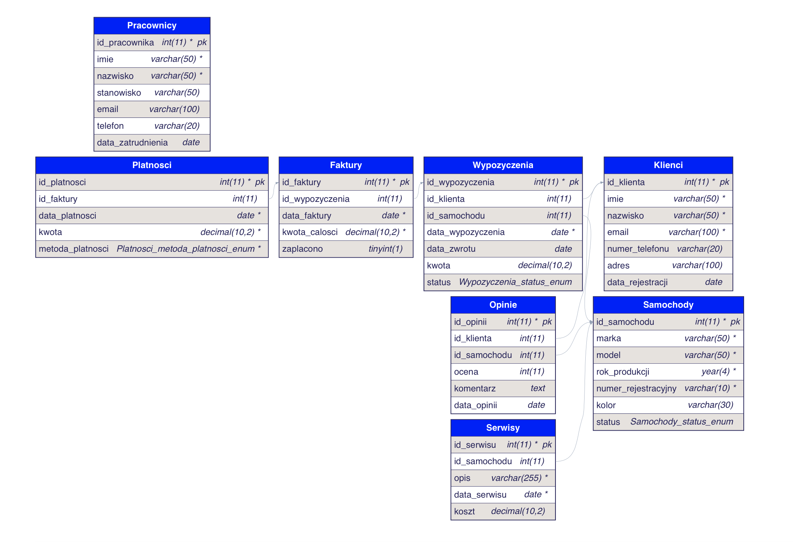

## Diagram ERD

## Warunkowe zapytania

#### Proste zadania (1-4)

1. Wyświetl wszystkich klientów, którzy zarejestrowali się po 1 stycznia 2020 roku.
2. Znajdź opinie, w których ocena jest równa 5.
3. Wyświetl wszystkie płatności dokonane kartą.
4. Pokaż wszystkie faktury, które mają kwotę większą niż 400 zł.

#### Zadania średnio trudne (5-9)

5. Wyświetl klientów, których nazwisko zaczyna się na "K".
6. Znajdź faktury, które zostały zapłacone, i wyświetl ich kwoty.
7. Pokaż wszystkie opinie klientów, które zostały wystawione w 2023 roku i mają ocenę co najmniej 4.
8. Wyświetl wszystkie płatności z kwotą pomiędzy 400 a 700 zł.
9. Znajdź wszystkich klientów, którzy złożyli co najmniej jedną opinię.

#### Zadania trudne (10-14)

10. Wyświetl wszystkich klientów, którzy zapłacili za faktury wydane w 2023 roku.
11. Znajdź wszystkie faktury, gdzie kwota całkowita jest większa niż 500 zł i nie zostały jeszcze zapłacone.
12. Wyświetl klientów, którzy dokonali płatności przelewem lub gotówką.
13. Pokaż faktury, które zostały wystawione na samochody z oceną poniżej 4.
14. Znajdź klientów, którzy wypożyczali samochody i zostawili co najmniej dwie różne opinie.

### Grupowanie danych

#### Proste zadania (15-18)

15. Pokaż liczbę faktur dla każdego klienta.
16. Wyświetl liczbę opinii wystawionych przez każdego klienta.
17. Znajdź średnią kwotę płatności dla każdej metody płatności.
18. Pokaż liczbę płatności wykonanych w każdym miesiącu 2023 roku.

#### Zadania średnio trudne (19-23)

19. Wyświetl wszystkich klientów, którzy dokonali co najmniej dwóch płatności.
20. Znajdź średnią ocenę samochodów na podstawie opinii klientów.
21. Pokaż liczbę faktur zapłaconych przez klientów z każdej miejscowości. <- znajdź błąd, i go zgłoś
22. Wyświetl wszystkich klientów, którzy mają średnią ocenę co najmniej 4 w swoich opiniach.
23. Pokaż liczbę faktur dla każdego roku i miesiąca.

#### Zadania trudne (24-28)

24. Znajdź osoby, gdzie średnia kwota faktur jest wyższa niż 600 zł.
25. Wyświetl klientów, którzy mają łączną kwotę płatności większą niż 1000 zł.
26. Pokaż typy płatności, które mają średnią kwotę powyżej 500 zł.
27. Wyświetl liczbę faktur i sumę kwot płatności dla każdego klienta.

### Łączenie tabel - powtórzenie

#### Zadania (29-33)

28. Wyświetl wszystkie faktury wraz z powiązanymi danymi o płatnościach.
29. Pokaż wszystkich klientów i ich opinie o samochodach.
30. Wyświetl listę klientów wraz z ich wszystkimi fakturami.
31. Pokaż szczegóły faktur i powiązanych płatności nawet, jeśli nie zostały zapłacone.
32. Wyświetl szczegóły klientów, którzy dokonali płatności kartą i jednocześnie wystawili co najmniej jedną opinię.

### Łączenie tabel

1. **Zadanie 1:** Wyświetl listę wszystkich klientów, którzy otrzymali faktury, wraz z łączną kwotą ich faktur. Posortuj wyniki alfabetycznie według nazwiska klienta.

2. **Zadanie 2:** Wyświetl listę samochodów oraz ich średnią ocenę na podstawie opinii klientów. Posortuj wyniki malejąco według średniej oceny.

3. **Zadanie 3:** Wyświetl listę klientów i liczbę różnych samochodów, które były oceniane w opiniach, przy założeniu, że samochody były przypisane do wypożyczeń obsługiwanych przez tych klientów. Posortuj wyniki malejąco według liczby samochodów.

4. **Zadanie 4:** Wyświetl listę wszystkich dostępnych samochodów, pokazując ich markę, model oraz datę ostatniego przeglądu technicznego. Posortuj wyniki według daty ostatniego przeglądu malejąco.

5. **Zadanie 5:** Wyświetl listę klientów, którzy złożyli zamówienia na wypożyczenie samochodów w danym okresie (_dowolny okres_), z informacją o liczbie dni wypożyczenia i łącznej wartości wypożyczenia.

6. **Zadanie 6:** Wyświetl listę klientów, którzy wykonali najwięcej wypożyczeń (top 3), wraz z liczbą wypożyczeń obsłużonych przez każdego z nich. Posortuj wyniki malejąco według liczby wypożyczeń.

7. **Zadanie 7:** Wyświetl listę samochodów, które nigdy nie zostały ocenione w opiniach klientów.

8. **Zadanie 8:** Wyświetl listę klientów, którzy mają więcej niż jedno aktywne wypożyczenie. Posortuj wyniki alfabetycznie według nazwiska klienta.

9. **Zadanie 9:** Wyświetl 10 najczęściej wypożyczanych samochodów wraz z liczbą wypożyczeń dla każdego z nich. Posortuj wyniki malejąco według liczby wypożyczeń.

10. **Zadanie 10:** Wyświetl średnią wartość wypożyczeń dla każdego klienta, który miał więcej niż 5 wypożyczeń. Posortuj wyniki malejąco według średniej wartości.

11. **Zadanie 11:** Wyświetl listę klientów, którzy wypożyczali samochody najwięcej razy w ostatnim roku, tylko dla samochodów ktorych koszt naprawy/serwisu nie przekroczył 5000, wraz z liczbą wypożyczeń dla każdego klienta. Posortuj wyniki malejąco według liczby wypożyczeń.

12. **Zadanie 12:** Wyświetl listę wszystkich samochodów, które były wypożyczane więcej niż 5 razy, z ich marką, modelem oraz średnią liczbą dni wypożyczeń, oraz kosztem napraw jakie zostały poniesione.

13. **Zadanie 13:** Wyświetl listę samochodów, które nigdy nie były wypożyczane lub nie zostały zwrócone.

14. **Zadanie 14:** Wyświetl liczbe pracowników na kazdym stanowisku, dodatkowo zostali zatrudnieni po 2020 roku. Posortuj wyniki według nazwiska.

15. **Zadanie 15:** Wyświetl listę samochodów, których średnia ocena w opiniach jest mniejsza niż 4. Posortuj wyniki rosnąco według średniej oceny.

16. **Zadanie 16:** Wyświetl listę klientów, którzy wypożyczyli samochody przynajmniej 3 razy, ale nigdy nie wystawili opinii o wypożyczonym samochodzie.

17. **Zadanie 17:** Wyświetl listę wszystkich samochodów, które były wypożyczone przynajmniej raz w ciągu ostatnich 12 miesięcy, wraz z liczbą dni, przez które były wypożyczone i ich klientów ktorzy zostali zarejestrowani od 2022 do 2023. Posortuj wyniki malejąco według liczby dni.

18. **Zadanie 18:** Wyświetl listę klientów razem z ich płatnosciami oraz listą samochodów, którzy nie zapłacili za swoje faktury.

19. **Zadanie 19:** Wyświetl listę samochodów u kturych wymieniano olej lub filtry dla kazdego roku, oraz posortuj od najdrozszej naprawy

20. **Zadanie 20:** Wyświetl łączną liczbę wypożyczeń oraz łączną kwote dla każdego klienta w ciągu ostatnich 12 miesięcy. Posortuj wyniki malejąco według łącznej wartości wypożyczeń.

21. **Zadanie 21:** Wyświetl listę wszystkich klientów, którzy wypożyczyli samochód marki "BMW" więcej niż 3 razy w ciągu ostatnich 2 lat. Posortuj wyniki alfabetycznie według nazwiska klienta.

22. **Zadanie 23:** Wyświetl listę samochodów, które były wypożyczane przez klientów w róznych okresach czasu. Posortuj wyniki alfabetycznie według marki samochodu.

23. **Zadanie 24:** Wyświetl listę klientów, którzy mają aktywne wypożyczenia trwające dłużej niż 30 dni. Posortuj wyniki alfabetycznie według nazwiska klienta. <- _trudne_

24. **Zadanie 25:** Wyświetl listę samochodów, które były wypożyczane przez klientów, którzy mają co różne imiona. Posortuj wyniki alfabetycznie według marki samochodu.

---

### **Zadania dotyczące tworzenia widoków**

1. **Stwórz widok dla aktywnych klientów**  
   Widok powinien wyświetlać wszystkich klientów, którzy w ciągu ostatnich 12 miesięcy dokonali przynajmniej jednego wypożyczenia, wraz z ich imieniem, nazwiskiem oraz datą ostatniego wypożyczenia.

2. **Stwórz widok pokazujący całkowity czas wypożyczeń dla każdego klienta**  
   Widok powinien prezentować imię i nazwisko każdego klienta oraz sumaryczny czas wszystkich jego wypożyczeń w dniach.

3. **Stwórz widok pokazujący klientów, którzy wydali najwięcej na wypożyczenia**  
   Widok powinien wyświetlać klientów, którzy w sumie wydali najwięcej pieniędzy na wypożyczenia, sortując ich od największej do najmniejszej kwoty.

4. **Stwórz widok przedstawiający najdłuższe wypożyczenia**  
   Widok powinien pokazywać wypożyczenia trwające dłużej niż 30 dni, wyświetlając datę wypożyczenia, datę zwrotu, nazwisko klienta oraz markę i model samochodu.

5. **Stwórz widok prezentujący dostępne samochody**  
   Widok ma wyświetlać wszystkie samochody, które są obecnie dostępne (nie są wypożyczone), pokazując markę, model i numer rejestracyjny oraz serwis (naprawy).

6. **Stwórz widok sumujący liczbę wypożyczeń dla każdej marki samochodu**  
   Widok powinien wyświetlać każdy marki samochodu oraz liczbę wypożyczeń dla każdej marki.

7. **Stwórz widok przedstawiający klientów, którzy nigdy nie dokonali wypożyczenia**  
   Widok powinien wyświetlać listę klientów, którzy zarejestrowali się w systemie, ale nigdy nie wypożyczyli samochodu.

---

### **Zadania dotyczące tworzenia użytkowników i nadawania im uprawnień**

1. **Utwórz użytkownika o ograniczonych uprawnieniach**. Użytkownik `pracownik1` powinien mieć tylko możliwość odczytu danych z tabeli `Faktury`.

2. **Utwórz użytkownika z pełnym dostępem do bazy**. Użytkownik `admin_bazy` powinien mieć pełny dostęp do wszystkich tabel w bazie danych.

3. ! wykonaj to dopiero po wykonaniu zadań dla uzytkownika !
   **Cofnij użytkownikowi uprawnienia**. Użytkownikowi `pracownik1` należy cofnąć uprawnienia do tabeli `Faktury`.

4. **Utwórz użytkownika z ograniczonym dostępem do wypożyczeń**. Użytkownik `pracownik_wypozyczen` powinien mieć możliwość odczytu oraz aktualizacji danych w tabeli `Wypozyczenia`, ale bez możliwości ich usuwania.

5. **Stwórz użytkownika z pełnym dostępem do tabeli samochodów**. Użytkownik `manager_samochodow` powinien mieć pełny dostęp do wszystkich danych w tabeli `Samochody`, w tym możliwość dodawania, modyfikowania i usuwania wpisów.

6. **Utwórz użytkownika tylko z możliwością odczytu**. Użytkownik `kontroler` powinien mieć uprawnienia wyłącznie do odczytu danych z wszystkich tabel w bazie danych.

7. **Utwórz użytkownika z ograniczonym dostępem do faktur**. Użytkownik `pracownik_faktur` powinien mieć możliwość odczytu i aktualizacji danych w tabeli `Faktury`, ale bez możliwości usuwania faktur.

8. **Nadaj użytkownikowi uprawnienia do tworzenia widoków**. Użytkownik `analityk` powinien mieć możliwość odczytu danych z tabeli `Wypozyczenia` oraz tworzenia widoków na jej podstawie.

9. **Utwórz użytkownika z dostępem do wszystkich danych dotyczących klientów**. Użytkownik `pracownik_klientow` powinien mieć pełny dostęp do wszystkich danych w tabeli `Klienci`, ale bez dostępu do innych tabel.

10. **Nadaj użytkownikowi uprawnienia do usuwania rekordów**. Użytkownikowi `manager_wypozyczen` należy przyznać dodatkowe uprawnienia do usuwania danych z tabeli `Wypozyczenia`.

11. **Odbierz użytkownikowi uprawnienia do aktualizacji danych**. Użytkownikowi `pracownik_wypozyczen` należy cofnąć uprawnienia do aktualizacji danych w tabeli `Wypozyczenia`, pozostawiając jedynie możliwość odczytu.

12. **Utwórz użytkownika tymczasowego z pełnym dostępem do bazy danych**. Użytkownik `temp_admin` powinien mieć pełny dostęp do wszystkich tabel, ale dostęp ten powinien być ograniczony. (_WITH MAX_USER_CONNECTIONS 0;_)

---

### **Zadania dotyczące logowania i wykonywania poleceń w terminalu**

1. **Zaloguj się na użytkownika `pracownik1`** i wykonaj zapytanie wyświetlające wszystkie rekordy z tabeli `Faktury`.

2. **Zaloguj się na użytkownika `admin_bazy`** i wykonaj następujące operacje:

   - Dodaj nowy rekord do tabeli `Faktury`.
   - Zaktualizuj istniejący rekord w tabeli `Faktury`.
   - Stwórz nową tabelę o nazwie Promocje z następującymi kolumnami:
     - ID (INTEGER, PRIMARY KEY, AUTOINCREMENT)
     - Nazwa (VARCHAR(255), NOT NULL)
     - Opis (TEXT)
     - Data_rozpoczecia (DATE, NOT NULL)
     - Data_zakonczenia (DATE)
     - Rabat (DECIMAL(5,2), NOT NULL)
     - ID_Pracownika (INT, Foreign Key)

3. **Zaloguj się na użytkownika `pracownik_wypozyczen`** i wykonaj zapytanie aktualizujące status wypożyczenia, np. zmień datę zwrotu dla rekordu w tabeli `Wypozyczenia`.

4. **Zaloguj się na użytkownika `manager_samochodow`** i wykonaj następujące operacje:

   - Dodaj nowy rekord do tabeli `Samochody`, wprowadzając dane nowego samochodu dostępnego w wypożyczalni.

5. **Zaloguj się na użytkownika `kontroler`** i wykonaj zapytanie wyświetlające pełną listę klientów z tabeli `Klienci`, bez możliwości modyfikacji danych.

6. **Zaloguj się na użytkownika `pracownik_faktur`** i wykonaj zapytanie aktualizujące kwotę dla wybranej faktury w tabeli `Faktury`, np. popraw błędnie wprowadzoną wartość.

7. **Zaloguj się na użytkownika `analityk`** i wykonaj zapytanie tworzące widok, który wyświetli wszystkie aktywne wypożyczenia (te, które nie mają daty zwrotu) z tabeli `Wypozyczenia`.

8. **Zaloguj się na użytkownika `pracownik_klientow`** i wykonaj zapytanie dodające nowego klienta do tabeli `Klienci`, wprowadzając wszystkie niezbędne dane, takie jak imię, nazwisko i adres.

9. **Zaloguj się na użytkownika `manager_wypozyczen`** i wykonaj zapytanie usuwające rekord dotyczący wypożyczenia, które zostało zakończone ponad rok temu, z tabeli `Wypozyczenia`.

10. **Zaloguj się na użytkownika `pracownik_wypozyczen`** i wykonaj zapytanie wyświetlające wszystkie wypożyczenia dla wybranego klienta na podstawie jego ID z tabeli `Wypozyczenia`.

11. **Zaloguj się na użytkownika `temp_admin`** i wykonaj zapytanie tworzące nową tabelę w bazie danych o nazwie `Promocje`.

## Projekt **SQL**

### **Zadanie 1: Tworzenie nowego użytkownika i nadanie uprawnień**

1. Zaloguj się jako administrator MySQL.
2. Stwórz nowego użytkownika o nazwie `large_company_Admin` z hasłem `password123`.
3. Przyznaj mu uprawnienia do usuwania wierszy, wyświtlania danych, wstawiania wierszy, tworzenie obiektów, modyfikowania zawartości

---

### **Zadanie 2: Tworzenie bazy danych i tabel**

1. Zaloguj się do MySQL jako użytkownik `large_company_Admin`.
2. Stwórz nową bazę danych o nazwie `large_company_db`.

#### Tabela `employees`

- `id`: identyfikator pracownika (liczba całkowita, klucz główny, autoinkrementacja),
- `name`: imię pracownika (tekst o maksymalnej długości 50 znaków),
- `position`: stanowisko pracownika (tekst o maksymalnej długości 50 znaków),
- `salary`: pensja pracownika (liczba całkowita),
- `department_id`: id działu, w którym pracuje pracownik (klucz obcy do tabeli `departments`),
- `hire_date`: data zatrudnienia pracownika (data),
- `status`: status pracownika (np. "aktywny" lub "zwolniony").

#### Tabela `departments`

- `id`: identyfikator działu (liczba całkowita, klucz główny, autoinkrementacja),
- `name`: nazwa działu (tekst o maksymalnej długości 50 znaków),
- `location`: lokalizacja działu (tekst o maksymalnej długości 100 znaków).

#### Tabela `projects`

- `id`: identyfikator projektu (liczba całkowita, klucz główny, autoinkrementacja),
- `name`: nazwa projektu (tekst o maksymalnej długości 100 znaków),
- `budget`: budżet projektu (liczba całkowita),
- `start_date`: data rozpoczęcia projektu (data),
- `end_date`: planowana data zakończenia projektu (data),
- `department_id`: id działu, który zarządza projektem (klucz obcy do tabeli `departments`).

#### Tabela `salaries`

- `id`: identyfikator pensji (liczba całkowita, klucz główny, autoinkrementacja),
- `employee_id`: identyfikator pracownika (klucz obcy do tabeli `employees`),
- `salary_amount`: kwota pensji (liczba całkowita),
- `date_paid`: data wypłaty (data).

#### Tabela `attendances`

- `id`: identyfikator obecności (liczba całkowita, klucz główny, autoinkrementacja),
- `employee_id`: identyfikator pracownika (klucz obcy do tabeli `employees`),
- `attendance_date`: data obecności (data),
- `status`: status obecności (np. "obecny", "nieobecny", "spóźniony").

---

### **Zadanie 3: Wstawianie dużej ilości danych do tabel**

1. Wstaw rekordy do tabeli `employees`:
   - Pracownicy powinni mieć różne stanowiska, pensje, działy, daty zatrudnienia oraz statusy.
2. Wstaw rekordy do tabeli `departments`:
   - Różne działy, takie jak "IT", "HR", "Marketing", "Sprzedaż" itd.
3. Wstaw rekordy dotabeli `projects`:
   - Projekty powinny mieć różne budżety, daty rozpoczęcia i zakończenia oraz być przypisane do różnych działów.
4. Wstaw rekordy dotabeli `salaries`:
   - Każdy rekord powinien zawierać pensję dla pracownika za określony miesiąc.
5. Wstaw rekordy dotabeli `attendances`:
   - Każdy rekord powinien rejestrować obecność pracownika w określonym dniu.

---

### **Zadanie 4: Wykonywanie zapytań warunkowych na dużych danych**

1. Wyświetl wszystkich pracowników, którzy są "aktywni" i mają pensję większą niż 4000.
2. Znajdź wszystkich pracowników z działu "IT", którzy zostali zatrudnieni w ciągu ostatnich dwóch lat.
3. Wyświetl wszystkie projekty o budżecie większym niż 500 000 złotych, sortując je według budżetu malejąco.

---

### **Zadanie 5: Grupowanie i filtrowanie danych**

1. Pogrupuj pracowników według stanowisk i policz, ilu pracowników przypada na każde stanowisko.
2. Policzenie średniej pensji w każdym dziale.
3. Pogrupuj projekty według działów i policz łączny budżet projektów dla każdego działu.

---

### **Zadanie 6: Używanie operatorów `IN`, `NOT IN` i `LIKE`**

1. Wyświetl wszystkich pracowników, którzy pracują w działach "HR", "IT" i "Marketing", używając operatora `IN`.
2. Wyświetl wszystkie projekty, które nie należą do działu "Finanse", używając operatora `NOT IN`.
3. Znajdź wszystkich pracowników, których imiona zaczynają się na literę "A" lub "M", używając operatora `LIKE`.

---

### **Zadanie 7: Usuwanie danych z tabel**

1. Usuń wszystkich pracowników, którzy zostali zwolnieni.
2. Usuń wszystkie projekty, które miały datę zakończenia wcześniej niż 3 lata temu.
3. Usuń rekordy obecności starsze niż 5 lat.

---
